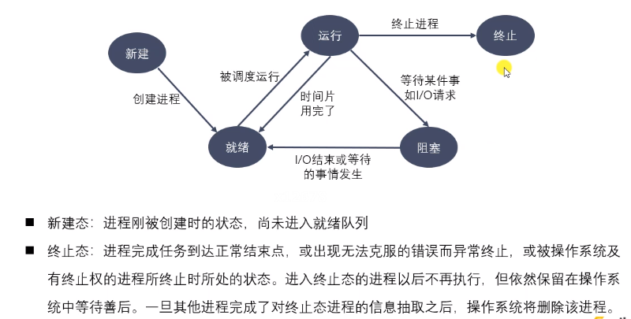
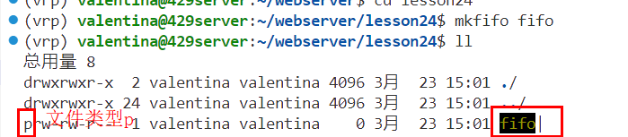
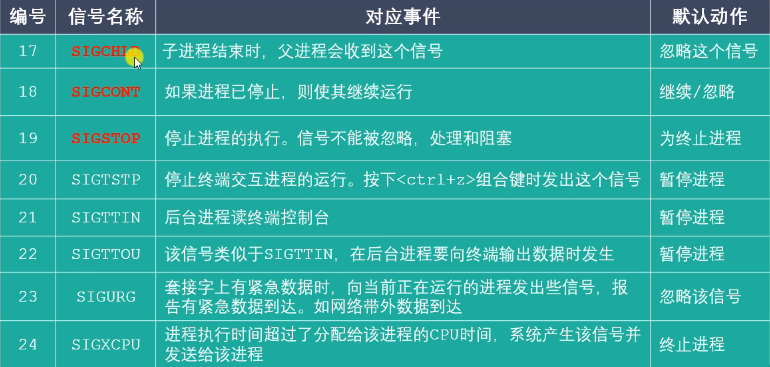
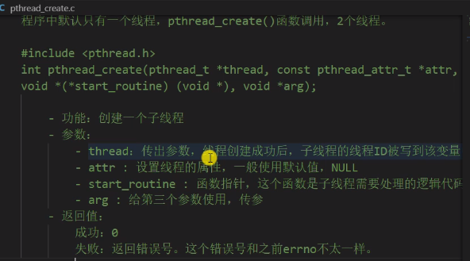

# 第一章 Linux系统编程入门

## 1 GCC

- gcc为编译器

- 使用命令行选项控制编译器在翻译源代码时遵循哪个c标准，‘-std=c99’，支持c99标准

- 安装

```
sudo apt install gcc g++ (版本>4.8.5才能支持c++11)
```

- 查看版本

  ```
  gcc/g++ -v/--version
  ```

- 编译

  ```
  gcc test.c -o app
  ./app
  ```

- **gcc工作流程**

  预处理：和头文件、删掉注释有关、宏替换

  

  ```c++
  // 这些步骤可跳过，比如可以直接gcc test.c -S -o test.s
  gcc test.c -E -o test.i //-E预处理，-o指定生成的名字
  gcc test.i -S -o test.s //-S 编译
  gcc test.s -c -o test.o //汇编成目标代码 这个文件是二进制文件，就看不到了
  gcc test.o -o test.out //连接成可执行文件
  ./test.out
  ```

- gcc g++区别

  

  

- gcc常用参数选项

  

  

  这里的-D怎么用：

  

  ```C++
  如果直接输入下面的语句，不会输出“我是个程序猿。。。”
  gcc test.c -o test
  ./test
  
  但是这样就会：，这样相当于在.c程序最上面加上了#define DEBUG
  gcc test.c -o test -DDEBUG //-D与宏名不用分开
  ```

## 2 静态库制作

1.静态库与动态库

- **静态库在程序的连接阶段被复制到了程序中**；动态库在链接阶段不会被复制，是**程序在运行时由系统动态加载到内存中供程序使用。**
- 库的好处：代码保密；方便部署与分发

2.**静态库的制作**

- 命名规则：**Linux：libxxx.a ;     window:libxxx.lib**，注意libxxx是库文件的名字，xxx是库的名字

  - lib前缀固定
  - xxx库的名字，自己命名
  - .a后缀

- 静态库的制作：

  - gcc获得.o文件

  - 使用ar工具(archive)将.o文件打包

    ```c++
    gcc -c xxx.c xxx.c 
    ar rcs libxxx.a xxx.o xxx.o
    // r -将文件插入备存文件中
    // c - 建立备存文件
    // s - 索引
    ```

- 案例：

  

## 3 静态库的使用

1.题外话之：复制指令cp的使用

```shell
//目前在lesson04目录下，想将calc、library这两个文件复制到lesson05
cp -r calc/ library/ ../lesson05
//目前在lesson05/library下，想将lesson05/calc下的静态库复制到library/lib。  ./表示当前目录
cp ../calc/libcalc.a ./lib/
```

2.**静态库使用**


```shell
//-I ./include/,指定.h文件所在的目录,main.c包含的.h文件在哪里。如果.h和.c文件在一个目录下，就不需要了
//-l calc 指定使用的库的名字，注意库的名字叫做calc。因为函数的定义在库中，不然会显示函数没有定义。
//-L ./lib/ 库所在的目录，不然找不到库calc
gcc main.c -o app -I ./include/ -l calc -L ./lib/
./app
```

## 4 动态库的制作与使用

1.命名规则

- **linux：libxxx.so**，在linux下是个可执行文件
- window：libxxx.dll

2.制作过程

- gcc得到.o代码，得到和位置无关的代码

  ```shell
  gcc -c -fpic/-fPIC a.c b.c
  ```

- gcc得到动态库

  ```shell
  gcc -shared a.o b.o -o libcalc.so
  ```

3.使用

如果直接像静态库那样使用会出错：

- 静态库：gcc进行链接的时候，会把**静态库中代码打包到可执行程序中**

- 动态库：链接的时候不会打包，**在程序启动之后，如果代码中用到了动态库的API，动态库才会被动态加载到内存中，是通过系统的动态载入器获取绝对路径。**

  


**正确方式：在LD_LIBRARY_PATH中添加绝对路径**

1）终端设置，这种方式开个新终端就会失效

```shell
// pwd可以显示当前的绝对路径
export LD_LIBRARY_PATH=$LD_LIBRARY_PATH:当前动态库的绝对路径
```

如果设置好了要查看

```shell
echo $LD_LIBRARY_PATH
```

此时可以正常使用了

```
gcc main.c -o main -I ./include/ -l calc -L ./lib/
./main
```

使用ldd main可以看到动态库路径可以查到，而不是显示not found


2）用户级别配置

进入home目录 

```shell
cd
```

对home目录下.bashrc进行编辑

```shell
vim .bashrc
```

在该文件的最下面一行(shift+g)加上

```
export LD_LIBRARY_PATH=$LD_LIBRARY_PATH:当前动态库的绝对路径
```

再点esc键进行命令行模式，输入:wq，按下回车。

激活.bashrc

```shell
source .bashrc
```

其余同理

```shell
gcc main.c -o main -I ./include/ -l calc -L ./lib/
./main
```


3）系统级

需要root权限

```shell
sudo vim /etc/profile
```

在最后一行加入同样的内容，再source一下

## 5 静态库与动态库对比

1.程序编译成可执行文件过程


- 静态库与动态库都是在**链接阶段处理**
- 静态库中的代码会打包到可执行文件中
- 动态库的只有部分信息会被打包，比如名称等。**动态库动态地被加载到内存中。**

2.静态库制作过程


3.动态库制作过程


4.静态库优缺点

- 优点：加载速度快；发布无需提供静态库，移植方便

- 缺点：消费系统资源，浪费内存；更新部署发布麻烦

  

5.动态库优缺点

- 优点：实现进程间资源共享（共享库），**当程序使用到动态库内容，会把代码加载到内存中，别的应用程序用到了不用再加载，可以共享**；更新部署发布简单，代码不会打包到应用程序中；可以控制何时加载动态库
- 缺点：加载速度慢；发布程序需要提供的动态库文件

## 6 Makefile

#### 6.1 介绍

- 工程中源文件 不计其数，makefile定义了一系列规则哪些文件要先编译、后编译、等操作。

- 好处就是**自动化编译**，一旦写好，只需要make命令，整个工程完全自动编译

#### 6.2 文件命名和规则

- 文件命名：makefile或Makefile

- makefile规则：一个makefile中可有一个或多个规则，**一个规则如下**：

  

  

  目标：最终要生成的文件

  依赖：生成目标文件所需要的文件或目标

  命令：通过执行命令对依赖操作生成目标(命令前tab缩进)

  **其他规则一般是为第一条规则服务的**

- 一个简单的实例

  ```
  vim makefile//对makefile文件编辑
  ```

  目标是生成可执行文件app

  

#### 6.3 工作原理

- 其他规则都是为第一条规则服务的

- 命令在执行前要坚持规则中的**依赖是否存在**，如果不存在就向下检查其他规则，是否有规则会生成该依赖：


- **检测更新**：如果依赖晚于目标，那条规则就会重新执行

第二个图的makefile更好：哪个文件改变了只会重新编译那个文件，最后再链接一下就ok了。

#### 6.4 变量、模式匹配、函数

变量：


用变量进行了一些替换


模式匹配：


函数：


src:返回所有.c的

objs：把src中.c替换成.o


## 7.gdb调试

-g的作用是在可执行文件中加入源代码的信息，但并不是把整个源文件嵌入

```shell
gcc -g main.c -o main
gdb main
```


## 8.文件IO(input output)

运行时，程序会加载到内存，**从内存的角度看文件的输入输出**

- 输入：文件读取数据到内存
- 输出：从内存把数据写到文件

**标准c库IO函数与linux系统IO函数**：类似于一个调用与被调用的关系，linux系统IO函数更偏底层，标准c是跨平台的，在不同的操作系统中调用不同的api(比如在linux上是会调用linux中的api)，**叫做系统调用**。

网络通信需要效率，不能在缓冲区里面，所以用linux系统IO函数(没有缓冲区)

对磁盘进行读写时，用缓冲区提高效率，所以用C库IO函数

#### 标准C库IO函数


**用fopen打开一个文件，会返回文件指针FILE*，可以用文件指针对文件进行操作。**fp是个结构体：

- **文件描述符（整型值）**：指向文件，定位文件；在进程的内核区域
- **文件读写指针**：读写数据，对文件数据操作
- **I/O缓冲区（内存）**：提高执行效率，对磁盘操作很耗时，所以先向缓冲区(内存)写内容。当缓冲区满了、关闭文件、刷新缓冲区时缓冲区内容会写在磁盘中。

可以在c代码中看一下这个结构体：

- 

- 点击FILE后，实际上是_IO_FILE这个结构体，再点进去看

  

- 

  

  

#### 标准C库IO与linux系统IO关系

调用与被调用关系

用户程序调用fputs，把数据写到文件指针fp对应的文件中。会经过C，会有个缓冲区，写到里面；还会调用linux写到磁盘；向缓冲区写数据会写多次，但是磁盘只用打一次交到。


## 9. 虚拟地址空间


- **引入虚拟内存原因：**由于物理内存空间是有限的，如果将进程都直接加载到物理内存上，则会出现物理内存空间不够用的情况，另外，一个进程也可以直接访问另一个进程在内存上的地址从而使其崩溃

  

  虚拟内存是为了解决物理内存空间不够的状况，将一部分磁盘空间当做内存，用于“扩充”[虚拟内存](https://so.csdn.net/so/search?q=虚拟内存&spm=1001.2101.3001.7020)的空间

  但是有一点需要明确，**虚拟内存中的内容如果想要使用，必须要导入到物理内存中才可以，所以这里面就涉及到调度算法**

- **虚拟空间与进程：**每个可执行程序运行期间(或者说一个进程)会对应一个4G(32位)的虚拟地址空间，运行结束就不存在了。程序直接操作的是虚拟地址空间，所以每个进程中相同编址的地址所对应的内容就不一样。

- **程序与进程：**一个程序运行起来了就是一个进程，是系统给程序分配资源的最小单位。程序是磁盘上的代码，运行的程序(进程)会加载到内存。**程序是个文件，只占用磁盘空间。当程序开始运行时，运行的程序(进程)会加载到内存，操作系统会为他分配资源，就会创建一个进程，进程是会占用内存空间的。**

- **mmu**：虚拟地址空间会被cpu中的mmu映射到真实的物理内存中。每个进程的虚拟地址空间都分为**用户区**和**内核区**，**所有进程的内核区都会被映射到物理内存中相同的位置（因为内核只有一个）**

- 进程虚拟地址空间会被划分成页，每一个进程会有一个页表，记录两部分内容：这一页是否被映射到物理内存上，映射的物理内存地址（如果在物理内存）

  当进程访问某个虚拟地址时，会先查看是否映射到了物理内存上，如果是，则进行地址转换进行访问，否则会发生**缺页异常**，并将磁盘里对应的页调到物理内存中，再进行地址转换和访问

- **虚拟地址空间的一些内容**：

  - 内核区普通用户没有权限，如果想要操作内核的数据，需要系统调用，调用linux系统的API(系统调用)
  - 受保护的地址：NULL
  - .text：代码加载到内存
  - 堆空间：new malloc
  - 共享库：共享库的代码
  - 栈空间：局部变量等

## 10.文件描述符

文件指针中的**文件描述符（整型值）**：指向文件，定位文件；**在进程的内核区域**。

**PCB是进程控制块(复杂结构体)**，有个文件描述符表(数组，默认大小1024)，**每个进程都有一个文件描述符表，一个进程可以同时打开多个文件**

前三个0 1 2默认打开，对应的是当前终端(同一个终端)


## 11.Linux系统IO函数

调用Linux系统的API称作**系统调用**

在shell中输入man+数字+命令/函数即可以查到相关的命令和函数。

```
man 2 函数名称：linux系统IO
man 3 函数名称：c库IO
```

#### open打开文件

```shell
man 2 open //查看open的用法，可以看到需要的头文件
```

```c
#include <sys/types.h>//前两个定义了宏
#include <sys/stat.h>
#include <fcntl.h>//函数声明

//打开一个已经存在的文件
int open(const char *pathname, int flags);//flags是定义的宏
    参数：
        - pathname:要打开的文件路径
        - flags:对文件的操作权限设置
         O_RDONLY, O_WRONLY, or O_RDWR 这三个设置互斥
    返回：
        返回一个新的文件描述符，调用失败返回-1

errno：属于linux系统函数库，是库中的一个全局变量，记录最近错误号

#include <stdio.h>
void perror(const char *s);//打印errno对应的错误描述，是个C库IO
    s参数：用户描述

// 创建一个新的
int open(const char *pathname, int flags, mode_t mode);
```

实际用法

```c++
#include <sys/types.h>//前两个定义了宏
#include <sys/stat.h>
#include <fcntl.h>//函数声明
#include <stdio.h> // c库
#include <unistd.h> //close函数

int main() {
   int fd = open("a.txt", O_RDONLY);
   if (fd == -1) {
        perror("open");// c库函数 传递的不是错误号
   }
   close(fd);
   return 0;
}
```

当a.txt不存在时


#### open创建新文件

```c
int open(const char *pathname, int flags, mode_t mode);
    参数：
        - pathname：要创建的文件的路径
        - flags：对文件的操作权限和其他的设置
            - 必选项：O_RDONLY, O_WRONLY, or O_RDWR 三者互斥
            - 可选项：O_CREAT 文件不存在会创建新文件
        - mode：八进制的数，表示创建出的新的文件的操作权限
                最终的权限mode & ~umask，作用是抹去某些权限
                mode 0777是最高权限(有读r、写w、可执行x权限就是7)
                umask 0002 (直接在终端输入umask会显示值)
                mode & ~umask 得到 0775 
```

完整代码：

```c
#include <sys/types.h>
#include <sys/stat.h>
#include <fcntl.h>
#include <unistd.h> // close函数
#include <stdio.h>

int main() {
    
    int fd = open("create.txt", O_RDWR | O_CREAT, 0777); // flag是32位的，这里要用或，遇1则为1

    if (fd == -1) {
        perror("open");
    }

    close(fd);
    return 0;
}
```

#### read、write函数

```c
#include <unistd.h>

ssize_t read(int fd, void *buf, size_t count);
    参数：
        - fd：文件描述符，open函数得到，通过fd操作某个文件
        - buf：需要读取数据存放的地方，数组的地址(传出参数)
        - count：指定数组的大小
    返回值：
        - 成功：
            >0：返回实际读取到的字节数
            =0：文件已经读取完了
        - 失败：-1，并设置errno

ssize_t write(int fd, const void *buf, size_t count);
    参数：
        - buf：要往磁盘写入的数据，数组
        -count:要写的数据实际大小
    返回值：
        成功：返回实际读取到的字节数
        -失败：-1，并设置errno
```

完整代码：

- read：从磁盘(srcfd指向的文件)读到buf中
- write：从buf中写到磁盘中(desfd)

```c
#include <unistd.h>
#include <stdio.h>
#include <sys/types.h>//前两个定义了宏
#include <sys/stat.h>
#include <fcntl.h>//函数声明

int main() {
    // 1. open打开english.txt
    int srcfd = open("english.txt", O_RDONLY);
    if (srcfd == -1) {
        perror("open");
        return -1;
    }
    // 2. 创建一个新的文件
    int desfd = open("cpy.txt", O_WRONLY | O_CREAT, 0664);
    if (desfd == -1) {
        perror("open");
        return -1;
    }
    // 3. 频繁读写操作
    char buf[1024] = {0};
    int len = 0;
    // 从磁盘(srcfd指向的文件)读到buf中
    while ((len = read(srcfd, buf, sizeof(buf))) > 0) { 
        // 从buf中写到磁盘中(desfd)
        write(desfd, buf, sizeof(buf));
    }

    // 4. 关闭文件
    close(desfd);
    close(srcfd);
    return 0;
}
```

#### lseek移动文件指针的位置

作用

- 移动文件指针到文件头:``lseek(fd, 0, SEEK_SET)``

- 获取当前文件指针的位置:``lseek(fd, 0, SEEK_CUR)``

- 获取文件长度:``lseek(fd, 0, SEEEK_END)``

- 扩展文件的长度，当前文件10b，增加100b。如果下载的文件有5G，磁盘还有5G空间，下载过程中，如果使用了空间，那导致下载不成功，因为磁盘不够。所以我们先创建出一个那么5G的文件，你后续可以通过lseek移动指针到起始位置开始下载写入。

  ``lseek(fd, 100, SEEK_END)``


使用

```c
/*
标准c库函数
#include <stdio.h>
int fseek(FILE *stream, long offset, int whence);

linux系统函数    
#include <sys/types.h> // 宏定义
#include <unistd.h>
off_t lseek(int fd, off_t offset, int whence);
    参数：
        - fd:文件描述符，通过它操作文件
        - offset:便宜量
        - whence:
            SEEK_SET:设置偏移量，文件开始+offset
            SEEK_CUR:设置偏移量，从当前位置+offset
            SEEK_END:设置偏移量，文件大小+offset
    返回值：返回文件指针的位置
*/
```

完整代码

```c
#include <sys/types.h>
#include <sys/stat.h>
#include <fcntl.h>
#include <unistd.h>
#include <stdio.h>

int main() {
    int fd = open("hello.txt", O_RDWR);
    if (fd == -1) {
        perror("open");
    }

    int ret = lseek(fd, 100, SEEK_END);
    if (ret == -1) {
        perror("lseek");
    }

    // 移动指针后，写入一个空数据，如果不写入什么文件大小似乎不会变
    write(fd, " ", 1);
    
    close(fd);
    return 0;
}
```

之前是13个字节，扩充100个，又写入了一个，变成了114


#### stat获取文件信息

作用：

- 获取文件的信息


用法

```c
/*
#include <sys/types.h>
#include <sys/stat.h>
#include <unistd.h>

int stat(const char *pathname, struct stat *statbuf);
    参数：
        - pathname:操作的文件的路径
        - statbuf:结构体变量，statbuf是个传出参数，保存获取到的文件信息
    返回：
        - 成功返回0
        - 失败-1

int lstat(const char *pathname, struct stat *statbuf);获取软链接的信息
*/
```


stat结构体

- 

**st_mode变量，16位，记录文件权限和类型**

- 如果要判断是否有某个权限，按位与；如果判断文件类型，与掩码进行与操作。


完整代码，利用stat输出文件大小

```c
#include <sys/types.h>
#include <sys/stat.h>
#include <unistd.h>
#include <stdio.h>

int main() {

    struct stat statbuf;

    int res = stat("a.txt", &statbuf);

    if (res == -1) {
        perror("stat");
        return -1;
    }

    printf("size: %ld\n", statbuf.st_size);
    return 0;
}
```


#### 模拟实现ls -l指令

ll指令:

我们需要编写一个可执行程序，可以实现和ll一样的功能


完整代码：

```c
#include <stdio.h>
#include <sys/types.h>
#include <sys/stat.h>
#include <unistd.h>
#include <pwd.h>
#include <grp.h>
#include <time.h>
#include <string.h>

// 模拟实现 ls -l 指令
// -rw-rw-r-- 1 nowcoder nowcoder 12 12月  3 15:48 a.txt
int main(int argc, char * argv[]) {

    // 判断输入的参数是否正确
    if(argc < 2) {
        printf("%s filename\n", argv[0]);
        return -1;
    }

    // 通过stat函数获取用户传入的文件的信息
    struct stat st;
    int ret = stat(argv[1], &st);
    if(ret == -1) {
        perror("stat");
        return -1;
    }

    // 获取文件类型和文件权限
    char perms[10] = {0};   // 用于保存文件类型和文件权限的字符串

    switch(st.st_mode & S_IFMT) {
        case S_IFLNK:
            perms[0] = 'l';
            break;
        case S_IFDIR:
            perms[0] = 'd';
            break;
        case S_IFREG:
            perms[0] = '-';
            break; 
        case S_IFBLK:
            perms[0] = 'b';
            break; 
        case S_IFCHR:
            perms[0] = 'c';
            break; 
        case S_IFSOCK:
            perms[0] = 's';
            break;
        case S_IFIFO:
            perms[0] = 'p';
            break;
        default:
            perms[0] = '?';
            break;
    }

    // 判断文件的访问权限

    // 文件所有者
    perms[1] = (st.st_mode & S_IRUSR) ? 'r' : '-';
    perms[2] = (st.st_mode & S_IWUSR) ? 'w' : '-';
    perms[3] = (st.st_mode & S_IXUSR) ? 'x' : '-';

    // 文件所在组
    perms[4] = (st.st_mode & S_IRGRP) ? 'r' : '-';
    perms[5] = (st.st_mode & S_IWGRP) ? 'w' : '-';
    perms[6] = (st.st_mode & S_IXGRP) ? 'x' : '-';

    // 其他人
    perms[7] = (st.st_mode & S_IROTH) ? 'r' : '-';
    perms[8] = (st.st_mode & S_IWOTH) ? 'w' : '-';
    perms[9] = (st.st_mode & S_IXOTH) ? 'x' : '-';

    // 硬连接数
    int linkNum = st.st_nlink;

    // 文件所有者
    char * fileUser = getpwuid(st.st_uid)->pw_name;

    // 文件所在组
    char * fileGrp = getgrgid(st.st_gid)->gr_name;

    // 文件大小
    long int fileSize = st.st_size;

    // 获取修改的时间
    char * time = ctime(&st.st_mtime);

    char mtime[512] = {0};
    strncpy(mtime, time, strlen(time) - 1);

    char buf[1024];
    sprintf(buf, "%s %d %s %s %ld %s %s", perms, linkNum, fileUser, fileGrp, fileSize, mtime, argv[1]);

    printf("%s\n", buf);

    return 0;
}
```

#### 文件属性操作函数


##### 1）access:判断某个文件是否有某个权限，或者文件是否存在

用法

```
int access(const char *pathname, int mode);
    参数：
        - pathname：判断的文件路径
        - mode：宏值。
            调用函数所在的进程对这个文件是否有如下权限
            R_OK:读
            W_OK:写
            X_OK:执行
            F_OK:存在
    返回：
        成功0，失败-1
```

##### 2）chmod:修改文件权限

用法

```
int chmod(const char *pathname, mode_t mode);
    参数：
        pathname：需要修改的文件的路径
        mode_t mode:需要修改的权限值，8进制数
    返回：
        成功0 失败-1
```

比如将a.txt的权限进行修改

```c
#include <sys/stat.h>
#include <stdio.h>

int main() {

    int ret = chmod("a.txt", 0777);

    if (ret == -1) {
        perror("chmod");
        return -1;
    }

    return 0;
}
```

修改前


修改后


##### 3）chown:修改文件所在组或所有者(一般可能没有权限)

```
int chown(const char *pathname, uid_t owner, gid_t group);
owner、group是要修改成的所有者、所在组id
```

查看用户id

```shell
vim /etc/passwd
```


查看系统中所有组的id

```shell
vim /etc/group
```

查看某个用户


##### 4）truncate:缩减或扩展文件的尺寸至指定的大小

```
int truncate(const char *path, off_t length);
	length:最终需要变成的大小
```

#### 目录操作函数


##### 1）mkdir 创建目录

```c
int mkdir(const char *pathname, mode_t mode);
/*	参数：
		pathname：创建的目录的路径
		mode：8进制数，权限。最终的权限是：mode & umask & 0777
*/
```

##### 2）rmdir 删除空目录 略

##### 3）rename 略

##### 4）chdir  修改进程工作目录

```c
int chdir(const char *path);
/*比如在home目录下启动了可执行程序a.out,那么进程默认的工作目录就是home*/
```

##### 5）getcwd 获取当前工作目录

```c
char *getcwd(char *buf, size_t size);
/*目录会写入buf中，指向的是一个数组，buf是个传出参数(与stat结构体一样)
size是数组的大小

返回：返回指向的一块内存，这个数据就是第一个参数*/
```

完整代码：

- 打印当前工作目录(lesson14)
- 更换当前目录为lesson13
- 创建新的文件(该文件就会在lesson13中创建)
- 打印当前工作目录(lesson13)

```c
int main() {
    char buf[128];
    getcwd(buf, sizeof(buf));
    printf("当前工作目录：%s\n", buf);

    // 修改工作目录
    int ret = chdir("/home/valentina/webserver/lesson13");

    // 创建新的文件
    int fd = open("new.txt",O_CREAT | O_RDWR, 0664);
    if (fd == -1) {
        perror("open");
    }

    close(fd);

    //获取当前工作目录
    char buf1[128];
    getcwd(buf, sizeof(buf));
    printf("当前工作目录：%s\n", buf);
}
```

#### 目录遍历函数


这些是**标准c库的函数**

```c
DIR *opendir(const char *name);
/*	参数：name要打开的目录名称；
	返回：DIR*类型，结构体；理解为目录流
		错误返回NULL
*/
struct dirent *readdir(DIR *dirp);
/*读取目录中的数据
	参数：dirp是opendir返回的结果
	返回值：struct dirent，读取到的文件信息；失败返回NULL
*/
int closedir(DIR *dirp);
/*关闭目录*/

```


##### 读取某个目录下所有普通文件个数

```c
#include <sys/types.h>
#include <dirent.h>
#include <stdio.h>
#include <string.h>
#include <stdlib.h>

int getFileNum(char * path) {
    //打开目录
    DIR * dir = opendir(path);
    if (dir == NULL) {
        perror("opendir");
        exit(0);
    }

    // 文件个数
    int total = 0;

    // 读取目录中的数据
    struct dirent * ptr;
    while ((ptr = readdir(dir)) != NULL) {// readdir把dir作为参数传入
        char * name = ptr->d_name;

        // 如果是上级、当前目录的话就跳过
        if (strcmp(name, ".") == 0 || strcmp(name, "..") == 0) 
            continue;
        
        // 如果是目录，要递归
        if (ptr->d_type == DT_DIR) {
            char newpath[256];
            sprintf(newpath, "%s/%s", path, name);
            total += getFileNum(newpath);
        }

        // 普通文件 数量+1
        if (ptr->d_type == DT_REG) {
            ++total;
        }
    }

    // 关闭目录
    closedir(dir);
    return total;
}
int main(int argc, char * argv[]) {
    // 判断参数个数
    if (argc < 2) {
        printf("%s path\n", argv[0]);
        return -1;
    }

    int num = getFileNum(argv[1]);
    printf("文件数量：%d\n", num);
    return 0;
}
```


#### dup dup2函数 （文件描述符）


dup

```c
int dup(int oldfd);
/*作用：复制一个新的文件描述符
多个文件描述符可以指向同一个文件：fd=3,int fd1=dup(fd)
fd fd1都指向同一个文件，从空暇的文件描述符表中找一个最小的，作为新的拷贝的文件描述符
*/
```

```c
#include <unistd.h>
#include <stdio.h>
#include <fcntl.h>
#include <sys/types.h>
#include <sys/stat.h>
#include <string.h>

int main() {
    //创建文件b.txt,返回文件描述符3
    int fd = open("b.txt", O_CREAT | O_RDWR, 0664);// 默认是3

    // 生成一个新的描述符
    int fd1 = dup(fd);
    if (fd1 == -1) {
        perror("open");
        return -1;
    }

    printf("fd:%d, fd1:%d\n", fd, fd1);
    close(fd);

    // 用新的文件描述符向b.txt中写入数据
    char * str = "hello";
    int ret = write(fd1, str, strlen(str));
    if (ret == -1) {
        perror("write");
        return -1;
    }

    close(fd1);
    return 0;
}
```

dup2

```c
int dup2(int oldfd, int newfd);
/*重定向文件描述符
oldfd指向a.txt，newfd指向b.txt
调用函数成功后，newfd和b.txt做close，newfd指向a.txt
*/
```

```c
#include <unistd.h>
#include <stdio.h>
#include <fcntl.h>
#include <sys/types.h>
#include <sys/stat.h>
#include <string.h>

int main() {
    int fd = open("1.txt", O_CREAT | O_RDWR, 0664);
    int fd1 = open("2.txt", O_CREAT | O_RDWR, 0664);
    printf("fd:%d, fd1:%d\n", fd, fd1);

    int fd2 =dup2(fd, fd1);// fd1 fd2是一样的，fd fd1 fd2都指向1.txt

    char * str = "hi";
    int len = write(fd1, str, strlen(str));// 会向1.txt中写内容
    if (len == -1) {
        perror("write");
        return -1;
    }

    printf("fd:%d, fd1:%d, fd2:%d\n", fd, fd1, fd2);
    close(fd);
    close(fd1);
    return 0;

}
```


#### fcntl函数


```c
int fcntl(int fd, int cmd, ...)
/*参数：
	fd：需要操作的文件描述符
	cmd：表示对文件描述符如何操作
		- F_DUPFD：复制文件描述符，复制的是fd，得到一个新的描述符(返回值)
		- F_GETFL：获取指定的文件描述符文件状态flag
			flag和open函数传递的flag是一个东西
		- F_SETFL：设置文件描述符文件状态flag
			必选项：O_RDONLY O_WRONL O_RDWR 不可被修改
			可选项：O_APPEND追加数据  NON_BLOCK设置成非阻塞
		
*/
```

# 第二章 Linux多进程开发

## 1.进程与程序

进程与程序：

- 程序是文件，文件中的信息描述了如何在运行时创建进程，只占用磁盘空间；程序占用内存、cpu资源。
- 进程是正在运行的程序的实例。是程序运行时，操作系统分配的资源。

单道程序与多道程序：

- 单：计算机内存中只运允许一个的程序运行
- 多：计算机内存中同时存放几道互相独立的程序，相互穿插运行，以提高CPU利用率。

时间片：

- 是操作系统分配给每个正在运行的进程微观上的一段cpu时间。

- 时间片由操作系统内核的调度程序分配给每个进程。**面试常问，常见的调度算法？**

并行与并发：


进程控制块：

- 为了管理进程，内核为每个进程分配了一个PCB进程控制块，维护进程信息，Linux内核的PCB是task_struct结构体

- 其内部成员很多，只需要掌握一下部分：

  


## 2. 进程状态(面试常问)

#### 进程状态

三态：**运行态、就绪态、阻塞态**


- 运行：进程占用处理器正在运行
- 就绪：进程具备运行条件，已分配到除cpu外的所有必要资源，等待系统分配处理器以运行；系统中处于就绪状态的进程可能有多个，构成就绪队列。
- 阻塞：又称等待(wait)或睡眠(sleep)态，进程不具备运行条件，正在等待某个事件完成。


五态：



- 其实就绪、阻塞也可以直接变成终止态
- 终止时，用户区的会自动释放，内核区还没释放。


#### 进程相关命令


```shell
ps aux
```

这是个快照，静态的

USER:进程所属用户 ;  PID:进程的ID ;  %CPU %MEM:CPU 内存的使用率;  TTY: 当前进程所属的终端 。这个指令也是一个进程.


终端和指令ps aux都是一个进程：


TTY指令可以查看当前在哪个终端：


STAT：


```shell
ps ajx
```

PPID 父进程的ID;  PGID 进程组的ID(班级);   SID 会话的ID(学校)


```shell
top //实时显示进程状态
```


```shell
kill pid;// 杀死进程
//等价于kill-SIGKILL pid,强制杀死进程，-9是个signal(信号)，可以用kill -l列出所有信号
kill -9 pid;
kill -l;// 列出所有信号
```


#### 进程号和相关函数


**init:操作系统内核初始进程**

运行的程序的父进程一般都是当前终端


## 3.创建进程

Linux系统函数，或者说是系统调用

```c
pid_t fork()
/*作用：用于创建子进程
返回值：
	成功：fork返回两次，父进程返回创建的子进程ID，子进程返回0
	失败：返回-1
	失败的主要两个原因：
		当前系统进程数到达上限，errno设置为EAGAIN
		系统内存不足，errno设置为ENOMEM
*/
```

```c
int main() {
    pid_t pid = fork();
    // 父进程
    if (pid > 0) {
        printf("pid: %d\n", pid);
        printf("This is a parent progess, pid: %d, ppid: %d\n", getpid(), getppid());
    }
    else if (pid == 0) {
        printf("This is a child progess, pid: %d, ppid: %d\n", getpid(), getppid());
    }

    for (int i = 0; i < 10; ++i) {
        printf("i: %d, pid: %d\n", i, pid);
        sleep(1);
    }
    return 0;
}
```


**父进程从int main开始执行，fork()函数在父进程中调用，子进程不会**

父子进程执行代码情况：


## 4. 父子进程虚拟地址空间


- 调用fork后，会copy一个虚拟地址空间。子进程的用户区数据与父进程一样，内核区的pid(标志进程号)不一样。
- 两个虚拟地址空间中的**.text是代码段，是一样的，虽然执行的代码不一样。**
- 代码中的pid变量用来判断执行if语句的哪个部分，存放在**栈空间**。**父进程栈空间pid>0,子进程栈空间pid=0**，根据这个值执行代码中不同的部分。

- ==子进程、父进程运行在分开的内存空间。fork调用后，两者虚拟空间有相同的内容，但是后面各自独立了，互不影响。(比如int num=10，父进程加10得20，子进程加5得15)==


==important，但是没太学懂==

在父子进程中打印num的地址是一样的，**打印的是虚拟地址**。不同的进程访问**同样的逻辑地址而对应的物理地址不同**，是由于各自页表的不同。linux系统下每个进程都拥有自己的页表，父进程fork出新的子进程时，子进程拷贝一份父进程的页表，且父子进程将页表状态修改为写保护。==**当父进程或子进程发生写操作时将会发生缺页异常，缺页异常处理函数将会为子进程分配新的物理地址**==。


实际上，Linux的fork使用**写时拷贝**、**读时共享**实现，一种推迟甚至避免拷贝数据的技术。

内核不复制整个进程的虚拟地址空间，**让父子进程共享用户区，内核区还是不一样的**。

只有需要写入的时候复制地址空间。

资源复制是在需要写入的时候才进行，之前以只读方式共享。

fork产生的子进程与父进程相同的文件描述符指向相同的文件表，引用计数器增加。


最开始父子共享，读时共享：


写时拷贝：


## 5. gdb多进程调试

- 如果父子进程都打断点，默认调试时只会跟踪父进程，子进程直接执行到程序结束。


## 6. exec函数族

- exec函数族根据指定的文件名找到可执行文件，**用其取代调用进程的内容**。(==一般是fork一下，在子进程中调用exec函数，那么可执行文件会替换掉子进程的内容==)。

- exec执行**成功后无返回**，因为调用进程的实体，包括代码段、数据、段和堆栈都已经被新的内容取代(**用户区被替换掉，内核区不变，比如当前工作目录、pid等**)。
- **失败返回-1**，**在原程序调用点接着执行**。


常见的exec函数族，**只有execve是linux系统函数**，其余是标准c库函数：(标准c库的是对execve进行封装的)


**(1) execl**

```c
execl(const char *path, const char *arg, ...)
/*参数：-path：需要指定的可执行文件相对路径/绝对路径
	-arg：可执行文件所需要的参数列表
		第一个参数一般没啥用，一般写可执行文件名称
		第二个参数开始为可执行文件所需要的参数列表
		参数最后要以NULL结束（哨兵）
返回值：成功无返回值。失败返回-1，并设置errno
*/
```

- 下面代码内容：execl传入的可执行程序：hello（打印hello字符串）。在子进程中调用execl函数，如果成功无返回；失败会通过perror打印错误信息，在原程序调用点继续执行。

```c
#include <unistd.h>
#include <sys/types.h>
#include <unistd.h>
#include <stdio.h>

int main() {
    pid_t pid = fork();
    if (pid > 0) {
        // 父进程
        printf("This is parent process, pid:%d\n", getpid());
    }
    else if (pid == 0){
        // 子进程
        execl("hello", "hello", NULL);// 第一个参数是可执行程序路径(同目录)，第二个是名称
        perror("execl");// 如果execl调用失败打印错误信息，子进程继续执行
        printf("This is child process, pid:%d\n", getpid());
    }
    printf("program is over,pid:%d\n", getpid());
    return 0;
}
```

失败：

成功：

- 另一个例子，ps aux这个指令，ps也是个可执行程序。

  查看ps程序位置：

  ```c
  execl("/usr/bin/ps", "ps", "aux", NULL);
  ```

  


**(2) execlp**

```c
execlp(const char *file, const char *arg, ...)
/*会在环境变量中查找指定的可执行文件名
file:可执行文件的文件名
*/
```

查看环境变量

```shell
env
```

```shell
execlp("ps", "ps", "aux", NULL);
```

**(3) execv**

```c
execv(const char *path, char *const argv[])
/*path:路径
	argv是需要参数的一个字符串数组
*/
```

```c
char * argv[] = {"ps", "aux"};// 用字符串数组
execv("/bin/ps", argv)
```

## 7. 进程管理

#### (1) 进程退出

==一般就用exit()，除了调用linux的_exit()，还会刷新缓冲区==


- 换行符会自动刷新IO缓冲区，所以“hello”一定会打印出来
- 如果调用linux系统函数_exit(0)，“world”这个词还在缓冲区里。

```c
int main() {
    printf("hello\n");
    printf("world");

    // exit(0); 会打印出world
    // _exit(0);不会打印出world
}
```

#### (2) 孤儿进程

- 父进程运行结束，子进程还在运行，该子进程称为孤儿进程
- 一般子进程结束后，父进程会对子进程资源回收
- 孤儿进程的父进程会设置为init(内核中第一个进程，pid=1)。init进程会循环地wait()它的已经退出的子进程。
- 孤儿进程没啥危害

以下代码中由于子进程sleep了一下，父进程提前结束。打印的结果中子进程的ppid=1

```c++
#include <sys/types.h>
#include <unistd.h>
#include <stdio.h>
int main() {
    pid_t pid = fork();
    // 父进程
    if (pid > 0) {
        printf("pid: %d\n", pid);
        printf("This is a parent progess, pid: %d, ppid: %d\n", getpid(), getppid());
    }
    else if (pid == 0) {
        sleep(1); // 父进程会结束
        printf("This is a child progess, pid: %d, ppid: %d\n", getpid(), getppid());
    }

    for (int i = 0; i < 3; ++i) {
        printf("i: %d, pid: %d\n", i, pid);
    }
    return 0;
}
```


#### (3) 僵尸进程

- **每个进程结束后，会自己释放地址空间的用户区数据，内核区PCB数据需要父进程释放**
- 子进程终止，父进程没有回收(比如父死循环)，子进程残留资源(PCB)存放于内核中，**变成僵尸进程**
- **僵尸进程无法被kill -9杀死**
- **危害：**父进程如果不调用wait()或waitpid()，僵尸进程的进程号会一直被占用。系统的进程号是有限的。如果产生大量的僵尸进程，将因为没有可用的进程号而导致系统无法产生新的进程。

该代码中父进程死循环，子进程结束资源一直无法回收。ps aux指令可查看进程情况。

可以crtl+c结束父进程，**子进程会变为孤儿进程，即父进程变为init。**

```c++
if (pid > 0) {
        while(1) {
            sleep(1);
            printf("This is a parent progess, pid: %d, ppid: %d\n", getpid(), getppid());
        }
    }
    else if (pid == 0) {
        printf("This is a child progess, pid: %d, ppid: %d\n", getpid(), getppid());
    }
```


## 8. 进程回收：wait() waitpid()

- 每个进程退出时，内核主要释放用户区数据，内核区进程控制块PCB会保留(进程号、退出状态、运行时间等)
- **父进程可以通过wait或waitpid函数得到子进程退出状态，并清除进程**

#### (1) wait

```c++
pid_t wait(int *wstatus)
```

- **作用：等待任意==一个==子进程结束，如果子进程结束，该函数会回收子进程资源**
- 参数：进程退出时的状态信息，传入的是int类型的地址，为传出参数。把退出时的信息写入这个里面。
- 返回值：成功返回回收子进程id；失败返回-1(所有的子进程都结束，调用函数失败)

**==调用wait函数的进程被挂起(阻塞)==，知道他的一个子进程退出或收到一个不能被忽略的信号时才被唤醒。(相当于继续往下执行)。如果没有子进程了，立刻返回-1**

==产生五个子进程==

```c++
pid_t pid;
    for (int i = 0; i < 5; ++i) {
        pid = fork();
        if (pid == 0) break;
    }
```

使用wait函数，如果子进程不结束，父进程会一直挂起，不执行wait函数后面的内容。

如果利用kill -9杀死某个子进程，父进程就会进入下一轮循环：

```c++
pid_t pid;
    for (int i = 0; i < 5; ++i) {
        pid = fork();
        if (pid == 0) break;
    }
    if (pid > 0) {
        while (1) {
            int ret = wait(NULL);
            if (ret == -1) break;
            printf("child die, pid:%d\n", ret);
            printf("This is parent, pid:%d\n", getpid());
        }
    }
    else if (pid == 0) {
        while (1) {  // 不希望子进程很快死掉成为僵尸进程
            printf("This is child, pid:%d\n", getpid());
            sleep(1);
        }
    }
```

#### (2) waitpid

```c++
pid_t waitpid(pid_t pid, int *wstatus, int option)
```

- **作用：回收指定进程号的子进程，可以设置是否阻塞**


## 9.进程间通信IPC（面试易问）

比如：qq间发消息、迅雷一边下载一边看


==进程间通信方式==


#### 匿名管道

1. 概念

   - 是unixi系统IPC的最古老方式。所有unix系统都支持该通信机制。

   - 

     竖线是管道符，后一个进程需要前一个进程的数据，所有需要两个进程的通信

     ls默认写出到标准输出，wc默认从标准输入读取。

2. 特点
   - 是**内核内存**中维护的缓冲器存储能力有限
   
   - 管道有**文件的特质**：读、写，**匿名管道没有文件实体。有名管道有文件实体，单不存储数据**
   
   - 管道读取的顺序与被写入顺序相同
   
- **管道数据传递单向，半双工**
  
   - 管道读数据是一次性操作，数据一旦被读走，就从管道中抛弃
   
   - ==匿名管道只能在父子进程、或两个兄弟、有亲缘关系的进程中使用==
   
     
   
3. 父子进程通过匿名管道通信

   **如果父读子写，父进程要关闭写端，子进程关闭读端**

   

   

   ```c++
   /*
       #include <unistd.h>
       int pipe(int pipefd[2]);
           功能：创建一个匿名管道，用来进程间通信。
           参数：int pipefd[2] 这个数组是一个传出参数。
               pipefd[0] 对应的是管道的读端
               pipefd[1] 对应的是管道的写端
           返回值：
               成功 0
               失败 -1
   
   管道默认是阻塞的：如果管道中没有数据，read阻塞，如果管道满了，write阻塞
   注意：匿名管道只能用于具有关系的进程之间的通信（父子进程，兄弟进程）
   */
   
   // 子进程发送数据给父进程，父进程读取到数据输出
   #include <unistd.h>
   #include <sys/types.h>
   #include <stdio.h>
   #include <stdlib.h>
   #include <string.h>
   
   int main() {
   
       // 在fork之前创建管道！！！！！！
       int pipefd[2];
       int ret = pipe(pipefd);
       if(ret == -1) {
           perror("pipe");
           exit(0);
       }
   
       // 创建子进程
       pid_t pid = fork();
       if(pid > 0) {
           // 父进程
           printf("i am parent process, pid : %d\n", getpid());
           // 关闭写端
           close(pipefd[1]);
           // 从管道的读取端读取数据
           char buf[1024] = {0};
           while(1) {
               int len = read(pipefd[0], buf, sizeof(buf));
               printf("parent recv : %s, pid : %d\n", buf, getpid());
           }
       } else if(pid == 0){
           // 子进程
           printf("i am child process, pid : %d\n", getpid());
           // 关闭读端
           close(pipefd[0]);
           char buf[1024] = {0};
           while(1) {
               // 向管道中写入数据
               char * str = "hello,i am child";
               write(pipefd[1], str, strlen(str));
               sleep(2);
           }
           
       }
       return 0;
   }
   ```

4. 匿名管道通信案例

   ```c++
   /*
       实现 ps aux | grep xxx 父子进程间通信
       
       子进程： ps aux, 子进程结束后，将数据发送给父进程
       父进程：获取到数据，过滤
       pipe()
       execlp()
       子进程将标准输出 stdout_fileno 重定向到管道的写端。  dup2
   */
   
   #include <unistd.h>
   #include <sys/types.h>
   #include <stdio.h>
   #include <stdlib.h>
   #include <string.h>
   #include <wait.h>
   
   int main() {
   
       // 创建一个管道
       int fd[2];
       int ret = pipe(fd);
   
       if(ret == -1) {
           perror("pipe");
           exit(0);
       }
   
       // 创建子进程
       pid_t pid = fork();
   
       if(pid > 0) {
           // 父进程
           // 关闭写端
           close(fd[1]);
           // 从管道中读取
           char buf[1024] = {0};
   
           int len = -1;
           while((len = read(fd[0], buf, sizeof(buf) - 1)) > 0) {
               // 过滤数据输出
               printf("%s", buf);
               memset(buf, 0, 1024);
           }
   
           wait(NULL);
   
       } else if(pid == 0) {
           // 子进程
           // 关闭读端
           close(fd[0]);
   
           // 子进程的文件描述符的重定向 stdout_fileno -> fd[1]
           dup2(fd[1], STDOUT_FILENO);
           // 执行 ps aux
           execlp("ps", "ps", "aux", NULL);
           perror("execlp");
           exit(0);
       } else {
           perror("fork");
           exit(0);
       }
   
   
       return 0;
   }
   ```

5. 管道读写特点

   

6. 设置管道非阻塞

   ```c++
   #include <unistd.h>
   #include <sys/types.h>
   #include <stdio.h>
   #include <stdlib.h>
   #include <string.h>
   #include <fcntl.h>
   /*
       设置管道非阻塞
       int flags = fcntl(fd[0], F_GETFL);  // 获取原来的flag
       flags |= O_NONBLOCK;            // 修改flag的值
       fcntl(fd[0], F_SETFL, flags);   // 设置新的flag
   */
   int main() {
   
       // 在fork之前创建管道
       int pipefd[2];
       int ret = pipe(pipefd);
       if(ret == -1) {
           perror("pipe");
           exit(0);
       }
   
       // 创建子进程
       pid_t pid = fork();
       if(pid > 0) {
           // 父进程
           printf("i am parent process, pid : %d\n", getpid());
   
           // 关闭写端
           close(pipefd[1]);
           
           // 从管道的读取端读取数据
           char buf[1024] = {0};
   
           int flags = fcntl(pipefd[0], F_GETFL);  // 获取原来的flag
           flags |= O_NONBLOCK;            // 修改flag的值
           fcntl(pipefd[0], F_SETFL, flags);   // 设置新的flag
   
           while(1) {
               int len = read(pipefd[0], buf, sizeof(buf));
               printf("len : %d\n", len);
               printf("parent recv : %s, pid : %d\n", buf, getpid());
               memset(buf, 0, 1024);
               sleep(1);
           }
   
       } else if(pid == 0){
           // 子进程
           printf("i am child process, pid : %d\n", getpid());
           // 关闭读端
           close(pipefd[0]);
           char buf[1024] = {0};
           while(1) {
               // 向管道中写入数据
               char * str = "hello,i am child";
               write(pipefd[1], str, strlen(str));
               sleep(5);
           }
           
       }
       return 0;
   }
   ```

   

#### 有名管道

1. 概念
   - 匿名管道只能用于亲缘关系的通信。为了克服这个缺点，提出了有名管道(FIFO)，**非亲缘进程也可以的通信**
   - **有名管道提供了一个路径名与之关联，以FIFO的文件形式存在文件系统中，但FIFO中的内容放在内存中。**打开方式与打开普通文件相同。不存在亲缘关系的进程**通过访问路径，可以通过fifo通信**
   - 一旦打开fifo，就能在它上面使用与操作匿名管道与其他文件的系统调用一样的IO系统调用(read()、write()、close())。与匿名管道一样，FIFO也有写入、读取端，读出顺序=写入顺序
   - 当使用FIFO的进程退出后，FIFO文件将继续保存在文件系统中以便以后使用


**向管道中写入数据，大小还是0，因为数据都保存在内核的内存中**




2. 有名管道使用举例

   创建两个没有亲缘关系的进程，即创建两个点c文件：write.c  read.c

3. 有名管道实现简单聊天

   
   
   - **思路：**
  - **A创建fifo1、fifo2(如果不存在就创建)。以只写打开fifo1、以只读打开fifo2。循环写读**
    
   - **B创建fifo1、fifo2(如果不存在就创建)。以只读打开fifo1、以只写打开fifo2。循环读写**
   
- 该实现方法只能A发一条，B收到；B再发一条，A收到。如果A连续写管道，只有第一句写入了管道，会阻塞在读管道2
   - **A打开管道1的写端时，如果B没有打开读端会阻塞。B同理。**
   
   ```c++
   //A
   #include <stdio.h>
   #include <unistd.h>
   #include <sys/types.h>
   #include <sys/stat.h>
   #include <fcntl.h>
   #include <string.h>
   #include <stdlib.h>
   int main() {
       int ret = access("fifo1", F_OK);// 判断文件是否存在
       if (ret == -1) {
           printf("管道不存在，创建对应的有名管道\n");
           ret = mkfifo("fifo1", 0664);
           if (ret == -1) {
               perror("mkfifo");
               exit(0);
           }
       }
   
       ret = access("fifo2", F_OK);
       if (ret == -1) {
           printf("管道不存在，创建对应的有名管道\n");
           ret = mkfifo("fifo2", 0664);
           if (ret == -1) {
               perror("mkfifo");
               exit(0);
           }
       }
   
       // 2. 以只写的方式打开fifo1
       int fdw = open("fifo1", O_WRONLY); //如果fifo1的读端没有被chatB打开，就会阻塞在这里
       if (fdw == -1) {
           perror("open");
           exit(0);
       }
       printf("打开fifo1成功，等待写入...\n");
       // 3. 以只读的方式打开fifo2
       int fdr = open("fifo2", O_RDONLY);
       if (fdr == -1) {
           perror("open");
           exit(0);
       }
       printf("打开fifo2成功，等待读取...\n");
   
       // 4.循环写读数据
       char buf[128];
       while (1) {
           memset(buf, 0 , 128);
           fgets(buf, 128, stdin); //获取标准输入数据
           ret = write(fdw, buf, strlen(buf)); //写数据
           if (ret == -1) {
               perror("write");
               exit(0);
           }
           memset(buf, 0, 128);
           ret = read(fdr, buf, 128); // 读管道数据
           if (ret <= 0) {
               perror("read");
               break;
           }
           printf("buf:%s\n", buf);
       }
       close(fdw);
       close(fdr);
}
   ```
   
   ```c++
   //B
   #include <stdio.h>
   #include <unistd.h>
   #include <sys/types.h>
   #include <sys/stat.h>
   #include <fcntl.h>
   #include <string.h>
   #include <stdlib.h>
   int main() {
       int ret = access("fifo1", F_OK);
       if (ret == -1) {
           printf("管道不存在，创建对应的有名管道\n");
           mkfifo("fifo1", 0664);
           if (ret == -1) {
               perror("mkfifo");
               exit(0);
           }
       }
       ret = access("fifo2", F_OK);
       if (ret == -1) {
           printf("管道不存在，创建对应的有名管道\n");
           mkfifo("fifo2", 0664);
           if (ret == -1) {
               perror("mkfifo");
               exit(0);
           }
       }
   
       // 2. 以只读的方式打开fifo1
       int fdr = open("fifo1", O_RDONLY);
       if (fdr == -1) {
           perror("open");
           exit(0);
       }
       printf("打开fifo1成功，等待读取...\n");
       // 3. 以只写的方式打开fifo2
       int fdw = open("fifo2", O_WRONLY);// 如果fifo2的读端另一端没有被chatA打开,阻塞
       if (fdw == -1) {
           perror("open");
           exit(0);
       }
       printf("打开fifo2成功，等待写入...\n");
   
       // 4.循环读写数据
       char buf[128];
       while (1) {
           memset(buf, 0, 128);
           ret = read(fdr, buf, 128);// 读管道数据
           if (ret <= 0) {
               perror("read");
               break;
           }
           printf("buf:%s\n", buf);
   
           memset(buf, 0 , 128);
           fgets(buf, 128, stdin);//获取标准输入数据
           ret = write(fdw, buf, strlen(buf));//写数据
           if (ret == -1) {
               perror("write");
               exit(0);
           } 
       }
       close(fdw);
       close(fdr);
}
   ```

   

   ## 消息队列

   管道这种进程通信方式虽然使用简单，但是**效率比较低**，不适合进程间频繁地交换数据，并且管道只能**传输无格式的字节流**，缓冲区大小有限。为此，消息传递机制（Linux 中称消息队列）应用而生。是链表

   
   
   #### 内存映射
   
   (这部分讲了：通过文件实体父子进程通信、文件拷贝、匿名映射(没有文件实体，不能做没有关系的进程的通信)
   
   1. 概念
   
      - 将磁盘文件的数据映射到内存(进程的虚拟地址空间)，用户通过修改内存才能就能修改磁盘文件。(修改内存效率更高)
   
        
   
      - 作用：进程通信、文件拷贝
      
      
      
      代码：通过内存映射实现父子进程通信:
      
      - open打开文件，计算文件大小size
      - mmap将文件映射到内存中
      - 创建子进程
      - 子进程写，父进程读

```c++
/*#include <sys/mman.h>
    void *mmap(void *addr, size_t length, int prot, int flags,int fd, off_t offset);
        - 功能：将一个文件或者设备的数据映射到内存中
        - 参数：
            - void *addr: NULL, 由内核指定
            - length : 要映射的数据的长度，这个值不能为0。建议使用文件的长度。
                    获取文件的长度：stat lseek
            - prot : 对申请的内存映射区的操作权限
                -PROT_EXEC ：可执行的权限
                -PROT_READ ：读权限
                -PROT_WRITE ：写权限
                -PROT_NONE ：没有权限
                要操作映射内存，必须要有读的权限。
                PROT_READ、PROT_READ|PROT_WRITE
            - flags :
                - MAP_SHARED : 映射区的数据会自动和磁盘文件进行同步，进程间通信，必须要设置这个选项
                - MAP_PRIVATE ：不同步，内存映射区的数据改变了，对原来的文件不会修改，会重新创建一个新的文件。（copy on write）
            - fd: 需要映射的那个文件的文件描述符
                - 通过open得到，open的是一个磁盘文件
                - 注意：文件的大小不能为0，open指定的权限不能和prot参数有冲突。
                    prot: PROT_READ                open:只读/读写 
                    prot: PROT_READ | PROT_WRITE   open:读写
            - offset：偏移量，一般不用。必须指定的是4k的整数倍，0表示不便宜。
        - 返回值：返回创建的内存的首地址
            失败返回MAP_FAILED，(void *) -1

    int munmap(void *addr, size_t length);
        - 功能：释放内存映射
        - 参数：
            - addr : 要释放的内存的首地址
            - length : 要释放的内存的大小，要和mmap函数中的length参数的值一样。
*/

/*
    使用内存映射实现进程间通信：
    1.有关系的进程（父子进程）
        - 还没有子进程的时候
            - 通过唯一的父进程，先创建内存映射区
        - 有了内存映射区以后，创建子进程
        - 父子进程共享创建的内存映射区
    
    2.没有关系的进程间通信
        - 准备一个大小不是0的磁盘文件
        - 进程1 通过磁盘文件创建内存映射区
            - 得到一个操作这块内存的指针
        - 进程2 通过磁盘文件创建内存映射区
            - 得到一个操作这块内存的指针
        - 使用内存映射区通信

    注意：内存映射区通信，是非阻塞。
*/

```

```c++
#include <stdio.h>
#include <sys/mman.h>
#include <fcntl.h>
#include <sys/types.h>
#include <unistd.h>
#include <string.h>
#include <stdlib.h>
#include <wait.h>

int main() {

    // 1.打开一个文件
    int fd = open("test.txt", O_RDWR);
    int size = lseek(fd, 0, SEEK_END);  // 获取文件的大小

    // 2.创建内存映射区
    void *ptr = mmap(NULL, size, PROT_READ | PROT_WRITE, MAP_SHARED, fd, 0);
    if(ptr == MAP_FAILED) {
        perror("mmap");
        exit(0);
    }

    // 3.创建子进程
    pid_t pid = fork();
    if(pid > 0) {
        wait(NULL);
        // 父进程
        char buf[64];
        strcpy(buf, (char *)ptr);
        printf("read data : %s\n", buf);
       
    }else if(pid == 0){
        // 子进程
        strcpy((char *)ptr, "nihao a, son!!!");
    }

    // 关闭内存映射区
    munmap(ptr, size);

    return 0;
}
```

代码：文件拷贝(内存拷贝速度快)

​	1.对原始的文件进行内存映射

​    2.创建一个新文件（拓展该文件）

​    3.把新文件的数据映射到内存中

​    4.通过内存拷贝将第一个文件的内存数据拷贝到新的文件内存中

​    5.释放资源

```c++
#include <stdio.h>
#include <sys/mman.h>
#include <sys/types.h>
#include <sys/stat.h>
#include <fcntl.h>
#include <unistd.h>
#include <string.h>
#include <stdlib.h>

int main() {

    // 1.对原始的文件进行内存映射
    int fd = open("english.txt", O_RDWR);
    if(fd == -1) {
        perror("open");
        exit(0);
    }

    // 获取原始文件的大小
    int len = lseek(fd, 0, SEEK_END);

    // 2.创建一个新文件（拓展该文件）
    int fd1 = open("cpy.txt", O_RDWR | O_CREAT, 0664);
    if(fd1 == -1) {
        perror("open");
        exit(0);
    }
    
    // 对新创建的文件进行拓展
    truncate("cpy.txt", len);
    write(fd1, " ", 1);

    // 3.分别做内存映射
    void * ptr = mmap(NULL, len, PROT_READ | PROT_WRITE, MAP_SHARED, fd, 0);
    void * ptr1 = mmap(NULL, len, PROT_READ | PROT_WRITE, MAP_SHARED, fd1, 0);

    if(ptr == MAP_FAILED) {
        perror("mmap");
        exit(0);
    }

    if(ptr1 == MAP_FAILED) {
        perror("mmap");
        exit(0);
    }

    // 内存拷贝
    memcpy(ptr1, ptr, len);
    
    // 释放资源
    munmap(ptr1, len);
    munmap(ptr, len);

    close(fd1);
    close(fd);

    return 0;
}
```

**匿名映射:没有文件实体，只能亲缘关系的进程通信**

```c++
#include <stdio.h>
#include <sys/mman.h>
#include <sys/types.h>
#include <sys/stat.h>
#include <fcntl.h>
#include <unistd.h>
#include <string.h>
#include <stdlib.h>
#include <sys/wait.h>

int main() {

    // 1.创建匿名内存映射区
    int len = 4096;
    void * ptr = mmap(NULL, len, PROT_READ | PROT_WRITE, MAP_SHARED | MAP_ANONYMOUS, -1, 0);
    if(ptr == MAP_FAILED) {
        perror("mmap");
        exit(0);
    }

    // 父子进程间通信
    pid_t pid = fork();

    if(pid > 0) {
        // 父进程
        strcpy((char *) ptr, "hello, world");
        wait(NULL);
    }else if(pid == 0) {
        // 子进程
        sleep(1);
        printf("%s\n", (char *)ptr);
    }

    // 释放内存映射区
    int ret = munmap(ptr, len);

    if(ret == -1) {
        perror("munmap");
        exit(0);
    }
    return 0;
}
```

#### 内存映射

**效率高，对内存操作**


```c++
/*
    #include <sys/mman.h>
    void *mmap(void *addr, size_t length, int prot, int flags,int fd, off_t offset);
        - 功能：将一个文件或者设备的数据映射到内存中
        - 参数：
            - void *addr: NULL, 由内核指定
            - length : 要映射的数据的长度，这个值不能为0。建议使用文件的长度。
                    获取文件的长度：stat lseek
            - prot : 对申请的内存映射区的操作权限
                -PROT_EXEC ：可执行的权限
                -PROT_READ ：读权限
                -PROT_WRITE ：写权限
                -PROT_NONE ：没有权限
                要操作映射内存，必须要有读的权限。
                PROT_READ、PROT_READ|PROT_WRITE
            - flags :
                - MAP_SHARED : 映射区的数据会自动和磁盘文件进行同步，进程间通信，必须要设置这个选项
                - MAP_PRIVATE ：不同步，内存映射区的数据改变了，对原来的文件不会修改，会重新创建一个新的文件。（copy on write）
            - fd: 需要映射的那个文件的文件描述符
                - 通过open得到，open的是一个磁盘文件
                - 注意：文件的大小不能为0，open指定的权限不能和prot参数有冲突。
                    prot: PROT_READ                open:只读/读写 
                    prot: PROT_READ | PROT_WRITE   open:读写
            - offset：偏移量，一般不用。必须指定的是4k的整数倍，0表示不便宜。
        - 返回值：返回创建的内存的首地址
            失败返回MAP_FAILED，(void *) -1

    int munmap(void *addr, size_t length);
        - 功能：释放内存映射
        - 参数：
            - addr : 要释放的内存的首地址
            - length : 要释放的内存的大小，要和mmap函数中的length参数的值一样。
*/

/*
    使用内存映射实现进程间通信：
    1.有关系的进程（父子进程）
        - 还没有子进程的时候
            - 通过唯一的父进程，先创建内存映射区
        - 有了内存映射区以后，创建子进程
        - 父子进程共享创建的内存映射区
    
    2.没有关系的进程间通信
        - 准备一个大小不是0的磁盘文件
        - 进程1 通过磁盘文件创建内存映射区
            - 得到一个操作这块内存的指针
        - 进程2 通过磁盘文件创建内存映射区
            - 得到一个操作这块内存的指针
        - 使用内存映射区通信

    注意：内存映射区通信，是非阻塞。
*/

#include <stdio.h>
#include <sys/mman.h>
#include <fcntl.h>
#include <sys/types.h>
#include <unistd.h>
#include <string.h>
#include <stdlib.h>
#include <wait.h>

// 作业:使用内存映射实现没有关系的进程间的通信。
int main() {

    // 1.打开一个文件
    int fd = open("test.txt", O_RDWR);
    int size = lseek(fd, 0, SEEK_END);  // 获取文件的大小

    // 2.创建内存映射区
    void *ptr = mmap(NULL, size, PROT_READ | PROT_WRITE, MAP_SHARED, fd, 0);
    if(ptr == MAP_FAILED) {
        perror("mmap");
        exit(0);
    }

    // 3.创建子进程
    pid_t pid = fork();
    if(pid > 0) {
        wait(NULL);// 等待子进程结束，因为子进程负责写数据
        // 父进程
        char buf[64];
        strcpy(buf, (char *)ptr);
        printf("read data : %s\n", buf);
       
    }else if(pid == 0){
        // 子进程写数据 内存映射区的数据修改后会自动同步到text文件中
        strcpy((char *)ptr, "nihao a, son!!!");
    }

    // 关闭内存映射区
    munmap(ptr, size);

    return 0;
}
```


#### 信号(面试)，也称作软件中断

1.概念




2. 信号的五种默认处理动作

   查看信号详细信息：man 7 signal

   信号5种默认处理动作：

   - Term 终止进程
   - Ign 进程忽略掉这个信号
   - Core 终止进程，并生成一个core文件,保存进程异常退出的错误信息
   - Stop 暂停进程
   - Cont 继续执行被暂停的进程

   信号几种状态：产生、未决(没到进程)、递达

   **sigkill sigstop信号不能被捕捉、阻塞、忽略，只能执行默认动作**

##### 信号相关函数


kill、raise、abort：

```c++
/*  
    #include <sys/types.h>
    #include <signal.h>

    int kill(pid_t pid, int sig);
        - 功能：给任何的进程或者进程组pid, 发送任何的信号 sig
        - 参数：
            - pid ：
                > 0 : 将信号发送给指定的进程
                = 0 : 将信号发送给当前的进程组
                = -1 : 将信号发送给每一个有权限接收这个信号的进程
                < -1 : 这个pid=某个进程组的ID取反 （-12345）
            - sig : 需要发送的信号的编号或者是宏值，0表示不发送任何信号

        kill(getppid(), 9);
        kill(getpid(), 9);
        
    int raise(int sig);
        - 功能：给当前进程发送信号
        - 参数：
            - sig : 要发送的信号
        - 返回值：
            - 成功 0
            - 失败 非0
        kill(getpid(), sig);   

    void abort(void);
        - 功能： 发送SIGABRT信号给当前的进程，杀死当前进程
        kill(getpid(), SIGABRT);
*/

#include <stdio.h>
#include <sys/types.h>
#include <signal.h>
#include <unistd.h>

int main() {

    pid_t pid = fork();

    if(pid == 0) {
        // 子进程
        int i = 0;
        for(i = 0; i < 5; i++) {
            printf("child process\n");
            sleep(1);
        }

    } else if(pid > 0) {
        // 父进程
        printf("parent process\n");
        sleep(2);
        printf("kill child process now\n");
        kill(pid, SIGINT);
    }

    return 0;
}
```

alarm：

实际的时间 = 内核时间(执行系统调用的时间，比如这里的alarm) + 用户时间 + 消耗的时间

 进行文件IO操作的时候比较浪费时间

 定时器，与进程的状态无关（自然定时法）。无论进程处于什么状态，alarm都会计时。

```c++
/*
    #include <unistd.h>
    unsigned int alarm(unsigned int seconds);
        - 功能：设置定时器（闹钟）。函数调用，开始倒计时，当倒计时为0的时候，
                函数会给当前的进程发送一个信号：SIGALARM
        - 参数：
            seconds: 倒计时的时长，单位：秒。如果参数为0，定时器无效（不进行倒计时，不发信号）。
                    取消一个定时器，通过alarm(0)。
        - 返回值：
            - 之前没有定时器，返回0
            - 之前有定时器，返回之前的定时器剩余的时间

    - SIGALARM ：默认终止当前的进程，每一个进程都有且只有唯一的一个定时器。
        alarm(10);  -> 返回0
        过了1秒
        alarm(5);   -> 返回9

    alarm(100) -> 该函数是不阻塞的
*/

#include <stdio.h>
#include <unistd.h>

int main() {
    int seconds = alarm(5);
    printf("seconds = %d\n", seconds);  // 0

    sleep(2);
    seconds = alarm(2);    // 不阻塞
    printf("seconds = %d\n", seconds);  // 3
    while(1) {
    }
    return 0;
}
```

setitimer：

**虽然这里设置的是过3秒以后，每隔2秒钟定时一次，但实际5s后程序就结束了，因为收到SIGALRM信号会终止。所以需要信号捕捉函数。**

```c++
/*
    #include <sys/time.h>
    int setitimer(int which, const struct itimerval *new_value,
                        struct itimerval *old_value);
    
        - 功能：设置定时器（闹钟）。可以替代alarm函数。精度微妙us，可以实现周期性定时
        - 参数：
            - which : 定时器以什么时间计时
              ITIMER_REAL: 真实时间，时间到达，发送 SIGALRM   常用
              ITIMER_VIRTUAL: 用户时间，时间到达，发送 SIGVTALRM
              ITIMER_PROF: 以该进程在用户态和内核态下所消耗的时间来计算，时间到达，发送 SIGPROF

            - new_value: 设置定时器的属性
            
                struct itimerval {      // 定时器的结构体
                struct timeval it_interval;  // 每个阶段的时间，间隔时间
                struct timeval it_value;     // 延迟多长时间执行定时器
                };

                struct timeval {        // 时间的结构体
                    time_t      tv_sec;     //  秒数     
                    suseconds_t tv_usec;    //  微秒    
                };

            过10秒后，每个2秒定时一次
           
            - old_value ：记录上一次的定时的时间参数，一般不使用，指定NULL
        
        - 返回值：
            成功 0
            失败 -1 并设置错误号
*/

#include <sys/time.h>
#include <stdio.h>
#include <stdlib.h>

// 过3秒以后，每隔2秒钟定时一次
int main() {

    struct itimerval new_value;

    // 设置间隔的时间
    new_value.it_interval.tv_sec = 2;
    new_value.it_interval.tv_usec = 0;

    // 设置延迟的时间,3秒之后开始第一次定时
    new_value.it_value.tv_sec = 3;
    new_value.it_value.tv_usec = 0;


    int ret = setitimer(ITIMER_REAL, &new_value, NULL); // 非阻塞的
    printf("定时器开始了...\n");

    if(ret == -1) {
        perror("setitimer");
        exit(0);
    }

    getchar();

    return 0;
}
```

##### 信号捕捉函数 sigaction用的多

关键词：**回调函数**

```c++
/*
    #include <signal.h>
    int sigaction(int signum, const struct sigaction *act,
                            struct sigaction *oldact);

        - 功能：检查或者改变信号的处理。信号捕捉
        - 参数：
            - signum : 需要捕捉的信号的编号或者宏值（信号的名称）
            - act ：捕捉到信号之后的处理动作
            - oldact : 上一次对信号捕捉相关的设置，一般不使用，传递NULL
        - 返回值：
            成功 0
            失败 -1

     struct sigaction {
        // 函数指针，指向的函数就是信号捕捉到之后的处理函数
        void     (*sa_handler)(int);
        // 不常用
        void     (*sa_sigaction)(int, siginfo_t *, void *);
        // 临时阻塞信号集，在信号捕捉函数执行过程中，临时阻塞某些信号。
        sigset_t   sa_mask;
        // 使用哪一个信号处理对捕捉到的信号进行处理
        // 这个值可以是0，表示使用sa_handler,也可以是SA_SIGINFO表示使用sa_sigaction
        int        sa_flags;
        // 被废弃掉了
        void     (*sa_restorer)(void);
    };

*/
#include <sys/time.h>
#include <stdio.h>
#include <stdlib.h>
#include <signal.h>

void myalarm(int num) {
    printf("捕捉到了信号的编号是：%d\n", num);
    printf("xxxxxxx\n");
}

// 过3秒以后，每隔2秒钟定时一次
int main() {

    struct sigaction act;
    act.sa_flags = 0;
    act.sa_handler = myalarm;
    sigemptyset(&act.sa_mask);  // 清空临时阻塞信号集
   
    // 注册信号捕捉
    sigaction(SIGALRM, &act, NULL);

    struct itimerval new_value;

    // 设置间隔的时间
    new_value.it_interval.tv_sec = 2;
    new_value.it_interval.tv_usec = 0;

    // 设置延迟的时间,3秒之后开始第一次定时
    new_value.it_value.tv_sec = 3;
    new_value.it_value.tv_usec = 0;

    int ret = setitimer(ITIMER_REAL, &new_value, NULL); // 非阻塞的
    printf("定时器开始了...\n");

    if(ret == -1) {
        perror("setitimer");
        exit(0);
    }

    // getchar();
    while(1);

    return 0;
}
```


```c++
/*
    #include <signal.h>
    typedef void (*sighandler_t)(int);
    sighandler_t signal(int signum, sighandler_t handler);
        - 功能：设置某个信号的捕捉行为
        - 参数：
            - signum: 要捕捉的信号
            - handler: 捕捉到信号要如何处理
                - SIG_IGN ： 忽略信号
                - SIG_DFL ： 使用信号默认的行为
                - 回调函数 :  这个函数是内核调用，程序员只负责写，捕捉到信号后如何去处理信号。
                回调函数：
                    - 需要程序员实现，提前准备好的，函数的类型根据实际需求，看函数指针的定义
                    - 不是程序员调用，而是当信号产生，由内核调用
                    - 函数指针是实现回调的手段，函数实现之后，将函数名放到函数指针的位置就可以了。

        - 返回值：
            成功，返回上一次注册的信号处理函数的地址。第一次调用返回NULL
            失败，返回SIG_ERR，设置错误号
            
    SIGKILL SIGSTOP不能被捕捉，不能被忽略。
*/

#include <sys/time.h>
#include <stdio.h>
#include <stdlib.h>
#include <signal.h>

void myalarm(int num) {
    printf("捕捉到了信号的编号是：%d\n", num);
    printf("xxxxxxx\n");
}

// 过3秒以后，每隔2秒钟定时一次
int main() {

    // 注册信号捕捉
    // signal(SIGALRM, SIG_IGN);
    // signal(SIGALRM, SIG_DFL);
    // void (*sighandler_t)(int); 函数指针，int类型的参数表示捕捉到的信号的值。
    signal(SIGALRM, myalarm);

    struct itimerval new_value;

    // 设置间隔的时间
    new_value.it_interval.tv_sec = 2;
    new_value.it_interval.tv_usec = 0;

    // 设置延迟的时间,3秒之后开始第一次定时
    new_value.it_value.tv_sec = 3;
    new_value.it_value.tv_usec = 0;

    int ret = setitimer(ITIMER_REAL, &new_value, NULL); // 非阻塞的
    printf("定时器开始了...\n");

    if(ret == -1) {
        perror("setitimer");
        exit(0);
    }

    getchar();

    return 0;
}
```


##### 信号集


##### SIGCHILD


**使用sigchild可以解决僵尸进程:**(看视频)

捕捉到sigchild再调用wait函数。否则wait函数阻塞，父进程一直等待子进程，做不了自己的事情。

没咋记录，懒。。。

#### 共享内存

**比内存映射更快**

1. 共享内存

   - ==不同于消息队列频繁的系统调用，对于共享内存机制来说，仅在建立共享内存区域时需要系统调用，一旦建立共享内存，所有的访问都可作为常规内存访问，无需借助内核。这样，数据就不需要在进程之间切换CPU状态来回拷贝，所以这是最快的一种进程通信方式。==

   - 允许多个进程**共享物理内存**的同一块区域(通常称为段)。由于一个共享内存段会成为进程用户空间的一部分，所以IPC机制**不需要内核介**入。只需让一个进程将数据赋值进共享内存中，并且这部分数据会对其他所有共享同一个段的进程可用。(会涉及到同步机制，毕竟几个进程同时写会有问题)
   - 管道：发送进程讲数据从 用户空间缓冲区->复制到内核内存 ，接受进程讲数据从内核内存->复制到用户空间缓冲区。IPC技术速度更快。(视频)

2. 共享内存使用步骤

   - shmget()创建新的共享内存段或取得既有共享内存段的标识符(即其他进程创建的共享内存段)。函数返回共享内存标识符。
   - shmat()使得共享内存段与进程绑定，成为调用进程虚拟内存一部分
   - 此时程序可以像对待其他内存对待该共享内存。如果要引用，使用shmat返回的addr值，是指向进程的虚拟地址空间中该共享内存段的起点的指针
   - shmdt分离共享内存段，可选，并且在进程终止时会自动完成这步
   - shmctl删除共享内存段，**只有当当前所有附加内存段的进程都与之分离之后才能删除**，只有一个进程需要执行该步

   

3. 问题1：操作系统如何知道一块共享内存被多少个进程关联？
       - 共享内存维护了一个结构体struct shmid_ds 这个结构体中有一个成员 shm_nattch
       - shm_nattach 记录了关联的进程个数

   问题2：可不可以对共享内存进行多次删除 shmctl
       - 可以的
           - 因为shmctl **标记删除共享内存**，不是直接删除
           - 什么时候真正删除呢?
           当和共享内存关联的进程数为0的时候，就真正被删除
           - 当共享内存的key为0的时候，表示共享内存被标记删除了
           如果一个进程和共享内存取消关联，那么这个进程就不能继续操作这个共享内存。也不能进行关联。

   ==共享内存和内存映射的区别：==
   1.共享内存可以直接创建，内存映射需要磁盘文件（匿名映射除外）
   2.共享内存效果更高
   3.内存
       所有的进程操作的是同一块共享内存。
       内存映射，每个进程在自己的虚拟地址空间中有一个独立的内存。
   4.数据安全

      - 进程突然退出
           共享内存还存在
           内存映射区消失
      - 运行进程的电脑死机，宕机了
           数据存在在共享内存中，没有了
           内存映射区的数据 ，由于磁盘文件中的数据还在，所以内存映射区的数据还存在。

   5.生命周期

   ​	内存映射区：进程退出，内存映射区销毁

   ​	共享内存：进程退出，共享内存还在，标记删除（所有的关联的进程数为0），或者关机
   ​	如果一个进程退出，会自动和共享内存进行取消关联。


3. 代码，两个进程共享内存，一个写，一个读

   
   
   
   
   
   
   ```c++
   //写
   int main() {
       // 1. 创建共享内存
       int shmid = shmget(100, 4096, IPC_CREAT|0664);
       // 2. 和当前进程关联
       void *ptr = shmat(shmid, NULL, 0);
       // 3. 写数据
       char *str = "hello";
       memcpy(ptr, str, strlen(str) + 1);// 目的地 源 拷贝的字节数
       
       printf("按任意键继续...");
    getchar();
       // 4.解除关联
       shmdt(ptr);
       // 5.删除共享内存
       shmctl(shmid, IPC_RMID, NULL);
   }
   ```
   
   ```c++
   //读
   int main() {
       // 1. 获取共享内存
       int shmid = shmget(100, 4096, IPC_CREAT);
       // 2. 和当前进程关联
       void *ptr = shmat(shmid, NULL, 0);
       // 3. 读数据
       printf("%s\n", (char*)ptr);
       
    printf("按任意键继续...");
       getchar();
       // 4.解除关联
       shmdt(ptr);
       // 5.删除共享内存
       shmctl(shmid, IPC_RMID, NULL);
   }
   ```
   
   ### 消息队列
   
   消息的链表，克服了信号的信息量少，管道只支持无格式字节流、缓冲区大小受限

# 第3章 linux多线程开发


## 1. 线程概述

1. 线程概述
   - 与进程类似，线程是允许应用程序并发执行(微观上不是同时，宏观是)多个任务的一种机制。==一个进程可包含多个线程。同一个程序中的所有线程会独立执行相同的程序，==且共享同一份全局内存区域，其中包括初始化数据段、未初始化数据段、堆内存段。
   
   - ==进程是cpu分配资源的最小单位，线程是操作系统执行调度的最小单位。==
   
   - 查看指定进程的LWP(light weight process)号:ps -Lf pid。比如打开火狐浏览器，用ps aux可以查看火狐的进程号，然后利用指令查看对应的所有的线程
   
     
2. 线程进程区别
   - fork创建进程代价高，速度慢，需要复制虚拟地址空间，时间开销大。==进程之间信息难共享，必须采用进程通信的方式进行信息交换==
   - ==线程共享虚拟地址空间，方便共享信息==，无需采用写时复制来复制内存，无需复制页表。线程可以更快速共享信息，只需将数据复制到共享变量中(全局或堆)。创建线程比创建进程快10倍甚至更多。


​		==线程的栈空间和.text不共享，会被划分，一个线程会有自己的一部分。==

## 2. 创建线程



```c++
void * callback(void * arg) {
    printf("child thread...");
    printf("arg value:%d\n", *(int*)arg);// 转换成int*类型，再取值
    return NULL;// 相当于pthread_exit(NULL) 子线程退出
}
int main() {
    pthread_t tid;

    int num = 10;
    int ret = pthread_create(&tid, NULL, callback, (void*)&num);// 转换成void*,再取地址
    if (ret != 0) {
        char * errstr = strerror(ret);
        printf("error: %s\n", errstr);
    }

    for (int i = 0; i < 5; ++i) {
        printf("%d\n", i);
    }
    //sleep(1) 如果主线程睡眠1s，子线程大概率可以强占到cpu资源，子线程就可以输出了
    return 0;// 进程退出(注意不是线程退出)，相当于把虚拟地址空间都释放掉了
}
```

输出可能：for循环是主线程的代码，callback是子线程的代码。如果主线程抢占了cpu，会执行return 0，程序结束，子进程没来得及执行callback


## 3. 进程终止pthread_exit


**pthread_exit()后面的代码不会执行，包括return0。**

**当main线程执行退出以后，这个main所属的进程什么时候退出呢？是不是当这个进程的所有线程都终止了，这个进程就自动退出了？可以这么理解。**

## 4. 连接已终止的线程，回收资源pthread_join

- 进程：子进程结束时，父进程需要回收子进程的一些资源
- **线程：任何的线程都可以回收已经终止的线程，不过一般是主线程回收子线程**

**如果子线程没有结束，该函数会阻塞**


子线程的返回值value要设置为全局变量，因为栈空间不共享，子线程结束后，栈销毁

```c++
int value = 10;

void * callback(void * arg) {
    printf("child thread id : %ld\n", pthread_self());
    // sleep(3);
    // return NULL; 
    // int value = 10; // 局部变量
    pthread_exit((void *)&value);   // 等价于return (void *)&value;
} 

int main() {

    // 创建一个子线程
    pthread_t tid;
    int ret = pthread_create(&tid, NULL, callback, NULL);

    if(ret != 0) {
        char * errstr = strerror(ret);
        printf("error : %s\n", errstr);
    }

    // 主线程
    for(int i = 0; i < 5; i++) {
        printf("%d\n", i);
    }

    printf("tid : %ld, main thread id : %ld\n", tid ,pthread_self());

    // 主线程调用pthread_join()回收子线程的资源，第二个参数NULL也可以
    int * thread_retval;
    ret = pthread_join(tid, (void **)&thread_retval);// 转换成void**二级指针

    if(ret != 0) {
        char * errstr = strerror(ret);
        printf("error : %s\n", errstr);
    }

    printf("exit data : %d\n", *thread_retval);

    printf("回收子线程资源成功！\n");

    // 让主线程退出,当主线程退出时，不会影响其他正常运行的线程。
    pthread_exit(NULL);

    return 0; 
}
```

## 5. 线程分离pthread_detach

被分离的线程在终止的时候可以自动释放资源


## 6. 线程取消pthread_cancel


## 7. 线程属性

!


## 8. 线程同步(重要)

这是一个有问题的代码，从而引出线程同步的概念：


```c++
/*
    使用多线程实现买票的案例。
    有3个窗口，一共是100张票。
*/
#include <stdio.h>
#include <pthread.h>
#include <unistd.h>

// 全局变量，所有的线程都共享这一份资源。
int tickets = 100;

void * sellticket(void * arg) {
    // 卖票
    while(tickets > 0) {
        usleep(6000);
        printf("%ld 正在卖第 %d 张门票\n", pthread_self(), tickets);
        tickets--;
    }
    return NULL;
}

int main() {
    // 创建3个子线程
    pthread_t tid1, tid2, tid3;
    pthread_create(&tid1, NULL, sellticket, NULL);
    pthread_create(&tid2, NULL, sellticket, NULL);
    pthread_create(&tid3, NULL, sellticket, NULL);
    // 回收子线程的资源,阻塞
    pthread_join(tid1, NULL);
    pthread_join(tid2, NULL);
    pthread_join(tid3, NULL);
    // 设置线程分离。
    // pthread_detach(tid1);
    // pthread_detach(tid2);
    // pthread_detach(tid3);
    pthread_exit(NULL); // 退出主线程
    return 0;
}
```

==需要注意的：==

- tickets设置为全局变量。如果写在函数内部，变成每个线程卖100张票，因为栈空间不共享。
- 问题出在selltickets函数的循环。假设有ABC三个线程，A睡眠时，B、C可能会强占CPU资源。

==线程同步：==

- **线程的主要优势在于，能够通过全局变量来共享信息。**必须确保多个线程不会同时修改同一变量，或者某一线程不会读取正在由其他线程修改的变量。

- **临界区**是指访问某一**共享资源**的代码片段，并且这段代码的执行应为**原子操作**(一个线程要一口气执行完)。

- **线程同步**：即当有一个线程在对内存进行操作时，其他线程都不可以对这个内存地址进行操作，其他线程则处于等待状态

## 9.互斥锁(实现线程同步的方式）

- 为避免线程更新共享变量时出现问题，可以使用**互斥量**（mutex 是 mutual exclusion的缩写）来确保同时**仅有一个线程可以访问某项共享资源。**

- 互斥量有两种状态：**已锁定（locked）和未锁定（unlocked）**。任何时候，至多只有一个线程可以锁定该互斥量。试图对已经锁定的某一互斥量再次加锁，将可能阻塞线程或者报错失败。

- **一旦线程锁定互斥量，随即成为该互斥量的所有者，只有所有者才能给互斥量解锁**。一般情况下，对每一共享资源（可能由多个相关变量组成）会使用不同的互斥量(意思是一个共享资源使用一个互斥量)，每一线程在访问同一资源时将采用如下协议：

   		​		 针对共享资源锁定互斥量

      		访问共享资源

      		对互斥量解锁


对上一节代码的修改：

```c++
/*
    互斥量的类型 pthread_mutex_t
    int pthread_mutex_init(pthread_mutex_t *restrict mutex, const pthread_mutexattr_t *restrict attr);
        - 初始化互斥量
        - 参数 ：
            - mutex ： 需要初始化的互斥量变量
            - attr ： 互斥量相关的属性，NULL
        - restrict : C语言的修饰符，被修饰的指针，不能由另外的一个指针进行操作。
            pthread_mutex_t *restrict mutex = xxx;
            pthread_mutex_t * mutex1 = mutex;

    int pthread_mutex_destroy(pthread_mutex_t *mutex);
        - 释放互斥量的资源

    int pthread_mutex_lock(pthread_mutex_t *mutex);
        - 加锁，阻塞的，如果有一个线程加锁了，那么其他的线程只能阻塞等待

    int pthread_mutex_trylock(pthread_mutex_t *mutex);
        - 尝试加锁，如果加锁失败，不会阻塞，会直接返回。

    int pthread_mutex_unlock(pthread_mutex_t *mutex);
        - 解锁
*/
#include <stdio.h>
#include <pthread.h>
#include <unistd.h>

// 全局变量，所有的线程都共享这一份资源。
int tickets = 1000;

// 创建一个互斥量，不能在主线程中创建，主线程退出了就没有了
pthread_mutex_t mutex;

void * sellticket(void * arg) {
    // 卖票
    while(1) {
        // 加锁
        pthread_mutex_lock(&mutex);

        if(tickets > 0) {
            usleep(6000);
            printf("%ld 正在卖第 %d 张门票\n", pthread_self(), tickets);
            tickets--;
        }
        // 解锁
        pthread_mutex_unlock(&mutex);
    }
    return NULL;
}

int main() {
    // 初始化互斥量
    pthread_mutex_init(&mutex, NULL);

    // 创建3个子线程
    pthread_t tid1, tid2, tid3;
    pthread_create(&tid1, NULL, sellticket, NULL);
    pthread_create(&tid2, NULL, sellticket, NULL);
    pthread_create(&tid3, NULL, sellticket, NULL);

    // 回收子线程的资源,阻塞
    pthread_join(tid1, NULL);
    pthread_join(tid2, NULL);
    pthread_join(tid3, NULL);

    pthread_exit(NULL); // 退出主线程

    // 释放互斥量资源
    pthread_mutex_destroy(&mutex);
    return 0;
}
```

## 10. 死锁(什么是死锁、死锁的场景 面试)

- 有时，一个线程需要同时访问两个或更多不同的共享资源，而每个资源又都由不同的互斥量管理。当超过一个线程加锁同一组互斥量时，就有可能发生死锁。

-  **两个或两个以上的进程在执行过程中，因争夺共享资源而造成的一种互相等待的现象**，若无外力作用，它们都将无法推进下去。此时称系统处于死锁状态或系统产生了死锁。

-  **死锁的几种场景**：

 忘记释放锁

 重复加锁

 多线程多锁，抢占锁资源


## 11. 读写锁(实现线程同步的方式)

- 当有一个线程已经持有互斥锁时，**互斥锁将所有试图进入临界区的线程都阻塞住**。但是考虑一种情形，当前持有互斥锁的线程只是要读访问共享资源，而同时有其它几个线程也想读取这个共享资源，但是由于互斥锁的排它性，所有其它线程都无法获取锁，也就无法读访问共享资源了，但是实际上多个线程同时读访问共享资源并不会导致问题。

- 在对数据的读写操作中，更多的是读操作，写操作较少，例如对数据库数据的读写应用。为了满足当前能够**允许多个读出，但只允许一个写入的需求，线程提供了读写锁来实现。**

-  **读写锁的特点：**

 如果有其它线程读数据，则允许其它线程执行读操作，但不允许写操作。

 如果有其它线程写数据，则其它线程都不允许读、写操作。

 写是独占的，写的优先级高。


```c++
/*
    读写锁的类型 pthread_rwlock_t
    int pthread_rwlock_init(pthread_rwlock_t *restrict rwlock, const pthread_rwlockattr_t *restrict attr);
    int pthread_rwlock_destroy(pthread_rwlock_t *rwlock);
    int pthread_rwlock_rdlock(pthread_rwlock_t *rwlock);
    int pthread_rwlock_tryrdlock(pthread_rwlock_t *rwlock);
    int pthread_rwlock_wrlock(pthread_rwlock_t *rwlock);
    int pthread_rwlock_trywrlock(pthread_rwlock_t *rwlock);
    int pthread_rwlock_unlock(pthread_rwlock_t *rwlock);

    案例：8个线程操作同一个全局变量。
    3个线程不定时写这个全局变量，5个线程不定时的读这个全局变量
*/

#include <stdio.h>
#include <pthread.h>
#include <unistd.h>

// 创建一个共享数据
int num = 1;
// pthread_mutex_t mutex;
pthread_rwlock_t rwlock;

void * writeNum(void * arg) {

    while(1) {
        pthread_rwlock_wrlock(&rwlock);
        num++;
        printf("++write, tid : %ld, num : %d\n", pthread_self(), num);
        pthread_rwlock_unlock(&rwlock);
        usleep(100);
    }

    return NULL;
}

void * readNum(void * arg) {

    while(1) {
        pthread_rwlock_rdlock(&rwlock);
        printf("===read, tid : %ld, num : %d\n", pthread_self(), num);
        pthread_rwlock_unlock(&rwlock);
        usleep(100);
    }

    return NULL;
}

int main() {

   pthread_rwlock_init(&rwlock, NULL);

    // 创建3个写线程，5个读线程
    pthread_t wtids[3], rtids[5];
    for(int i = 0; i < 3; i++) {
        pthread_create(&wtids[i], NULL, writeNum, NULL);
    }

    for(int i = 0; i < 5; i++) {
        pthread_create(&rtids[i], NULL, readNum, NULL);
    }

    // 设置线程分离
    for(int i = 0; i < 3; i++) {
       pthread_detach(wtids[i]);
    }

    for(int i = 0; i < 5; i++) {
         pthread_detach(rtids[i]);
    }

    pthread_exit(NULL);

    pthread_rwlock_destroy(&rwlock);

    return 0;
}
```


## 12. 生产者消费者


```c++
/*
    生产者消费者模型（粗略的版本）
*/
#include <stdio.h>
#include <pthread.h>
#include <stdlib.h>
#include <unistd.h>

// 创建一个互斥量
pthread_mutex_t mutex;

struct Node{
    int num;
    struct Node *next;
};

// 头结点
struct Node * head = NULL;

void * producer(void * arg) {

    // 不断的创建新的节点，添加到链表中
    while(1) {
        pthread_mutex_lock(&mutex);
        struct Node * newNode = (struct Node *)malloc(sizeof(struct Node));
        newNode->next = head;
        head = newNode;
        newNode->num = rand() % 1000;
        printf("add node, num : %d, tid : %ld\n", newNode->num, pthread_self());
        pthread_mutex_unlock(&mutex);
        usleep(100);
    }

    return NULL;
}

void * customer(void * arg) {

    while(1) {
        pthread_mutex_lock(&mutex);
        // 保存头结点的指针
        struct Node * tmp = head;

        // 判断是否有数据
        if(head != NULL) {
            // 有数据
            head = head->next;
            printf("del node, num : %d, tid : %ld\n", tmp->num, pthread_self());
            free(tmp);
            pthread_mutex_unlock(&mutex);
            usleep(100);
        } else {
            // 没有数据
            pthread_mutex_unlock(&mutex);
        }
    }
    return  NULL;
}

int main() {

    pthread_mutex_init(&mutex, NULL);

    // 创建5个生产者线程，和5个消费者线程
    pthread_t ptids[5], ctids[5];

    for(int i = 0; i < 5; i++) {
        pthread_create(&ptids[i], NULL, producer, NULL);
        pthread_create(&ctids[i], NULL, customer, NULL);
    }

    for(int i = 0; i < 5; i++) {
        pthread_detach(ptids[i]);
        pthread_detach(ctids[i]);
    }

    while(1) {
        sleep(10);
    }

    pthread_mutex_destroy(&mutex);

    pthread_exit(NULL);

    return 0;
}
```


## 13. 条件变量

当消费者消费完，需要通知生产者生产；生产者也需要通知消费者消费。

```c++
/*
    条件变量的类型 pthread_cond_t
    int pthread_cond_init(pthread_cond_t *restrict cond, const pthread_condattr_t *restrict attr);
    int pthread_cond_destroy(pthread_cond_t *cond);
    int pthread_cond_wait(pthread_cond_t *restrict cond, pthread_mutex_t *restrict mutex);
        - 调用了该函数，线程会阻塞。
    int pthread_cond_timedwait(pthread_cond_t *restrict cond, pthread_mutex_t *restrict mutex, const struct timespec *restrict abstime);
        - 等待多长时间，调用了这个函数，线程会阻塞，直到指定的时间结束。
    int pthread_cond_signal(pthread_cond_t *cond);
        - 唤醒一个或者多个等待的线程
    int pthread_cond_broadcast(pthread_cond_t *cond);
        - 唤醒所有的等待的线程
*/
#include <stdio.h>
#include <pthread.h>
#include <stdlib.h>
#include <unistd.h>

// 创建一个互斥量
pthread_mutex_t mutex;
// 创建条件变量
pthread_cond_t cond;

struct Node{
    int num;
    struct Node *next;
};

// 头结点
struct Node * head = NULL;

void * producer(void * arg) {

    // 不断的创建新的节点，添加到链表中
    while(1) {
        pthread_mutex_lock(&mutex);
        struct Node * newNode = (struct Node *)malloc(sizeof(struct Node));
        newNode->next = head;
        head = newNode;
        newNode->num = rand() % 1000;
        printf("add node, num : %d, tid : %ld\n", newNode->num, pthread_self());
        
        // 只要生产了一个，就通知消费者消费
        pthread_cond_signal(&cond);

        pthread_mutex_unlock(&mutex);
        usleep(100);
    }

    return NULL;
}

void * customer(void * arg) {

    while(1) {
        pthread_mutex_lock(&mutex);
        // 保存头结点的指针
        struct Node * tmp = head;
        // 判断是否有数据
        if(head != NULL) {
            // 有数据
            head = head->next;
            printf("del node, num : %d, tid : %ld\n", tmp->num, pthread_self());
            free(tmp);
            pthread_mutex_unlock(&mutex);
            usleep(100);
        } else {
            // 没有数据，需要等待
            // 当这个函数调用阻塞的时候，会对互斥锁进行解锁，当不阻塞的，继续向下执行，会重新加锁。
            pthread_cond_wait(&cond, &mutex);
            pthread_mutex_unlock(&mutex);
        }
    }
    return  NULL;
}

int main() {

    pthread_mutex_init(&mutex, NULL);
    pthread_cond_init(&cond, NULL);

    // 创建5个生产者线程，和5个消费者线程
    pthread_t ptids[5], ctids[5];

    for(int i = 0; i < 5; i++) {
        pthread_create(&ptids[i], NULL, producer, NULL);
        pthread_create(&ctids[i], NULL, customer, NULL);
    }

    for(int i = 0; i < 5; i++) {
        pthread_detach(ptids[i]);
        pthread_detach(ctids[i]);
    }

    while(1) {
        sleep(10);
    }

    pthread_mutex_destroy(&mutex);
    pthread_cond_destroy(&cond);

    pthread_exit(NULL);

    return 0;
}

```

## 14. 信号量


**sem_wait、sem_wait要写在外面，不然会死锁。假设一直都是生产者线程抢占到cpu已经生产了8个（我们设置的psem为8），然后接下来又是生产者抢占到cpu，然后对互斥量上锁，在sem_wait函数阻塞，阻塞后cpu空闲，cpu去执行消费者线程，而消费者需要拿锁，但是锁在上一个生产者的手中，导致消费者卡在拿锁的函数，形成死锁。**

```c++
/*
    信号量的类型 sem_t
    int sem_init(sem_t *sem, int pshared, unsigned int value);
        - 初始化信号量
        - 参数：
            - sem : 信号量变量的地址
            - pshared : 0 用在线程间 ，非0 用在进程间
            - value : 信号量中的值

    int sem_destroy(sem_t *sem);
        - 释放资源

    int sem_wait(sem_t *sem);
        - 对信号量加锁，调用一次对信号量的值-1，如果值为0，就阻塞

    int sem_trywait(sem_t *sem);

    int sem_timedwait(sem_t *sem, const struct timespec *abs_timeout);
    int sem_post(sem_t *sem);
        - 对信号量解锁，调用一次对信号量的值+1

    int sem_getvalue(sem_t *sem, int *sval);

    sem_t psem;
    sem_t csem;
    init(psem, 0, 8);
    init(csem, 0, 0);

    producer() {
        sem_wait(&psem);
        sem_post(&csem)
    }

    customer() {
        sem_wait(&csem);
        sem_post(&psem)
    }

*/

#include <stdio.h>
#include <pthread.h>
#include <stdlib.h>
#include <unistd.h>
#include <semaphore.h>

// 创建一个互斥量
pthread_mutex_t mutex;
// 创建两个信号量
sem_t psem;
sem_t csem;

struct Node{
    int num;
    struct Node *next;
};

// 头结点
struct Node * head = NULL;

void * producer(void * arg) {

    // 不断的创建新的节点，添加到链表中
    while(1) {
        sem_wait(&psem);
        pthread_mutex_lock(&mutex);
        struct Node * newNode = (struct Node *)malloc(sizeof(struct Node));
        newNode->next = head;
        head = newNode;
        newNode->num = rand() % 1000;
        printf("add node, num : %d, tid : %ld\n", newNode->num, pthread_self());
        pthread_mutex_unlock(&mutex);
        sem_post(&csem);
    }

    return NULL;
}

void * customer(void * arg) {

    while(1) {
        sem_wait(&csem);
        pthread_mutex_lock(&mutex);
        // 保存头结点的指针
        struct Node * tmp = head;
        head = head->next;
        printf("del node, num : %d, tid : %ld\n", tmp->num, pthread_self());
        free(tmp);
        pthread_mutex_unlock(&mutex);
        sem_post(&psem);
    }
    return  NULL;
}

int main() {

    pthread_mutex_init(&mutex, NULL);
    sem_init(&psem, 0, 8);
    sem_init(&csem, 0, 0);

    // 创建5个生产者线程，和5个消费者线程
    pthread_t ptids[5], ctids[5];

    for(int i = 0; i < 5; i++) {
        pthread_create(&ptids[i], NULL, producer, NULL);
        pthread_create(&ctids[i], NULL, customer, NULL);
    }

    for(int i = 0; i < 5; i++) {
        pthread_detach(ptids[i]);
        pthread_detach(ctids[i]);
    }

    while(1) {
        sleep(10);
    }

    pthread_mutex_destroy(&mutex);

    pthread_exit(NULL);

    return 0;
}

```


# 第4章 网络编程

端口本质是个缓冲区(读缓冲区 写缓冲区)，端口号标识缓冲区

两个计算机通过IP地址通讯，计算机的通讯本质上是应用程序之间的通讯，通过端口号(绑定进程)进行通讯

一个应用多个端口：qq可以通话、视频


## 1.字节序

大小端判断：

第一种方法：字符指针判断在32位平台下，int占4个字节，而char类型的指针是占一个字节的,如果我们把int强传为char类型的指针,只会保存一-个字节的数据,那么我们只需要判断char里面的第-一个字节和int里面的第–个字节是否是一致即可判断。如果-致则为小端模式,反之为大端模式。

```c++
int  a=1;
if((char)&a==1){
小端
}
else{
大端
}

```

第二种方法：**联合体判断由于联合体所有数据共享一块地址空间**， 存放数据的所有成员都是从低地址开始存放,所以我们可以在联合体内定义一个int和一个char类型变量,然后在外部实例化的时候创建int变量，用char变量调用，相当于隐式类型转化,如果结果为1,则低字节存放在低地址，既是小端机器，反之大端机器。

```c++
union Test
{
int a;
char b;
};
int main()
{ Test t;
t.a=1;
if(t.b==1)
小端
else
大端
```

## 2.字节序转换函数


## 3. ip地址转换

```c++
/*
    #include <arpa/inet.h>
    // p:点分十进制的IP字符串，n:表示network，网络字节序的整数
    int inet_pton(int af, const char *src, void *dst);
        af:地址族： AF_INET  AF_INET6
        src:需要转换的点分十进制的IP字符串
        dst:转换后的结果保存在这个里面

    // 将网络字节序的整数，转换成点分十进制的IP地址字符串
    const char *inet_ntop(int af, const void *src, char *dst, socklen_t size);
        af:地址族： AF_INET  AF_INET6
        src: 要转换的ip的整数的地址
        dst: 转换成IP地址字符串保存的地方
        size：第三个参数的大小（数组的大小）
        返回值：返回转换后的数据的地址（字符串），和 dst 是一样的

*/

#include <stdio.h>
#include <arpa/inet.h>

int main() {

    // 创建一个ip字符串,点分十进制的IP地址字符串
    char buf[] = "192.168.1.4"; // 小端，192在内存地址的高位
    unsigned int num = 0;

    // 将点分十进制的IP字符串转换成网络字节序的整数
    inet_pton(AF_INET, buf, &num);
    unsigned char * p = (unsigned char *)&num; // 一个字节一个字节地打印
    printf("%d %d %d %d\n", *p, *(p+1), *(p+2), *(p+3));// 192 168 1 4 (大端字节序，192已经在低位了)


    // 将网络字节序的IP整数转换成点分十进制的IP字符串
    char ip[16] = "";
    const char * str =  inet_ntop(AF_INET, &num, ip, 16);
    printf("str : %s\n", str);// 192.168.1.4
    printf("ip : %s\n", str);// 192.168.1.4
    printf("%d\n", ip == str);

    return 0;
}
```

## 4. TCP通信实现_基础版本

server

```c++
#include <stdio.h>
#include <arpa/inet.h>
#include <unistd.h>
#include <string.h>
#include <stdlib.h>

int main() {
    // 1.创建用于监听的套接字socket
    int lfd = socket(AF_INET, SOCK_STREAM, 0);// 前两个参数：协议族ipv4 tcp使用流式协议

    if (lfd == -1) {
        perror("socket");
        exit(-1);
    }

    // 2. 将lfd和本地的ip 端口进行绑定
    struct sockaddr_in saddr;// 专用socket地址
    saddr.sin_family = AF_INET;// 地址族 ipv4
    saddr.sin_addr.s_addr = INADDR_ANY;// 0.0.0.0
    saddr.sin_port = htons(9999);// 主机字节序转换成网络字节序
    int ret = bind(lfd, (struct sockaddr *)&saddr, sizeof(saddr));// 强制转化为通用socket地址

    if (ret == -1) {
        perror("bind");
        exit(-1);
    }

    // 3.监听
    ret = listen(lfd, 8);
    if(ret == -1) {
        perror("listen");
        exit(-1);
    }

    // 4. 接受客户端连接 阻塞等待连接
    struct sockaddr_in clientaddr;
    int len = sizeof(clientaddr);
    int cfd = accept(lfd, (struct sockaddr *)&clientaddr, &len);

    if(cfd == -1) {
        perror("accept");
        exit(-1);
    }
    // 输出客户端信息
    char clientIP[16];
    inet_ntop(AF_INET, &clientaddr.sin_addr.s_addr, clientIP, sizeof(clientIP));// 网络字节序的整数->主机字节序的字符串，存在clientIP中
    unsigned short clientPort = ntohs(clientaddr.sin_port);// 端口网络字节学->主机字节序
    printf("client ip is %s, port is %d\n", clientIP, clientPort);

    // 5. 通信
    char recvBuf[1024] = {0};
    while(1) {
        int num = read(cfd, recvBuf, sizeof(recvBuf));
        if(num == -1) {
            perror("read");
            exit(-1);
        } else if (num > 0) {
            printf("recv client data: %s\n", recvBuf);
        } else if (num == 0) {
            printf("client closed...");
            break;
        }

        char * data = "hello, I am server";
        write(cfd, data, strlen(data));
    }
    
    close(cfd);
    close(lfd);
}
```

client

```c++
#include <stdio.h>
#include <arpa/inet.h>
#include <unistd.h>
#include <string.h>
#include <stdlib.h>

int main() {
    // 1. 创建套接字
    int fd = socket(AF_INET, SOCK_STREAM, 0);
    if(fd == -1) {
        perror("socket");
        exit(-1);
    }

    // 2.连接服务器
    struct sockaddr_in serveraddr;
    serveraddr.sin_family = AF_INET;
    inet_pton(AF_INET, "127.0.0.1", &serveraddr.sin_addr.s_addr); // 字符串转换成网络字节序的整数
    serveraddr.sin_port = htons(9999);
    int ret = connect(fd, (struct sockaddr *)&serveraddr, sizeof(serveraddr));

    if(ret == -1) {
        perror("connect");
        exit(-1);
    }

    // 3.通信
    char recvBuf[1024] = {0};
    while(1) {
        char * data = "hello, I am client";
        write(fd, data, strlen(data));

        sleep(1);

        int len = read(fd, recvBuf, sizeof(recvBuf));
        if(len == -1) {
            perror("read");
            exit(-1);
        } else if(len > 0) {
            printf("recv server data : %s\n", recvBuf);
        } else if(len == 0) {
            // 表示服务器端断开连接
            printf("server closed...");
            break;
        }
    }

    close(fd);
}
```

## 5. 并发服务器_多进程

关键

- 父进程负责等待并接受客户端连接，子进程通信

- 使用信号处理函数来回收子进程

- ```
  if(errno == EINTR) 
       continue;
  accept本来阻塞，用来解决中断结束后回到accept会继续执行的问题(即不会阻塞)
  ```


server

```c++
#include <stdio.h>
#include <arpa/inet.h>
#include <unistd.h>
#include <stdlib.h>
#include <string.h>
#include <signal.h>
#include <wait.h>
#include <errno.h>

void recyleChild(int arg) {
    // 需要用循环，和信号集知识有关
    while(1) {
        int ret = waitpid(-1, NULL, WNOHANG);
        if(ret == -1) {
            // 所有的子进程都回收了
            break;
        }else if(ret == 0) {
            // 还有子进程活着
            break;
        } else if(ret > 0){
            // 被回收了
            printf("子进程 %d 被回收了\n", ret);
        }
    }
}

int main() {
    // 子进程结束，需要父进程回收资源，在父进程中调用wait不合适，故使用信号
    struct sigaction act;
    act.sa_flags = 0;
    sigemptyset(&act.sa_mask);
    act.sa_handler = recyleChild;
    sigaction(SIGCHLD, &act, NULL);
    // 创建socket
    int lfd = socket(AF_INET, SOCK_STREAM, 0);
    if(lfd == -1){
        perror("socket");
        exit(-1);
    }

    // 绑定
    struct sockaddr_in saddr;
    saddr.sin_family = AF_INET;
    saddr.sin_addr.s_addr = INADDR_ANY;
    saddr.sin_port = htons(9999);
    int ret = bind(lfd, (struct sockaddr *)&saddr, sizeof(saddr));
    if(ret == -1) {
        perror("bind");
        exit(-1);
    }

    // 监听
    ret = listen(lfd, 128);
    if(ret == -1) {
        perror("listen");
        exit(-1);
    }

    // 不断循环等待客户端连接
    while(1) {
        struct sockaddr_in cliaddr;
        int len = sizeof(cliaddr);
        int cfd = accept(lfd, (struct sockaddr*)&cliaddr, &len);
        if(cfd == -1) {
            // 如果没有新的客户端连接，accept函数阻塞
            // 如果此时有个子进程回收，中断结束后会回到accept，此时不会阻塞，不加下面的if会出错
            if(errno == EINTR) {
                continue;
            }
            perror("accept");
            exit(-1);
        }

        // 每一个连接进来，创建一个子进程跟客户端通信
        pid_t pid = fork();
        if (pid == 0) {
            // 获取客户端信息
            char cliIp[16];
            inet_ntop(AF_INET, &cliaddr.sin_addr.s_addr, cliIp, sizeof(cliIp));
            unsigned short cliPort = ntohs(cliaddr.sin_port);
            printf("client ip is : %s, prot is %d\n", cliIp, cliPort);

            // 接受客户端数据
            char recvBuf[1024] = {0};
            while(1) {
                int len = read(cfd, recvBuf, sizeof(recvBuf));
                if(len == -1) {
                    perror("read");
                    exit(-1);
                }else if(len > 0) {
                    printf("recv client : %s\n", recvBuf);
                } else if(len == 0) {
                    printf("client closed....\n");
                    break;
                }
                write(cfd, recvBuf, strlen(recvBuf) + 1);
            }
            close(cfd);
            exit(0);    // 退出当前子进程
        }
    }
}
```

client

```c++
#include <stdio.h>
#include <arpa/inet.h>
#include <unistd.h>
#include <string.h>
#include <stdlib.h>

int main() {
    // 创建套接字
    int fd = socket(AF_INET, SOCK_STREAM, 0);
    if(fd == -1) {
        perror("socket");
        exit(-1);
    }
    // 连接服务器
    struct sockaddr_in saddr;
    saddr.sin_family = AF_INET;
    saddr.sin_port = htons(9999);
    inet_pton(AF_INET, "127.0.0.1", &saddr.sin_addr.s_addr);
    int ret = connect(fd, (struct sockaddr *)&saddr, sizeof(saddr));
    if(ret == -1) {
        perror("connect");
        exit(-1);
    }

    // 3. 通信
    char recvBuf[1024];
    int i = 0;
    while(1) {
        
        sprintf(recvBuf, "data : %d\n", i++);
        
        // 给服务器端发送数据
        write(fd, recvBuf, strlen(recvBuf)+1);

        int len = read(fd, recvBuf, sizeof(recvBuf));
        if(len == -1) {
            perror("read");
            exit(-1);
        } else if(len > 0) {
            printf("recv server : %s\n", recvBuf);
        } else if(len == 0) {
            // 表示服务器端断开连接
            printf("server closed...");
            break;
        }

        sleep(1);
    }

    // 关闭连接
    close(fd);

    return 0;
    
}
```

## 6. 并发服务器_多线程

关键:

设置了一个结构体数组的目的，如果同时有很多个client来通信就不好，设置数组限制数量，只有当某个元素的fd=-1时表示可用

```c++
#include <stdio.h>
#include <arpa/inet.h>
#include <unistd.h>
#include <stdlib.h>
#include <string.h>
#include <pthread.h>

// 线程 公用同一个内核空间 栈不共享

// 单个线程的函数需要的参数
struct sockInfo {
    int fd; // 通信的文件描述符
    struct sockaddr_in addr; // 客户端信息 注意：结构体类型不能直接赋值给结构体
    pthread_t tid;  // 线程号
};

//  不能在主线程定义，栈空间不共享，主线程结束会释放
//  如果一下来了很多很多客户端不好，故控制了数量，同时只能支持128个客户端连接
struct sockInfo sockinfos[128]; 

void * working(void * arg) {
    // 子线程和客户端通信   cfd 客户端的信息 线程号
    // 获取客户端的信息
    struct sockInfo * pinfo = (struct sockInfo *)arg;

    char cliIp[16];
    inet_ntop(AF_INET, &pinfo->addr.sin_addr.s_addr, cliIp, sizeof(cliIp));
    unsigned short cliPort = ntohs(pinfo->addr.sin_port);
    printf("client ip is : %s, prot is %d\n", cliIp, cliPort);

    // 接收客户端发来的数据
    char recvBuf[1024];
    while(1) {
        int len = read(pinfo->fd, &recvBuf, sizeof(recvBuf));

        if(len == -1) {
            perror("read");
            exit(-1);
        }else if(len > 0) {
            printf("recv client : %s\n", recvBuf);
        } else if(len == 0) {
            printf("client closed....\n");
            break;
        }
        write(pinfo->fd, recvBuf, strlen(recvBuf) + 1);
    }
    close(pinfo->fd);
    return NULL;
}

int main() {

    // 创建socket
    int lfd = socket(PF_INET, SOCK_STREAM, 0);
    if(lfd == -1){
        perror("socket");
        exit(-1);
    }

    struct sockaddr_in saddr;
    saddr.sin_family = AF_INET;
    saddr.sin_port = htons(9999);
    saddr.sin_addr.s_addr = INADDR_ANY;

    // 绑定
    int ret = bind(lfd,(struct sockaddr *)&saddr, sizeof(saddr));
    if(ret == -1) {
        perror("bind");
        exit(-1);
    }

    // 监听
    ret = listen(lfd, 128);
    if(ret == -1) {
        perror("listen");
        exit(-1);
    }

    // 初始化数据，不初始化里面数据是随机的
    int max = sizeof(sockinfos) / sizeof(sockinfos[0]);
    for(int i = 0; i < max; i++) {
        bzero(&sockinfos[i], sizeof(sockinfos[i]));
        sockinfos[i].fd = -1; // -1表示当前文件描述符可用
        sockinfos[i].tid = -1;
    }

    // 循环等待客户端连接，一旦一个客户端连接进来，就创建一个子线程进行通信
    while(1) {

        struct sockaddr_in cliaddr;
        int len = sizeof(cliaddr);
        // 接受连接
        int cfd = accept(lfd, (struct sockaddr*)&cliaddr, &len);

        struct sockInfo * pinfo; // 创建结构体指针
        for(int i = 0; i < max; i++) {
            // 从这个数组中找到一个可以用的sockInfo元素
            if(sockinfos[i].fd == -1) {
                pinfo = &sockinfos[i];//地址赋给pinfo
                break;
            }
            if(i == max - 1) {
                sleep(1);
                i--;
            }
        }

        pinfo->fd = cfd;
        memcpy(&pinfo->addr, &cliaddr, len); //  箭头表示取结构体指针变量指向的元素

        // 创建子线程
        pthread_create(&pinfo->tid, NULL, working, pinfo);

        pthread_detach(pinfo->tid);
    }

    close(lfd);
    return 0;
}

```

## 7. 多路复用select

```c++
#include <stdio.h>
#include <arpa/inet.h>
#include <unistd.h>
#include <stdlib.h>
#include <string.h>
#include <sys/select.h>

int main() {

    // 创建socket
    int lfd = socket(PF_INET, SOCK_STREAM, 0);
    struct sockaddr_in saddr;
    saddr.sin_port = htons(9999);
    saddr.sin_family = AF_INET;
    saddr.sin_addr.s_addr = INADDR_ANY;

    // 绑定
    bind(lfd, (struct sockaddr *)&saddr, sizeof(saddr));

    // 监听
    listen(lfd, 8);

    // 创建一个fd_set的集合，存放的是需要检测的文件描述符
    fd_set rdset, tmp;
    FD_ZERO(&rdset);
    FD_SET(lfd, &rdset);
    int maxfd = lfd;

    while(1) {

        tmp = rdset;

        // 调用select系统函数，让内核帮检测哪些文件描述符有数据
        int ret = select(maxfd + 1, &tmp, NULL, NULL, NULL);
        if(ret == -1) {
            perror("select");
            exit(-1);
        } else if(ret == 0) {
            continue;
        } else if(ret > 0) {
            // 说明检测到了有文件描述符的对应的缓冲区的数据发生了改变
            if(FD_ISSET(lfd, &tmp)) {
                // 表示有新的客户端连接进来了
                struct sockaddr_in cliaddr;
                int len = sizeof(cliaddr);
                int cfd = accept(lfd, (struct sockaddr *)&cliaddr, &len);

                // 将新的文件描述符加入到集合中
                FD_SET(cfd, &rdset);

                // 更新最大的文件描述符
                maxfd = maxfd > cfd ? maxfd : cfd;
            }

            for(int i = lfd + 1; i <= maxfd; i++) {
                if(FD_ISSET(i, &tmp)) {
                    // 说明这个文件描述符对应的客户端发来了数据
                    char buf[1024] = {0};
                    int len = read(i, buf, sizeof(buf));
                    if(len == -1) {
                        perror("read");
                        exit(-1);
                    } else if(len == 0) {
                        printf("client closed...\n");
                        close(i);
                        FD_CLR(i, &rdset);
                    } else if(len > 0) {
                        printf("read buf = %s\n", buf);
                        write(i, buf, strlen(buf) + 1);
                    }
                }
            }

        }

    }
    close(lfd);
    return 0;
}


```

## 8. 多路复用poll

## 9. 多路复用epoll

server

```c++
#include <stdio.h>
#include <arpa/inet.h>
#include <unistd.h>
#include <stdlib.h>
#include <string.h>
#include <sys/epoll.h>

int main() {

    // 创建socket
    int lfd = socket(PF_INET, SOCK_STREAM, 0);
    struct sockaddr_in saddr;
    saddr.sin_port = htons(9999);
    saddr.sin_family = AF_INET;
    saddr.sin_addr.s_addr = INADDR_ANY;

    // 绑定
    bind(lfd, (struct sockaddr *)&saddr, sizeof(saddr));

    // 监听
    listen(lfd, 8);

    // 调用epoll_create()创建一个epoll实例
    int epfd = epoll_create(100);

    // 将监听的文件描述符相关的检测信息添加到epoll实例中
    struct epoll_event epev;
    epev.events = EPOLLIN;
    epev.data.fd = lfd;
    epoll_ctl(epfd, EPOLL_CTL_ADD, lfd, &epev);

    struct epoll_event epevs[1024];

    while(1) {

        int ret = epoll_wait(epfd, epevs, 1024, -1);
        if(ret == -1) {
            perror("epoll_wait");
            exit(-1);
        }

        printf("ret = %d\n", ret);

        for(int i = 0; i < ret; i++) {

            int curfd = epevs[i].data.fd;

            if(curfd == lfd) {
                // 监听的文件描述符有数据达到，有客户端连接
                struct sockaddr_in cliaddr;
                int len = sizeof(cliaddr);
                int cfd = accept(lfd, (struct sockaddr *)&cliaddr, &len);

                epev.events = EPOLLIN;
                epev.data.fd = cfd;
                epoll_ctl(epfd, EPOLL_CTL_ADD, cfd, &epev);
            } else {
                if(epevs[i].events & EPOLLOUT) {
                    continue;
                }   
                // 有数据到达，需要通信
                char buf[1024] = {0};
                int len = read(curfd, buf, sizeof(buf));
                if(len == -1) {
                    perror("read");
                    exit(-1);
                } else if(len == 0) {
                    printf("client closed...\n");
                    epoll_ctl(epfd, EPOLL_CTL_DEL, curfd, NULL);
                    close(curfd);
                } else if(len > 0) {
                    printf("read buf = %s\n", buf);
                    write(curfd, buf, strlen(buf) + 1);
                }

            }

        }
    }

    close(lfd);
    close(epfd);
    return 0;
}
```

client

```c++
#include <stdio.h>
#include <arpa/inet.h>
#include <stdlib.h>
#include <unistd.h>
#include <string.h>

int main() {

    // 创建socket
    int fd = socket(PF_INET, SOCK_STREAM, 0);
    if(fd == -1) {
        perror("socket");
        return -1;
    }

    struct sockaddr_in seraddr;
    inet_pton(AF_INET, "127.0.0.1", &seraddr.sin_addr.s_addr);
    seraddr.sin_family = AF_INET;
    seraddr.sin_port = htons(9999);

    // 连接服务器
    int ret = connect(fd, (struct sockaddr *)&seraddr, sizeof(seraddr));

    if(ret == -1){
        perror("connect");
        return -1;
    }

    int num = 0;
    while(1) {
        char sendBuf[1024] = {0};
        sprintf(sendBuf, "send data %d", num++);
        write(fd, sendBuf, strlen(sendBuf) + 1);

        // 接收
        int len = read(fd, sendBuf, sizeof(sendBuf));
        if(len == -1) {
            perror("read");
            return -1;
        }else if(len > 0) {
            printf("read buf = %s\n", sendBuf);
        } else {
            printf("服务器已经断开连接...\n");
            break;
        }
        // sleep(1);
        usleep(1000);
    }

    close(fd);

    return 0;
}

```


# 第5章 

# 第五章

## 1. 阻塞、非阻塞、同步、异步

典型的一次IO的两个阶段：**数据就绪** 和 **数据读写**

- 数据就绪：比如服务器要接受客户端请求，监听是否有数据过来。

- 数据读写：数据过来了，客服端发了数据，数据在缓冲区中，怎么读写。


**阻塞、非阻塞是数据就绪时的情况**。主要是在操作系统、内核区的TCP接受缓冲区

- 阻塞：数据还没有到达，会处于阻塞状态，线程挂起(不占用cpu资源，cpu可以调度其他进程或线程)

- 非阻塞：不会挂起，程序会继续往下执行


**数据读写主要在应用程序**，根据应用程序和内核的交互方式：

- 同步：应用层将数据从内核中(缓冲区)搬到应用层中buf。调用网络IO接口 ，数据准备好后 ，读写时应用层自己读写 。
- 异步：效率更高，编程复杂。将sockfd、buf、通知方式给操作系统，操作系统会自己把数据放到buf中，然后通知应用程序数据到达。

- 本质是：数据是应用程序自己搬的呢   还是操作系统帮忙的，弄好了通知

==io多路复用是同步（面试）==


**总结：**

- 一个典型的网络IO接口调用，分为两个阶段，分别是“数据就绪” 和 “数据读写”。

- 数据就绪阶段分为阻塞和非阻塞，表现得结果就是，阻塞当前线程或是直接返回。

- 同步表示A向B请求调用一个网络IO接口时（或者调用某个业务逻辑API接口时），数据的读写都是由请求方A自己来完成的（不管是阻塞还是非阻塞）；异步表示A向B请求调用一个网络IO接口时（或者调用某个业务逻辑API接口时），向B传入请求的事件以及事件发生时通知的方式，A就可以处理其它逻辑了，当B监听到事件处理完成后，会用事先约定好的通知方式，通知A处理结果。


## 2. UNIX LINUX上的5种IO模型

==阻塞blocking、非阻塞(NIO)、IO复用、信号驱动(signal-driven)、异步（asynchronous）(面试)==

### 阻塞


### **非阻塞**


### 多路复用

**Linux 用 select/poll/epoll 函数实现 IO 复用模型**，这些函数也会使进程**阻塞**，但是和阻塞IO所不同的是

这些函数可以同时阻塞多个IO操作。而且可以同时对多个读操作、写操作的IO函数进行检测。直到有数

据可读或可写时，才真正调用IO操作函数。


**多路复用：单进程、单线程一次可以检测多个客户端的事件，并不是处理高并发**


### 信号驱动（signal-driven）


### 异步（asynchronous）

Linux中，可以调用 aio_read 函数告诉内核描述字缓冲区指针和缓冲区的大小、文件偏移及通知的方

式，然后立即返回，当内核将数据拷贝到缓冲区后，再通知应用程序。


## 3. webserver网页服务器  HHTP协议

 **Web Server 就是一个服务器软件（程序），或者是运行这个服务器软件的硬件（计算机）**。其主要功能是通过 HTTP 协议与客户端（通常是浏览器（Browser））进行通信，来接收，存储，处理来自客户端的 HTTP 请求，并对其请求做出 HTTP 响应，返回给客户端其请求的内容（文件、网页等）或返回一个 Error 信息。

通常用户使用 Web 浏览器与相应服务器进行通信。在浏览器中键入“域名”或“IP地址:端口号”，浏览器则先将你的域名解析成相应的 IP 地址或者直接根据你的IP地址向对应的 Web 服务器发送一个 HTTP 请求。**这一过程首先要通过 TCP 协议的三次握手建立与目标 Web 服务器的连接，然后 HTTP 协议生成针对目标 Web 服务器的 HTTP 请求报文，通过 TCP、IP 等协议发送到目标 Web 服务器上。**


==HTTP请求/响应的步骤：==


==浏览器地址栏键入URl，按下回车会经历的流程：==


