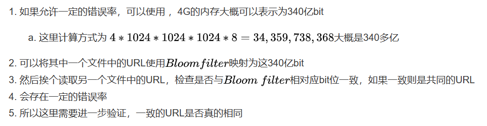
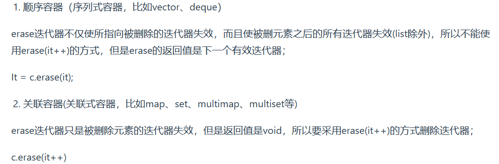
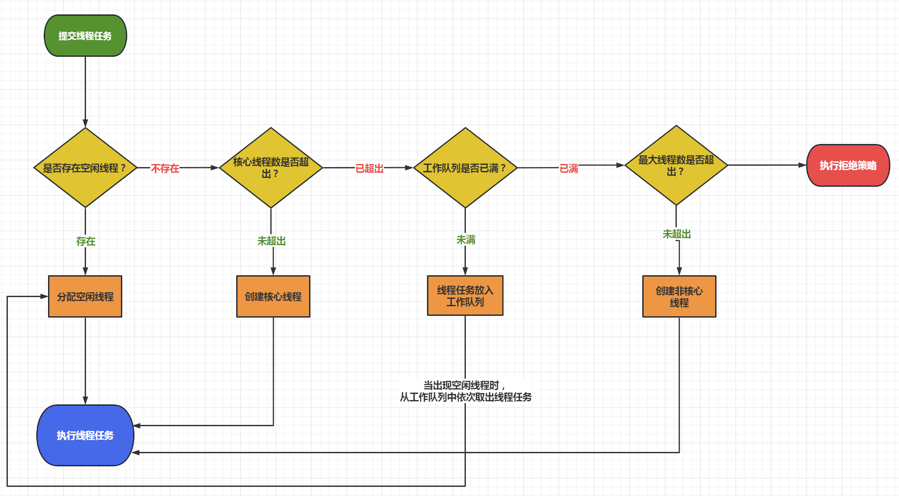

[腾讯微信部门C++实习一面](https://mp.weixin.qq.com/s/265ucFbWtOIA41j37iIFSQ)

https://mp.weixin.qq.com/s/TYMBc8vHDaVdsbveTFNq9g

https://mp.weixin.qq.com/s/wqVfwpGUPTcIZVC4-wxMpA


## 左值右值

[C++知识篇--右值引用_c++ 右值引用-CSDN博客](https://blog.csdn.net/beijixingcd/article/details/126131624)

[右值引用详解_右值引用解决了什么问题-CSDN博客](https://blog.csdn.net/HR_Reborn/article/details/130363997)

1. 区别。2

   能取地址就是左值，否则右值

   

2. 右值分类

   在 C++11 中右值又分为**将亡值（xvalue，eXpiring Value）**，和**纯右值（prvalue，Pure Rvalue）**

   纯右值就是 C++98 的右值，用于辨识临时变量和一些不跟对象关联的值：

   - 非引用返回的函数返回的临时变量值就是一个纯右值；
   - 一些运算表达式，比如 1 + 3 产生的临时变量值，也是纯右值；
   - 而不跟对象关联的字面量值，比如：2、‘c’、true，也是纯右值；
   - 类型转换函数的返回值、lambda 表达式等，也都是右值；

   将亡值则与 C++11 新增的跟右值引用相关的表达式，这样表达式通常是将要被移动的对象（移为他用），比如：

   - 返回右值引用 T&& 的函数返回值；
   - std::move 的返回值；
   - 转换为 T&& 的类型转换函数的返回值；

   

3. 左值引用与右值引用，**都是别名，传参的时候避免拷贝**

   - 左值引用只能指向左值，但是const左值引用可以指向右值
   - 右值引用只能指向右值
   - **被声明出来的左、右值引用都是左值**

4. 右值引用作用：

   - 移动语义：资源的所有权从一个对象转移到另一个对象，避免了不必要的复制。比如：**移动构造**就是基于右值引用（**有些情况下，深拷贝不是必须的**）。

     ```c++
     // 必须深拷贝，因为p，s之后都要用到
     String s;
     String p = s;
     // 会调用一次构造，两次拷贝构造（深拷贝），三次析构 ？？？ 感觉写错了？
     // 但是最后只用到了str，深拷贝多余
     String GetTemp() {return String();}
     int main()
     {
     	String str = GetTemp();
     }
     // 移动语义的使用
         Moveable a;
         Moveable c(move(a));  // a不能再用了，移动拷贝构造后，a的内存已经被c窃取了
     ```

   - 完美转发，主要用于函数模板

     [C++ 完美转发 - 王清河 - 博客园 (cnblogs.com)](https://www.cnblogs.com/wanghao-boke/p/17756937.html)

     函数模板中将参数原封不动地转发给其他函数，同时保留参数的值类别（左值还是右值）

     ```c++
     #include <iostream>
     #include <list>
     
     using namespace std;
     
     void RunCode(int && m) {}
     void RunCode(int &m) {}
     void RunCode(const int && m) {}
     void RunCode(const int & m) {}
     
     template<typename T>
     void PerfectForward(T &&t){RunCode(forward<T>(t));}
     
     int main()
     {
         int a;
         int b;
         const int c = 1;
         const int d = 0;
     
         PerfectForward(a);  // lvalue ref
         PerfectForward(move(b));  // rvalue ref
         PerfectForward(c);  // const lvalue ref
         PerfectForward(move(d)); // const rvalue ref
     }
     ```

     


## c++新特性

1. auto编译器自动推断类型

2. 智能指针

3. nullptr新关键字

   - NULL 来自C，一般宏定义

     c++是整数0，c是(void*)0. c++无法和0区分！

     nullptr可以明确区分整型和指针类型，**根据环境自动转换成相应的指针类型，但是不会被转换为任何整型**

     具体看阿秀

4. 基于范围的for循环简化了语法
5. 右值引用 移动语义，提高性能
6. lambda表达式

## 排行榜

## 海量数据处理场景题

[亿级别大数的排序查找_亿级数据排序-CSDN博客](https://blog.csdn.net/mhywoniu/article/details/105393574)

1. 大量数据排序：外部归并

2. 大量url中找到相同url

   - 

   - 上面还有一种方式，布隆过滤器（bits array 和多个hash函数），节省空间

     布隆过滤器只能增加不能删除；判断是否存在有一定概率误判，如果不存在一定不存在

     

   - 如果只有一个文件，找这个文件中相同的url：类似也是用hash去处理，**重复的url肯定会分到同一个文件中去**，接下来就是找重复的就是了

3. 大量数据找高频词

   哈希取余弄到不同文件中，**相同的在一个文件中**，每个文件取出频率最高的。最后统计所有的，可以维护一个大小为k的小顶堆。

4. 找出访问百度网站最多的ip

   同上，不用堆

5. 大量数据中找出不重复的整数。大量数据中判断一个数是否存在。

   判断**数字是否存在，数字是否重复**，可以用**位图**


## 位图

[海量数据处理之 Bit-map 详细讲解-CSDN博客](https://blog.csdn.net/wuhuayangs/article/details/122730567)

以bit为单位标记数据，**节省空间**

存储方式、添加、删除操作看链接

**作用：**

- ==**排序**==

  

  排序数据不能重复，数据比较密集有优势

- ==快速查询==

  假设用的是int数组存，首先我们先对所有的数字进行一次遍历，然后将相应的转态位改为 1。遍历完以后就是查询，由于我们的 Bit-map 采取的是连续存储（int 数组中的一个元素是 4 字节占 32 位），我们实际上是采用了一种分桶的思想。**一个数组元素可以存储32个状态位，那将待查询的数字除以32，定位到对应的数组元素（桶），然后再求余（%32）**，就可以定位到相应的状态位。如果为 1，则代表该数字存在，否则，该数字不存在。

- ==快速去重==

  如何从 20 亿个整数中找出不重复的整数的个数，前提是内存不足以容纳这 20 亿个整数，那么你会用什么办法？ **一个数字两个bit存**

  

## stl

[【C++基础】STL容器面试题分享一定要看！！！！](https://blog.csdn.net/weixin_62892290/article/details/136458681)

### pushbach emplaceback

push_back: 先构造一个对象再拷贝进末尾。如果传入是左值：构造+拷贝构造；传入是右值（临时对象/调用move）：构造+移动构造。

```c++
// 1. 构造+拷贝构造
BaseClassTwoPara b1(1, 2);
vl.push_back(b1);
// 2. 传入临时对象。构造+移动构造
vl.push_back(BaseClassTwoPara(1,2));
// 3. 调用move。构造+移动构造
BaseClassTwoPara b1(1, 2);
vl.push_back(std::move(b1))
```

emplace_back:支持直接将构造函数所需的参数传递过去，这种方式直接在容器的尾部构造。（否则和pushback差不多）。**避免了临时对象的创建**。

### vector和list区别：

vector和list的不同点：
1.底层结构：
vector是一段连续的空间，用动态[顺序表](https://so.csdn.net/so/search?q=顺序表&spm=1001.2101.3001.7020)实现，而list是一个带头结点的双向链表（环状）；

2.是否支持随机访问：
vector支持**随机访问**，list不支持随机访问
vector能进行高效的随机存取操作，时间复杂度为O(1)（随机）;list是通过指针访问数据，不能随机访问，时间复杂度为O(n)。

3.**任意位置**插入和删除元素的效率：
vector中效率低，[时间复杂度](https://so.csdn.net/so/search?q=时间复杂度&spm=1001.2101.3001.7020)为O(n），list中效率高，时间复杂度为O(1）

原因在于vector中插入元素时，从插入位置开始所有元素都要往后移动一位，还可能需要增容，申请新的空间，拷贝原来的空间的内容，再释放原有的空间，增容代价高，而删除一个元素，从删除位置的下一位开始所有元素都要向前移动一位；list中增加和删除节点只需要改变指针的指向，申请和释放单个元素的空间，代价相对较小。

4.空间利用率
vector底层为连续空间，不容易造成内存碎片，空间利用率高，缓存利用率高；
list底层节点动态开辟，小节点容易造成内存碎片，空间利用率低，缓存利用率低；

5.迭代器 感觉说的不太对迭代器是模板类
**vector中的迭代器是原生态指针，也就是元素类型的指针；**
**list中的迭代器是对原生态指针(节点指针)的封装；**

list对++重载了：

```c++
self& operator++() //前置++
		{
			_node = _node->next;
			return *this;
		}
		self operator++(int) //后置++
		{
			self temp(*this);
			_node = _node->next;

			return temp;//返回的是++之前的位置，也就是原来的位置，但是迭代器已经向后移动了
		}
```


6.迭代器失效
vector:
vector中插入元素有可能需要增容，**迭代器指向的之前的空间会被释放**，之前的迭代器会失效；

删除元素也会导致迭代器失效:

>  对于删除元素的操作，并不会发生底层空间的改变，看似迭代器还指向着原来的位置，没有发生什么问题。但迭代器是和空间绑定的吗？并不是的，迭代器绑定的对象应该是元素！那么通过迭代器删除元素之后，迭代器本来指向的元素已经消失，此时指向的只是因为补齐而来的元素。那么，就出现了两个问题：（1）删除操作完成后，迭代器若++，便跳过了补齐来的元素(这个也不一定是问题，代码写法可以解决)。（2）而如果删除的是最后一个元素，补齐来的元素是end，而end没有数据，解引用时便会报错。
>
> 

list:

中插入元素只是添加了一个新的节点，不会导致之前存在的迭代器失效，而删除元素只会导致当前迭代器失效，其他迭代器不会受到影响；



7.使用场景
vector适用于需要高速存储的，支持随机访问的，不关心插入删除效率的场景；
list适用于需要进行大量插入和删除操作的，**不关心随机访问的场景**

### deque

双端队列


头插尾插效率高o(1)


### vector扩容

- 如果已满，在新增数据的时候，**就要分配⼀块更⼤的内存，将原来的数据复制过来，释放之前的内存**，在插入新增的元素 ，所以对vector的任何操作，⼀旦引起空间新配置，指向原vector的所有迭代器就都失效了

  ```c++
  int main() {
  	std::vector<int> arr;
  	arr.emplace_back(1);
  
  	auto it = arr.begin();
  	auto it2 = arr.end();
  	std::cout << *it << "\t" << *(--it2) << std::endl;
  
  	arr.emplace_back(2);
  	std::cout << *it << "\t" << *(--it2) << std::endl; // 无输出
  
  	return 0;
  }
  
  ```

- **size()** **和** **capacity()** 

- **resize()和reserve()** 

   

- 扩容机制
  不同编译器在vector的扩容策略上显然不太一致，在vector的size()(当前容器所用空间)等于capacity()(当前容器总空间)时会发生扩容。

  不同的的编译器实现方式不同,vs编译器每次是以1.5倍且向下取整的策略进行扩容，gcc编译器则是每次以2.0倍的策略进行扩容。
  ==**所以为了提高内存利用率，减少扩容次数，每次扩容的倍数应该在[1.5，2]之间更合适**==

  

- 由于动态增长会影响会影响效率，可以事先调用reserve分配空间

### sort 

STL的sort函数在**数据量大时采用快排**，分段递归排序，一旦分段后的数据小于某个值，就改用**插入排序**。如果递归层次过深，还会改用**堆排序**。这样就结合了各类算法的所有优点。

## 数据结构

### 排序算法


- 归并：


```c++
void merge(vector<int>& num, int left, int mid, int right) {
	int i = left, j = mid + 1;
	int count = 0;
	vector<int> tmp(right - left + 1);
	while (i <= mid && j <= right) {
		if (num[i] <= num[j]) {
			tmp[count++] = num[i++];
		} else {
			tmp[count++] = num[j++];
		}
	}
	while (i <= mid) {
		tmp[count++] = num[i++];
	}
	while (j <= right) {
		tmp[count++] = num[j++];
	}
	int flag = 0;
	for (int k = left; k <= right; ++k) {
		num[k] = tmp[flag++];
	}
	
}
void mergeSort(vector<int>& num, int left, int right) {
	if (left >= right) return;
	int mid = left + (right - left) / 2;

	mergeSort(num, left, mid);
	mergeSort(num, mid + 1, right);
	merge(num, left, mid, right);
}
```

- 快排

  [[排序算法\] 快速排序 (C++) (含三种写法) - MarisaMagic - 博客园](https://www.cnblogs.com/MarisaMagic/p/16909610.html)

  最好：**在理想的情况下，我们选取的轴刚好就是这个区间的中位数**。（复杂度还是nlogn）

  最坏：一般数组有序的情况 ，**选取的轴刚好就是这个区间的最大值或者最小值**
  
  **==辅助空间复杂度==**每趟排序需要一个辅助空间，辅助空间和趟数有关，最好情况是log2 n ，最差的情况是n。
  
  ```c++
  int partition(vector<int>& num, int left, int right) {
  	int flag = num[left];
  	int i = left, j = right;
  	while (i < j) {
  		while (i < j && num[j] >= flag) --j;
  		num[i] = num[j];
  		while (i < j && num[i] <= flag) ++i;
  		num[j] = num[i];
  	}
  	num[i] = flag;
  	return i;
  }
  
  void quickSelect(vector<int>& num, int left, int right) {
  	if (left >= right) return;
  	int i = partition(num, left, right);
	quickSelect(num, left, i - 1);
  	quickSelect(num, i + 1, right);
  }
  ```
  
  

### 哈希

key值映射到表中一个位置来访问记录，以加快查找的速度。这个映射函数叫做哈希函数，存放记录的数组叫做哈希表。

时间复杂度：平均情况下插入删除查找**O(1)**

哈希冲突解决：

- **开放地址法**：找一个新的空闲地址
  - 线性探测：冲突发生时，顺序查看表中下一单元，直到找出一个空单元或查遍全表。
  - 二次探测：增量d为$1^{2}$ 、$-1^{2}$、$2^{2}$、$-2^{2}$ 、 ….表的左右进行跳跃式探测，比较灵活
- **再哈希**:同时构造多个不同的哈希函数，等发生哈希冲突时就使用第二个、第三个……等其他的哈希函数计算地址，直到不发生冲突为止。虽然不易发生聚集，但是增加了计算时间。
- **链地址法**：将所有哈希地址相同的记录都链接在同一链表中。当链表过长会将链表转成红黑树以实现O(logn)时间复杂度内查找.


作者：IT妹子
链接：https://www.zhihu.com/question/637030924/answer/3384509798
来源：知乎
著作权归作者所有。商业转载请联系作者获得授权，非商业转载请注明出处。


ConcurrentHashMap 是 Java 并发包中提供的线程安全的哈希表实现，它通过一些机制来确保在多线程环境中的线程安全性：

1. **分段锁（Segment）**：ConcurrentHashMap 内部分为多个 Segment，每个 Segment 代表一个独立的哈希表，每个 Segment 都可以看作是一个小的 ConcurrentHashMap。不同的线程可以同时操作不同的 Segment，从而减小了锁的粒度，提高了并发度。
2. **使用 volatile 修饰数组和链表**：ConcurrentHashMap 内部使用 volatile 修饰数组和链表的引用，确保了多线程环境下的可见性。
3. **使用 CAS 操作（Compare and Swap）**：ConcurrentHashMap 中的操作大多采用了 CAS 操作，通过原子性地比较并交换来实现对数组和链表的操作，从而避免了使用传统的锁机制，提高了并发性能。
4. **扩容机制**：ConcurrentHashMap 在进行扩容时，只会对部分 Segment 进行扩容，而不是对整个哈希表进行扩容，减少了扩容操作对整个数据结构的影响。

ConcurrentHashMap 在多线程环境中保证线程安全性的核心思想是通过分段锁、volatile 关键字、CAS 操作等技术手段来保护并发访问，从而提高了并发访问的效率和性能。

### 二叉平衡树AVL

二叉查找树：左边比根小，右边比根大。但是可能出现树不平衡的情况。

平衡二叉树特点：

- 拥有二叉查找树的全部特性。
- 每个节点的左子树和右子树的高度差至多等于1。

平衡二叉树这种高度差为 1 的要求太严格了，尤其是对于频繁删除、插入的场景非常浪费时间

### 红黑树

 O(logN) 时间内完成查找、增加、删除等操作

- 每个节点要么是黑色要么是红色
- 根节点是黑色
- 每个叶子节点是黑色，并且为空节点
- 红色结点的两个子结点必须都是黑色的，这保证了**没有两个连续的红色节点相连**
- 从一个节点到该节点的子孙节点的所有路径上包含相同数目的黑节点。

==满足上面的性质红黑树就能保证：其最长路径中结点个数不会超过最短路径结点个数的两倍（最短路径就是全黑节点，最长路径就是一个红节点一个黑节点，当从根节点到叶子节点的路径上黑色节点相同时，最长路径刚好是最短路径的两倍）==

### 堆

一般来说，我们会让堆是一棵**完全二叉树（Complete Binary Tree）**，完全二叉树就是除了最后一层以外每一层均填满，而且最后一层从左至右地填满。

最大堆：任意节点的值大于或等于其子节点的值，根节点最大


堆的插入log(n)：

> 先将元素加入到末尾，然后shiftup

堆的删除log(n)：

> 一般是删除根节点，只需要将根节点的值与最后一个节点交换，去掉最后一个节点，然后对根节点shiftdown

修改操作log(n):

>  修改后根据情况shiftup或者shiftdown

建堆o(n):

> 有两种：向下调整和向上调整。[带你了解建堆的时间复杂度_请证明建立大根堆的时间复杂度为n-CSDN博客](https://blog.csdn.net/m0_73740682/article/details/132382954)
>
> 向下调整算法有一个前提：左右子树必须是一个堆，才能调整。
>
> ==一般使用向下调整，时间复杂度o(n),从第一个非叶子结点开始==。

堆满了怎么插入元素呢：

> 先pop堆顶

==堆排序o(nlogn)==

>将待排序序列构造成一个大顶堆，此时，整个序列的最大值就是堆顶的根节点。将其与末尾元素进行交换，此时末尾就为最大值。然后将剩余n-1个元素重新构造成一个堆，这样会得到n个元素的次小值。如此反复执行，便能得到一个有序序列了。

### 跳表

跳跃表在插入、删除和查找操作的[平均时间复杂度](https://so.csdn.net/so/search?q=平均时间复杂度&spm=1001.2101.3001.7020)都是 O(log n)

跳表在原来的有序链表上加上了多级索引，通过索引来快速查找；可以支持快速的删除、插入和查找操作。


[跳表（Skip List）-CSDN博客](https://blog.csdn.net/weixin_45480785/article/details/116293416)

## C++代码到程序执行过程

相关问题：

- c++ 代码到程序的执行过程。
- 运行一个 exe 程序详细流程。
- `C++` 的编译从源码到可执行文件中间的步骤有哪些呢？
- 你了解 G++ 在编译的时候的 `o(1)`、`O(2)`、`O(3)` 这些优化有什么区别吗

from gpt：C++ 编译的过程从**源码到可执行文件**经历了多个步骤，主要包括预处理、编译、汇编、链接等阶段。以下是这些步骤的概述：

1. 预处理（Preprocessing）：
   - 预处理阶段是在编译之前的一个独立阶段。主要任务包括处理 **`#include` 指令，宏替换，条件编译**（`#if`, `#ifdef`, `#ifndef` 等）等。预处理器会生成一个经过预处理的文件，通常以 `.i` 或 `.ii` 为扩展名。
     `g++ -E source.cpp -o source.ii`
2. 编译（Compilation）：
   - 编译阶段将预处理后的文件翻译成汇编语言。这个阶段产生的文件通常以 `.s` 或 `.asm` 为扩展名。编译器会**对源代码进行语法分析、词法分析**，生成**汇编代码**。
     `g++ -S source.ii -o source.s`
3. 汇编（Assembly）：
   - 汇编器将汇编代码**翻译成机器码，生成目标文件**。目标文件通常以 `.o`、`.obj`、`.co` 等为扩展名。
     `g++ -c source.s -o source.o`
4. 链接（Linking）：
   - 链接阶段将**目标文件和库文件链接**在一起，**生成最终的可执行文件**。链接器的任务包括解析符号引用、符号表的建立、地址重定位等。生成的可执行文件通常没有特定的扩展名。
     `g++ source.o -o executable`


## 函数指针

声明：返回类型 （*指针变量名）（参数列表）

```c++
int fun1(int bh, string str);
int fun2(int no, string hh);
int fun3(int id, string info);

// 函数指针的声明
int (*pf)(int, string)
```

使用

```c++
void func(int a, string b) {
    
}
int main() {
    int a = 1;
    string b = "hi";
    
    func(a, b);
    
    void (*pfunc)(int, sring); // 声明函数指针
    pfunc = func; // 对函数指针复制，语法：函数指针名=函数名  pfunc = &func也可以
    pfunc(a, b); // 用函数指针名调用函数
    (*pfunc)(a, b); // c语言
}
```


## struct class区别

- struct默认公有，class默认私有
- struct默认公有继承，class默认private继承
- **`class`**：通常用于定义复杂的数据结构和抽象数据类型。`class`不仅可以存储数据，还可以定义操作这些数据的函数，支持封装、继承和多态等面向对象编程的特性。

## const关键字

**修饰变量**：此时变量视为只读变量，不能被修改；（下面的问题是如何修改这个变量）

```
const int MAX_VALUE = 100;
```

**修饰函数**：可以用来修改函数的**参数**，表示函数不会修改这个参数，也可以修改函数的**返回值**，表示函数的返回值只读，不能被修改；

**修饰指针**：修饰指针有三种情况

​	const修饰指针   --- 常量指针

```c++
const int* a = &temp; // 指针指向的值不能修改
```

​    const修饰常量   --- 指针常量

```c++
int* const a = &temp; // 指针的指向不能修改
```

​    const即修饰指针，又修饰常量

**常量引用**：常量引用是指引用一个只读变量的引用，因此不能通过常量引用修改变量的值。

**修饰成员函数,常函数**：成员函数加const，不可修改成员变量（除非加mutable）

**修饰对象：常对象只能调用常函数**

## static关键字

1. 静态成员变量

- 所有对象共享
- 类内声明，类外定义，以分配存储空间（编译阶段分配内存）
- 访问方式：p.m_a 或 Person::m_a

```c++
class ExampleClass {
public:
 static int staticVar; // 静态成员变ᰁ声明
};
// 静态成员变ᰁ定义
int ExampleClass::staticVar = 0;
```


2.  静态成员函数

- 所有对象共享一个函数
- **静态成员函数只能访问静态成员变量：因为static是类的，不是对象的，不具有this指针**
- p.func() 或 Person::func()


3. 静态局部变量

- 函数内部使用static修饰的局部变量
- **函数内部声明的，但其生命周期跨越整个程序运行期**，默认初始化0，只在声明它的函数内可⻅
- 仅第一次调用函数时初始化，之后保持其值

```c++
void exampleFunction() {
 static int localVar = 0; // 静态局部变
 localVar++;
 cout << "LocalVar: " << localVar << endl;
}
```

## define inline typedef

define宏定义：

- 在**预处理**时进行简单的[字符串替换](https://so.csdn.net/so/search?q=字符串替换&spm=1001.2101.3001.7020)，没有类型检查.

typedef：

- 已有的数据类型创建别名

- **编译时**处理
- 有类型检查
- 有自己的作用域

inline：

编译时C++编译器会在调用内联函数的地方插入函数体。**减小函数调用开销**。

## ++i不是原子操作 && volatile

其实是分3步执行的，读取i的值，增加i的值，回写i的新值


## volatile constexpr

`volatile` 是一个关键字，**用来告诉编译器对访问该变量的代码就不再进行优化，系统**总是重新从它所在的**内存读取数据**

编译器优化级别较高的时候,就有可能将一些变量设置进**寄存器里面**

这个例子说的好：[C++中的volatile关键字及其作用_C 语言_脚本之家 (jb51.net)](https://www.jb51.net/article/281558.htm)

比如多线程环境下的共享变量

当多个线程共享同一个变量时，如果这个变量没有使用volatile关键字，会导致编译器在优化时将该变量缓存在寄存器中，而不是直接从内存中访问。这样可能导致一个线程修改了该变量的值，但另一个线程仍然读取的是缓存中的旧值。


[多线程情况下volatile 也提到了atomic](https://blog.csdn.net/MrHHHHHH/article/details/134867129)

*CAS 必须**借助 volatile 才能读取到共享变量的最新值**来实现【比较并交换】的效果。*

CAS 是直接读写内存的, 而不是操作寄存器

## atomic

## new &malloc、delete &free


补充：new自由存储区为对象分配空间，malloc从堆上分配内存

new数组：

```c++
int *arr = new int[10];
delete[] arr;
```


delete & free：

- delete是c++运算符，free是库函数
- delete会调用对象的析构函数，free只是简单释放内存块

[原理](https://blog.csdn.net/weixin_43202635/article/details/107781926)

## 大小端

小端：低字节放在低地址（视觉上反着）

大端：低字节放在高地址，网络字节序大端

```c++
int main() {
	int a = 1;
	char* p = (char*) & a;//char* -- 访问一个字节（第一个地址）
	if (*p == 1)
	{
		printf("小端\n");
	}
	else
	{
		printf("大端\n");
	}
	return 0;
}
```


## 4种强制类型转换

1. static_cast没有运行时类型检查来保证转换的安全性

- 基础数据类型转换

  ```
  double d = 5.5;
  int i = static_cast<int>(d);  // i = 5
  ```

- 上行转换安全，指向派生类的指针或引用转换为指向基类的指针或引用

```c++
int n = 5;
float m = 8.0;
n = static_cast<int>(float);

class Father{
};
class Son: public Father{
};
pFather = static_cast<Father*>(pSon);// 上行转换安全，子类包含内容多于父类
```

- 把空指针转换成目标类型的空指针。
- 把任何类型的表达式转换成void类型

2. dynamic_cast有类型检查

- 具有**虚函数的基类**与**派生类**之间的**指针或引用**的转换，运行时检测转换是否安全。
- 转型不成功会返回空指针。上行下行转换都可以，但是上行更推荐static_cast,因为dynamic有额外开销

```c++

#include <iostream>
#include <string>

//基类与派生类之间的转换

class CFather
{
public:
	CFather() {
		m_nTest = 3;
	}

	virtual void foo() {
		std::cout << "CFather()::void foo()" << std::endl;
	}

	int m_nTest;
};

class CSon : public CFather
{
public:
	virtual void foo() {
		std::cout << "CSon::void foo()" << std::endl;
	}
	
	int m_nSon;
};

int main() {

	CFather f;
	CSon s;
	CFather* pFather = &f;
	CSon* pSon = &s;

	//向下转换，父类转子类,不安全
	//父类：虚表+成员变量共8个字节,转换为子类后就会认为有12个字节
	//编译器判断其为子类型，因此在做赋值时就会越界：出父类内存边界
	//运行时才会发现
	pSon = static_cast<CSon*>(pFather);
	pSon->m_nSon = 123;

	//向上转换，子类转父类,安全
	pFather = static_cast<CFather*>(pSon);
}
```


3. reinterpret_cast: 类型之间进行强制转换
4. const_cast:常量指针转换为⾮常量指针，并且仍然指向原来的对象。常量引⽤被转换为⾮常量引⽤，并且仍然指向原来的对象。去掉类型的const或volatile属性

## 堆栈区别


1. 空间分配：栈操作系统自动分配释放，存放**函数的参数值**，**局部变量**的值等；堆由程序员分配释放
2. 内存管理：
   - 栈：一块连续的内存区域，操作系统预定好的。只要栈的剩余空间大于分配的空间，。。，否则提示栈溢出。栈的空间一般几M。
   - 堆：记录空闲内存地址的链表。是不连续的内存空间。一般几G。
3. 生长方向：相反
4. 堆容易有空间碎片
5. 效率上栈快

## 进程的地址空间分布

[4.6 深入理解 Linux 虚拟内存管理 | 小林coding (xiaolincoding.com)](https://xiaolincoding.com/os/3_memory/linux_mem.html#_3-进程虚拟内存空间)

假设4G(32位)的虚拟地址空间。**所有进程的内核区都会被映射到物理内存中相同的位置（因为内核只有一个）**


**从低地址到高地址，一个程序由代码段、数据段、BSS 段、堆栈段组成。**

1. **代码段**：存放程序**执行代码**的一块内存区域。只读，**不允许修改**，代码段的头部还会包含一些**只读的常量**，如**字符串常量字面值**（注意：**const 变量**虽然属于常量，但是本质还是变量，不存储于代码段）。
2. **数据段 data**：存放程序中**已初始化**的**全局变量**和**静态变量**的一块内存区域。
3. **BSS** 段：存放程序中**未初始化**的**全局变量**和**静态变量**的一块内存区域。
4. 可执行程序在运行时又会多出两个区域：**堆区**和**栈区。**

- **堆区**：动态申请内存用。堆从低地址向高地址增长。
- **栈区**：存储**局部变量**、**函数参数值**。栈从高地址向低地址增长。是一块连续的空间。

5. 最后还有一个**文件映射区（共享区）**，位于堆和栈之间。

## c++内存分区

### 临时变量是存在哪里的?

1. **函数内部的临时变量**：在函数内部声明的临时变量通常存储在栈上。当函数调用时，会为这些临时变量分配内存，当函数返回时，这些临时变量所占用的内存会被释放。
2. **表达式中的临时变量**：在表达式计算过程中产生的临时变量通常存储在**寄存器**中，这样可以提高计算速度。对于无法存储在寄存器中的较大的临时变量，可能会存储在栈上。
3. **全局临时变量**：如果临时变量是全局的，则存储在静态存储区。这些变量在程序运行期间一直存在，不会随着函数的调用而分配和释放。


c++运行时，内存被分成几个不同的区域：


栈：局部变量、函数参数等，函数调用结束自动释放。**栈内存分配运算内置于处理器的指令集中，效率很高，但是分配的内存容量有限**

堆：new malloc分配的内存快，手动释放，否则操作系统会自动回收

全局/静态存储区：全局变量 静态变量。程序**编译时已分配。**

常量区  代码区

## 堆快一点还是栈快一点？（字节提前批一面）

**栈内存分配运算内置于处理器的指令集中，效率很高，但是分配的内存容量有限**

**栈快一点**。因为操作系统会在底层对栈提供支持，会分配专门的寄存器存放栈的地址，栈的入栈出栈操作也十分简单，并且有专门的指令执行，所以栈的效率比较高也比较快。

而堆的操作是由C/C++函数库提供的，在分配堆内存的时候需要一定的算法寻找合适大小的内存。并且获取堆的内容需要两次访问，第一次访问指针，第二次根据指针保存的地址访问内存，因此堆比较慢。

## 内存泄露

程序没有释放不再使用的内存

可以用valgrind工具检查

如果基类析构函数不被声明为虚函数，并且我们使用父类指针指向子类对象并删除该指针时，么⼦类的析构函数将不会被调⽤，⼦类的资源没有正确是释放，因此造成内存泄露

**如何防⽌内存泄露**：智能指针，可以自动管理内存的生命周期，当不再需要时会自动释放内存，从而避免内存泄漏；内存的分配封装在类中，构造函数分配内存，析构函数释放内存（不过注意前面说的问题，虚基类）

### 避免内存泄漏的方法有哪些?

1. 手动释放内存：在动态分配内存后，确保在不再需要使用时及时释放。使用`delete`或`delete[]`释放对应的内存。
2. 使用智能指针：使用智能指针管理动态分配的内存，可以避免忘记释放内存的问题。C++11引入的`std::shared_ptr`和`std::unique_ptr`是两种常用的智能指针，它们会在对象不再需要时自动释放内存。
3. 避免循环引用：如果使用`std::shared_ptr`管理对象，要注意避免循环引用，即两个对象互相持有对方的`shared_ptr`，导致对象无法释放。
4. RAII（资源获取即初始化）：使用RAII管理资源，即在对象构造时分配资源，在对象析构时释放资源。通过RAII，可以确保资源在对象不再需要时被正确释放。
5. 内存检测工具：使用内存检测工具（如Valgrind、Dr.Memory等）来检测内存泄漏问题，及时发现并修复潜在的内存泄漏。
6. 一定要将基类的析构函数声明为**虚函数**


## 智能指针

### 数据成员

shared_ptr:

- 一个指针指向原始数据
- 一个指针指针指向引用控制块（引用计数器、自定义删除器、自定义适配器 如果有的话）


[线程安全高赞](https://www.zhihu.com/question/56836057)：

在多线程环境下，管理同一个数据的shared_ptr在进行计数的增加或减少的时候是线程安全的

**总结：shared_ptr 的引用计数本身是线程安全且无锁的，但 shared_ptr 对象本身的读写则不是**

- 修改指向是否线程安全，两种情况：（只用说这个就行了，我感觉上面和下面的第二条重复了）
  - **多线程代码操作的是同一个shared_ptr的对象，如果会修改指向不安全**
    - 
  - **多线程代码操作的不是同一个shared_ptr的对象，管理的是同一份数据**，用的是同一个引用计数。当发生多线程中修改sp指向的操作的时候，是不会出现非预期的异常行为的。

总结：

多线程环境下，调用不同的 shared_ptr 实例的成员函数是不需要额外的同步手段的，即使这些 shared_ptr 管理的是相同的对象。

多线程对于同一个 shared_ptr 实例的读操作（访问）可以保证线程安全；但对于同一个 shared_ptr 实例的写操作（改变一个 shared_ptr 指向的对象）则需要同步，否则会发生 race condition。即 shared_ptr 的引用计数本身是线程安全且无锁的，但 shared_ptr 对象本身的读写则不是，因为 shared_ptr 有两个数据成员，读写操作不能原子化：

- 多个线程可以同时读取一个 shared_ptr 对象；

- 多个线程同时读写一个 shared_ptr 对象，则需要加锁。

以上讨论是 shared_ptr 对象本身的线程安全级别，而非其管理的对象的安全级别，shared_ptr 所管理的对象的并发操作是否为线程安全的，取决于具体所管理的对象，必要时需要使用一些同步手段加以保证。


shared_ptr在64位是8字节

1. 你知道智能指针吗？原理

- **模板类**，类的构造函数中传入一个普通指针，析构函数释放指针。对象在生命周期结束时会自动调用析构函数，这样不用手动释放内存了。**防止内存泄露**

2. unique_ptr

- 同时只有一个unique_ptr指向同一个对象。unique_ptr被销毁时，指向的对象也被销毁。

- **禁用赋值、拷贝构造函数**，防止两个unique_ptr指向同一个对象

```c++
unique_ptr(const unique_ptr&) noexcept = delete;
unique_ptr& operator=(const unique&) noexcept=delete;
```

- 支持**移动语义**，可以**交出控制权**

```c++
unique_ptr(const unique_ptr &&) noexcept;// 移动构造
unique& operator=(const unique_ptr &&) noexcept;// 移动赋值
```

```c++
unique_ptr<Test> tPtr1(new Test());
unique_ptr<Test> tPtr3(std::move(tPtr1));
```

- 自实现:[参考](https://blog.csdn.net/yizhiniu_xuyw/article/details/118151175)

```c++
template<typename T>
class UniquePtr {
private:
    T* ptr_;
public:
    // 构造函数：explicit构造函数是用来防止隐式转换, 即不允许写成unique_ptr<T> tempPtr = T;
    explicit UniquePtr(T* ptr) noexcept: ptr_(ptr){}
    // 析构函数
    ~UniquePtr() noexcept{
        delete ptr_;
        ptr_ = nullptr; // 防止野指针
    }
    // 禁用拷贝构造、移动构造
    UniquePtr(const UniquePtr &) noexcept = delete;
    UniquePtr& operator=(const UniquePtr &) noexcept = delete;
    
    // 移动构造
    UniquePtr(UniquePtr &&p) noexcept {
        p.swap(*this);
    }
    // 移动赋值
    UniquePtr& operator=(Unique &&p) noexcept {
        p.swap(*this);
        return *this;
    }
    // 重载
    T& operator*() noexcept {
        return *ptr_;
    }
    T* operator->() noexcept {
        return ptr_;
    }
    // release释放对原始指针的控制权，返回管理的指针
    T* release() noexcept {
        T* res = ptr_;
        ptr_ = nullptr;
        return res;
    }
    T* get() const noexcept {
        return ptr_;
    }
    //释放原来指向的资源对象，同时指向新的对象
    void reset(T* ptr) noexcept {
        delete ptr_;
		ptr_ = nullptr;
		std::swap(ptr_, ptr);
    }
    // 交换两个管理的指针
    void swap(Unique &p) noexcept {
        std::swap(ptr_, p.ptr_);
    }
}
```

2. shared_ptr

- **引用计数**，允许多个智能指针指向同一个对象。每当多一个指针指向该对象时，指向该对象的所有智能指针内部的引用计数加1，每当减少一个智能指针指向对象时，引用计数会减1，当计数为0的时候会自动的释放动态分配的资源。
- shared_ptr是线程安全的吗：（shared_ptr）的引用计数本身是安全且无锁的，但对象的读写则不是。
- 引用计数变化:==引用计数用指针==

```c++
#include <iostream>
#include <memory>

int main() {
   
    // 创建 shared_ptr
    std::shared_ptr<int> sp1 = std::make_shared<int>(10);
    std::cout << "sp1 reference count: " << sp1.use_count() << std::endl;  // 输出：1

    // 创建一个 shared_ptr 并复制给 sp2
    std::shared_ptr<int> sp2 = sp1;
    std::cout << "sp1 reference count after assigning to sp2: " << sp1.use_count() << std::endl;  // 输出：2
    std::cout << "sp2 reference count: " << sp2.use_count() << std::endl;  // 输出：2

    // 创建一个新的 shared_ptr 并赋值给 sp3
    std::shared_ptr<int> sp3;
    sp3 = sp1;
    std::cout << "sp1 reference count after assigning to sp3: " << sp1.use_count() << std::endl;  // 输出：3

    // 重置 sp2，断开与原对象的关联
    sp2.reset();
    std::cout << "sp1 reference count after sp2 reset: " << sp1.use_count() << std::endl;  // 输出：2

    // sp3 离开其作用域
    {
   
        std::shared_ptr<int> sp3_local = sp1;
        std::cout << "sp1 reference count inside scope: " << sp1.use_count() << std::endl;  // 输出：3
    }

    std::cout << "sp1 reference count after scope: " << sp1.use_count() << std::endl;  // 输出：2

    return 0;
}
```

- 自实现：==引用计数用指针，引用计数这一变量的存储，是在堆上的==

```c++
#include <iostream>
#include <vector>
#include <unordered_set>

template <typename T>
class shared_ptr {
private:
    T* ptr;
    int* ref_count;
    void release() {
        if (ref_count) {
            --(*ref_count);
            if (*ref_count == 0) {
                delete ptr;
                delete ref_count;
                ptr = nullptr;
            	ref_count = nullptr;
            }
        }
    }

public:
    shared_ptr() : ptr(nullptr), ref_count(nullptr) {}
    shared_ptr(T* p) : ptr(p), ref_count(new int(1)) {}
    shared_ptr(const shared_ptr& other) : ptr(other.ptr), ref_count(other.ref_count) {
        if (ref_count) {
            ++(*ref_count);
        }
    }
    ~shared_ptr() {
        release();
    }
    shared_ptr& operator=(const shared_ptr& other) {
        if (this != &other) {
            release();
            ptr = other.ptr;
            ref_count = other.ref_count;
            if (ref_count) {
                ++(*ref_count);
            }
        }
        return *this;
    }

    T* get() const {
        return ptr;
    }

    int use_count() const {
        return ref_count ? *ref_count : 0;
    }

    void reset() {
        release();
    }

    void reset(T* p) {
        release();
        ptr = p;
        ref_count = new int(1);
    }

    T& operator*() const {
        return *ptr;
    }

    T* operator->() const {
        return ptr;
    }
};

class MyClass {
public:
    MyClass() {
        std::cout << "MyClass constructor" << std::endl;
    }
    ~MyClass() {
        std::cout << "MyClass destructor" << std::endl;
    }
    void hello() {
        std::cout << "Hello, world!" << std::endl;
    }
};

int main() {
    shared_ptr<MyClass> ptr1(new MyClass());
    shared_ptr<MyClass> ptr2 = ptr1;
    std::cout << "ptr1 use count: " << ptr1.use_count() << std::endl;
    std::cout << "ptr2 use count: " << ptr2.use_count() << std::endl;
    ptr1->hello();
    ptr2.reset();
    std::cout << "ptr1 use count: " << ptr1.use_count() << std::endl;
    std::cout << "ptr2 use count: " << ptr2.use_count() << std::endl;
    return 0;
}
```

[智能指针循环引用图解秒懂-CSDN博客](https://blog.csdn.net/weixin_43796685/article/details/104297360)


## 野指针&悬浮指针

两者概念不同地方说法不同，但我觉得本质一样

1. 野指针：没有初始过的指针，它指向内存中的任意一个空间

2. 悬浮指针

指针释放：**释放的是指向的内存里的值**， 释放后指针依旧指向该内存空间

悬浮指针：指向已经被释放/无效的内存地址的指针

避免：

- delete后置null
- 避免返回局部变量的指针
- 智能指针

产生情况：

```c++
// 1. 释放后没有置空指针
int *ptr = new int(3);
delete ptr;// 此时的ptr是野指针，指向了已经被释放的内存
ptr = nullptr;
// 2. 返回局部变量的指针
int* func() {
    int x = 10;
    return &x; // x是局部变量，函数结束后x销毁，返回的指针成为野指针
}
// 3. 函数参数指针被释放
void foo(int *ptr) {
    delete ptr;
}
int main() {
    int* ptr = new int(3);
    foo(ptr); // 在foo中ptr指向的空间被释放，但在main中ptr可用，成为野指针
}
```

## 内存对齐

[讲的很清楚](https://blog.csdn.net/weixin_45031801/article/details/136490540)

关键点总结：

- 为什么要内存对齐：
  - CPU 在读取内存的时候是一块一块进行读取到寄存器中处理的。**内存对齐是拿空间来换取时间**的做法 。（比如：如假设cpu一次读4个字节，现在存了一个char和int,要读取int，它存在1-4，得先读0-3，再读4-7，再删除0，5，6，7，最后合并1234，效率太低，若是内存对齐的,他就会存在4-7，一次就读取）

- 

## 实现内存拷贝strcpy函数、strlen、strcat、strcmp

```c++
char* strcpy(char* dst, const char* src) { // 1
	assert(dst != NULL && src != NULL); // 2
    char* res = dst; // 3
    while((*dst++ = *src++)!= '\0'); // 4
    return res; // 5
}
```

1. src用const修饰，不可更改
2. 空指针检查
3. 5.  返回目标字符串的地址
4. 字符串的末尾正确加上了'\0'


```c++
int strlen(char* dst) {
	assert(dst != NULL);
	int len = 0;
    while ((*dst++)!='\0') {
        ++len
    }
    return len;
}

char* strcat(char* dst, char* src) {
    assert(dst != NULL && src != NULL);
    char* = dst;
    // 找到dst为\0的地方
    while((*dst) != '\0') {
        ++dst;
    }
    
    while ((*dst++ = *src++) != '\0')
        
    return dst;
}

bool strcmp(const char* str1, const char* str2) {
    assert(str1 != NULL && str2 != NULL);
    
    // 找到首个不相等的字符
    while (*str1 && *str2 && (*str1 == *str2)) {
        ++str1;
        ++str2;
    }
    return *str1 - *str2;
}
```


### todo:内存重叠情况

## string类的基础设计

注意：String& String::operator=(const String &other)先写返回值   注意空指针

```c++
class String
{
public:
 String(const char *str = NULL);
 String(const String &other);
 ~ String(void);
 String & operate =(const String &other);
private:
 char *m_data;
};
```

编写上面的函数：

```c++
String::String(const char *str) {
    if (str == NULL) {
        m_data = new char[1];
        m_data = '\0';
    } else {
        int len = strlen(str);
        m_data = new char[len + 1];
        strcpy(m_data, str);
    }
}

String::String(const String &other) {
    if (other.m_data == NULL) {
        m_data = new char[1];
        m_data = '\0';
    } else {
        int len = strlen(other.m_data);
        m_data = new char[len + 1];
        strcpy(m_data, other.m_data);
    }
}

String::~ String(void) {
    delete[] m_data;
}

String& String::operator=(const String &other) {
    if (other.m_data != m_data) {
        if(m_data != NULL)
            delete;
        
        if (other.m_data == NULL) {
            m_data = NULL;
        } else {
            int len = strlen(other.m_data);
            m_data = new char[len + 1];
            strcpy(m_data, other.m_data); 
        }
    }
    return *this; //返回本对象的引⽤
}
```


## 友元

作用：可以访问私有成员

- 全局函数做友元

- 类做友元
- 成员函数作友元

```c++
// 全局函数做友元
class Build {
    friend void visit(Build *b); // 脱离prublic private写
public:
    m_sittingRoom;
private:
    m_bedRoom; 
};

void visit(Build *b) {
    cout << b->m_bedRoom << endl; // 可以访问私有成员
    cout << b->m_sittingRoom << endl; 
}
```

```c++
// 类作友元
class B {
	friend class A;
public:
	string m_sitting;
private:
	string m_bedroom;
};
class A {

public:
	B b;
	A() {
		b.m_sitting = "sitting";
		b.m_bedroom = "bedroom";
	}
	void visit() {
		cout << b.m_sitting << endl;
		cout << b.m_bedroom << endl;
	}
};
```

```c++
class B {
  friend void A::visit();  
};
```


## 面向对象三大特性：继承、封装、多态

1. 继承

某种类型对象获得另一个类型对象的属性和方法

2. 封装

数据 代码绑在一起

3. 多态：**一个接口，多种实现**，基于继承和封装

- **重载类模板编译时多态，虚函数运行时多态**（函数地址什么时候确定）
- 多态满足条件

  * 有继承关系
  * 子类**重写**父类中的虚函数

- 多态使用条件
  - **父类指针或引用 指向子类对象**

## 重载与重写

1. 重载overload

同一范围定义中同名函数。函数名相同，参数列表不同。**编译时多态**。

2. 重写override

派生类重写（覆盖）基类中虚函数，函数名、列表、返回值都要一样。**运行时多态。**

## C++对象模型和this指针

### 成员变量和成员函数分开存储

在C++中，类内的成员变量和成员函数分开存储

只有**非静态成员变量**才属于类的对象上

```C++
class Person {
public:
	Person() {
		mA = 0;
	}
	//非静态成员变量占对象空间
	int mA;
	//静态成员变量不占对象空间
	static int mB; 
	//函数也不占对象空间，所有对象共享一个函数实例
	void func() {
		cout << "mA:" << this->mA << endl;
	}
	//静态成员函数也不占对象空间
	static void sfunc() {
	}
};

int main() {
	// 空对象1字节，里面一个int就4字节
	cout << sizeof(Person) << endl;
	return 0;
}
```


### this指针概念

C++中成员变量和成员函数是分开存储的

每一个非静态成员函数只会诞生一份函数实例，也就是说多个同类型的对象会共用一块代码

那么问题是：这一块代码是如何区分那个对象调用自己的呢？


c++通过提供特殊的对象指针，this指针，解决上述问题。**this指针指向被调用的成员函数所属的对象**


- this指针的类型：类类型* const，即成员函数中，不能给this指针赋值
- **只能在“非静态成员函数”的内部使用** 
- this指针本质上是“成员函数”的形参，当对象调用成员函数时，将对象地址作为实参传递给this形参。所以对象中不存储this指针 
- this指针是“成员函数”第一个隐含的指针形参，通常this指针在系统中是隐含存在的，也可以把它显式表示出来 
- 非静态成员函数中可以直接使用this来代表指向该函数作用对象的指针，静态成员函数中不能使用this指针，因为静态成员函数并不具体作用于某个对象，因此，静态成员函数真实的参数的个数，就是程序中写出的参数个数 

this指针的用途：

*  当形参和成员变量同名时，可用this指针来区分
*  在类的非静态成员函数中返回对象本身，可使用return *this

```C++
class Person
{
public:

	Person(int age)
	{
		//1、当形参和成员变量同名时，可用this指针来区分
		this->age = age;
	}

	Person& PersonAddPerson(Person p) // 要返回Person& 不然打印p2.age没有反应
	{
		this->age += p.age;
		//返回对象本身
		return *this;
	}

	int age;
};

void test01()
{
	Person p1(10);
	cout << "p1.age = " << p1.age << endl;

	Person p2(10);
	p2.PersonAddPerson(p1).PersonAddPerson(p1).PersonAddPerson(p1);
	cout << "p2.age = " << p2.age << endl;
}

int main() {
	test01();
}
```


## 父类、子类 构造析构顺序

[看这个](https://blog.csdn.net/WChQGouge/article/details/99873343)

## 多态的一些常见问题

0. 概念

   概念：多态就是同一个接口，不同功能的实现；

         特点：多态分为两种多态，一种是运行时的多态，也就是动态多态；另一种是编译时多态，就是静态多态；
       
         动态多态实现起来会用到虚函数，通过重写来实现的，即子类重新实现父类的虚函数，要求声明格式完全一样，只是函数功能不一样，当重写虚函数之后，在子类内存中就会把虚函数表中父类的虚函数地址给覆盖掉，变成子类的虚函数地址，当父类指针或引用指向子类对象时，调用虚函数，若该虚函数被子类重写了，就会去执行子类的对应函数体，从而达到动态多态的效果；
       
         静态多态主要通过重载或者模板来实现的，就是要求在相同作用域下，函数名一样，参数列表不一样，可以是参数的类型不一样，也可以是参数数量不一样，当然给参数加const也可以实现重载，在编译的时候，通过实参来确定调用的，属于编译时多态，也就是静态多态。
       
         我们常说的C++的多态，默认主要说动态多态为主，所以在回答问题的时候，一定要把这个动态多态给好好展开；
   
1. 虚函数表

- 虚函数表是实现多态的方式
- 每个对象中有个**指向虚函数表的指针vptr**。**虚函数表是一个包含了虚函数指针的数组**（将虚函数的地址集中管理）
- 当对象调用虚函数时，实际上是通过 vptr 在虚函数表中查找对应的函数指针。


2. 编译 运行

- 对于类的虚函数发生在运行期是动态绑定，发生在**运行期**。

- 虽然虚函数的调用是在运行期才确定，但是**虚函数表的创建是在编译阶段就完成构建**。


3. 虚函数 纯虚函数 抽象类

多态中父类虚函数的实现常常没有意义，主要子类重写内容

虚函数->纯虚函数：`virtual 返回值类型 函数名 （参数列表）= 0 ;`

有纯虚函数的类：==抽象类==

抽象类无法实例化对象

子类要重写抽象类的虚函数，否则也成为抽象类


4. 虚析构、纯虚析构

**父类的指针可以指向子类对象,当通过父类指针释放对象时，只会调用父类析构**。如果子类有属性开辟 到堆区，内存泄露。

解决方式：将父类中的析构函数改为**虚析构**或者**纯虚析构**


5. 不能是虚函数

构造函数  静态成员函数（没有this指针） 内联函数

构造函数：

构造函数是为了构造对象的，所以在调用构造函数时候必然知道是哪个对象调用了构造函数，所以构造函数不能为虚函数。

**虚函数表指针**是在构造函数中初始化的，在虚表指针没有被正确初始化之前，我们不能调用虚函数。


inline：

inline是在编译器将函数类容替换到函数调用处，是静态编译的。而虚函数是动态调用的，**在编译器并不知道需要调用的是父类还是子类的虚函数**，所以不能够inline声明展开，所以编译器会忽略

**友元函数**‌：**友元函数不是类的成员函数，不能被继承**。虚函数需要被继承以实现多态，因此友元函数不能是虚函数


6. 静态多态 & 动态多态

- **静态多态：**（编译时多态）

主要实现方式**函数重载和模板**。

函数重载是在同一作用域内定义多个同名函数，参数列表不同。编译器根据参数类型决定调用哪个函数。

模板是在编译时根据模板参数的类型生成具体的代码，实现对不同类型的参数进行相同操作的函数或类。

- **动态多态**：（运行时多态）


7. 存储位置

   

## 深拷贝 浅拷贝

浅拷贝：简单的赋值操作（默认）

深拷贝：在堆区会重新申请空间，再值拷贝

有属性在堆区开辟，要自己提供拷贝函数，不**然浅拷贝会带来重复释放空间**的问题

## 条件变量与锁

[参考1](https://www.zhihu.com/question/587575043?utm_id=0)

[参考2，lock_guard用法](https://blog.csdn.net/neuzhangno/article/details/131521027)

## lambda表达式

c++11 可以创建匿名函数

```c++
[capture list](parameters) -> return_type { body }
```

- `capture list`：捕获列表，用来捕获外部变量。可以是值捕获（`[=]`）、引用捕获（`[&]`）或特定变量的捕获（`[x, &y]`）等方式。
- `parameters`：参数列表，与普通函数的参数列表类似。
- `return_type`：返回类型，可以省略，由编译器推导出来。
- `body`：函数体，与普通函数的函数体类似。

```c++
int main() {
    int a = 5;
    int b = 10;

    // Lambda表达式，求两个数的和
    auto sum = [](int x, int y) -> int {
        return x + y;
    };

    std::cout << "Sum of " << a << " and " << b << " is " << sum(a, b) << std::endl;

    return 0;
}
```

如果要**修改捕获列表中的值**，必须要**引用捕获**

在Lambda表达式中捕获的外部变量，指的是 Lambda表达式定义的位置所在 的 外部作用域中 的变量。具体来说，**Lambda表达式可以捕获以下外部变量：**

- **局部变量**：Lambda表达式可以捕获定义在Lambda表达式外部作用域中的局部变量，包括函数中的局部变量和全局变量。捕获局部变量的方式和捕获全局变量的方式相同，可以使用值捕获、引用捕获和显式捕获。
- **成员变量**：如果Lambda表达式定义在类中，并且使用了this捕获了当前对象的指针，则Lambda表达式可以访问当前对象的所有成员变量。
- **静态变量**：Lambda表达式可以捕获定义在外部作用域中的静态变量，可以使用值捕获、引用捕获和显式捕获


## 线程池

线程池需要下面四个核心成员：

- 任务队列，任务队列中存放需要线程执行的任务；
- 工作线程，负责不断从任务队列中取出任务并执行。
- 互斥锁，由于任务队列中是临界资源，被多个线程访问，需要互斥锁保证安全性；
- 条件变量，当任务队列不为空的时候或者需要停止线程池运行时唤醒线程；
- 线程池是否停止工作的标志

优点：

- **减少线程创建和销毁的开销**：线程池有效地管理线程的创建、销毁和重用，**避免了频繁创建和销毁线程的开销**，节省了系统资源。线程创建和销毁是开销较大的操作。**线程池在初始化时创建一组线程**，并将它们保持在就绪状态，从而在需要时可以快速执行任务，而不必每次都重新创建线程。
- **控制并发度：** 线程池允许您限制同时执行的线程数量


感觉下面是针对java的：

主要参数：


线程池执行流程：

- 提交一个**新的线程任务**，线程池会判断当前线程池中是否存在空闲线程，如果存在空闲线程，则**分配一个空闲线程**，用于执行线程任务；如果不存在空闲线程，则线程池会判断当前“存活的线程数”是否小于**核心线程数**。
- 如果小于核心线程数，那么就**创建一个新的线程**（核心线程）去处理线程任务；如果大于核心线程数，线程池就检查**工作队列**。
- 如果工作队列未满，则将该任务**放入工作队列进行等待**。线程池中如果出现空闲线程，将从工作队列中按照**FIFO**的规则取出一个线程任务并分配执行；如果工作队列已满，则判断线程数是否达到**最大线程数**。
- 如果当前“存活线程数”没有达到最大线程数，则创建一个新线程（**非核心线程**）执行新线程任务；如果当前“存活线程数”已达到最大线程数，直接采用**拒绝策略**处理新任务。


[线程池拒绝策略](https://www.cnblogs.com/wgjava/p/18235655)





原文链接：https://blog.csdn.net/pan_1214_/article/details/134065658

一、const与#define的区别：
const定义的常量是变量带类型，而#define定义的只是个常数不带类型；
define只在预处理阶段起作用，简单的文本替换，而const在编译、链接过程中起作用；
define只是简单的字符串替换没有类型检查。而const是有数据类型的，是要进行判断的，可以避免一些低级错误；
define预处理后，占用代码段空间，const占用数据段空间；
const不能重定义，而define可以通过#undef取消某个符号的定义，进行重定义；
define独特功能，比如可以用来防止文件重复引用。
二、#define和别名typedef的区别
执行时间不同，typedef在编译阶段有效，typedef有类型检查的功能；#define是宏定义，发生在预处理阶段，不进行类型检查；
功能差异，typedef用来定义类型的别名，定义与平台无关的数据类型，与struct的结合使用等。#define不只是可以为类型取别名，还可以定义常量、变量、编译开关等。
作用域不同，#define没有作用域的限制，只要是之前预定义过的宏，在以后的程序中都可以使用。而typedef有自己的作用域。
三、 define与inline的区别
#define是关键字，inline是函数；
宏定义在预处理阶段进行文本替换，inline函数在编译阶段进行替换；
inline函数有类型检查，相比宏定义比较安全；

## 空类

### 默认的函数

空类默认**默认会产生以下6个函数：默认构造函数、拷贝构造函数、析构函数、赋值运算符重载函数、取址运算法重载函数、const取址运算符重载函数等。

```c++
class Empty
{
  public:
  Empty(); // 缺省构造函数，即默认构造函数
  Empty( const Empty& ); // 拷贝构造函数
  ~Empty(); // 析构函数
  Empty& operator=( const Empty& ); // 赋值运算符
  Empty*operator&(){}//取址运算符    
  const Empty*operator&()const{}//默认const修饰的取地址运算符重载
};

// const对象默认调用const成员函数，非const对象默认调用非const成员函数；
// 详见https://blog.csdn.net/u014630623/article/details/51290954
```


### sizeof 一个空类大小是多少？为什么？


sizeof 一个空类的大小为 1，因为空类也可以实例化，每个实例化的对象在内存当中都有独一无二的地址，为了达到这个目的，编译器往往会给一个空类隐含的加一个字节，这样空类在实例化后在内存得到了独一无二的地址，所以 sizeof(A) 的大小为 1。

函数都不占空间，变量占，**继承的变量也占空间**，虚函数表指针占空间，考虑内存对齐

```c++
#include<iostream>
using namespace std;

class Parent
{
public:
	int a;
protected:
	int b;
private:
	int c;
};

class Son : protected Parent
{
public:
	int s_a;
};

int main()
{
	cout << "父类的字节大小：" << sizeof(Parent) << endl;
	cout << "子类的字节大小：" << sizeof(Son) << endl;
	system("pause");
	return 0;
}
```

输出：

```
父类的字节大小：12
子类的字节大小：16
请按任意键继续. . .
```


## ==todo==

```c++
//首先是封装，然后mutable有什么作用，std::ref的作用，notify_all可不可以改成notify_one？
//thread对象可以复制吗？如果不可以复制emplace_back是怎么实现的？
//万能引用的实现机制，wait的实现机制，我能想到的就这些，std::ref我也只是会用，自己也没搞懂，用空我也要去看一下

#include<iostream>
#include<thread>
#include<mutex>
#include<condition_variable>
#include<vector>
using namespace std;
constexpr int n=10;
class Counter{
    static constexpr int kMax=100;
    mutable mutex mtx_;
    condition_variable cond_;
    int idx_=0;
public:
    int getIdx() const{
        lock_guard lk(mtx_);
        return idx_;
    }
    void count(int threadIdx){
        while(true){
            unique_lock lk(mtx_);
            cond_.wait(lk,[this,threadIdx](){
                return idx_%n==threadIdx||idx_>=kMax;
            });
            if(idx_>=kMax)
                break;
            cout<<"thread"<<threadIdx<<"count"<<idx_++<<"\n";
            cond_.notify_all();
        }
    }
};
void thread_func(Counter& counter,int threadIdx){
    counter.count(threadIdx);
}
int main(){
    vector<thread> threads;
    Counter counter;
    for(int i=0;i<n;++i){
        threads.emplace_back(thread_func,ref(counter),i);
    }
    for(int i=0;i<n;++i){
        threads[i].join();
    }
    return 0;
}
```

## 设计模式

- **饿汉式**：适合系统启动时就需要准备好的、占用资源较小的全局资源对象，常见于数据库连接池、全局配置类、日志系统等。这些对象在系统生命周期中频繁使用，提前加载有利于系统的快速响应。
- **懒汉式**：适合延迟加载的对象，**特别是创建代价大、系统启动时不一定会立即使用的对象**，如大数据处理、第三方服务连接、复杂计算类等。在这些场景下，懒汉式可以有效减少系统启动的时间和内存占用，提升系统的整体性能。


### 单例模式

**应用：配置管理、线程池、日志系统**

**缺点：难以扩展，不能继承**

单例模式：[【设计模式】C++面试高频之单例模式、懒汉模式和饿汉模式_哔哩哔哩_bilibili](https://www.bilibili.com/video/BV1kh4y1B7qN/?spm_id_from=333.337.search-card.all.click&vd_source=02fba9262f39b6a6053eea3dd75e9e3c)

```c++
// 再加上禁用拷贝、赋值
Singleton(Singleton&)=delete;
Singleton& operator=(const Singleton&)=delete;
```

**懒汉模式**

需要用到的时候创建实例

- private：

构造函数：否在可以在main中初始化很多个对象

static instance：单例，这个变量属于这个类的

- public：

（线程不安全）getinstance：返回单列对象，获得单例的接口。线程不安全。

（线程安全）判断两次：主要是不为空就不用加锁了

```c++
// 线程不安全
class singleClass {
public:
	static singleClass* getInstance() {
		if (instance == nullptr) {
			instance = new singleClass();
		}
		return instance;
	}
private:
	static singleClass* instance;
	singleClass() {};
};
singleClass* singleClass::instance = nullptr;

int main() {
	singleClass* s1 = singl
}

// 线程安全 腾讯面试！！！
class Singleton {
public:
	static Singleton* getInstance() {
		if (instance == nullptr) {
			mtx.lock();
			if (instance == nullptr) {
				instance = new Singleton();
			}
			mtx.unlock();
		}
		return instance;
	}
private:
	static Singleton* instance;
	static mutex mtx;
	Singleton(){}
	// 禁止拷贝构造与赋值
	Singleton(const Singleton&) = delete;
	Singleton& operator=(const Singleton&) = delete;
};
Singleton* Singleton::instance = nullptr;
mutex Singleton::mtx;

void createSingletonInstance() {
	Singleton* singleton = Singleton::getInstance();
	cout << singleton << endl;
}
int main()
{
	thread t1(createSingletonInstance);
	thread t2(createSingletonInstance);
	t1.join();
	t2.join();
	return 0;
}

```


**饿汉模式**

类一加载就创建实例，所以不需要再getinstance中判断instance是否存在。

```c++
class singleClass {
public:
	static singleClass* getInstance() {
		return instance;
	}
private:
	static singleClass* instance;
	singleClass() {};
};
singleClass* singleClass::instance = new singleClass;
```


懒汉模式:

- 实例在第一次使用时创建。
- 需要考虑线程安全问题，因此使用了加锁机制。
- 适用于实例创建开销大且不一定需要每次都创建的场景。

饿汉模式:

- 实例在类加载时创建。
- 不需要加锁，线程安全。
- 适用于实例创建开销小且一定会被使用的场景。

在实际开发中，选择哪种模式取决于你的应用程序对资源和性能的需求。**懒汉模式更加节省资源，但在多线程环境中需要小心处理。饿汉模式更加简单且安全，但可能会浪费一些资源。**希望这些解释能帮助你更好地理解这两种单例模式及其实现方法


### 工厂模式

[2-07 抽象工厂模式_哔哩哔哩_bilibili](https://www.bilibili.com/video/BV1Mb411t7ut?p=22&spm_id_from=pageDriver&vd_source=02fba9262f39b6a6053eea3dd75e9e3c)

[C++设计模式（工厂模式）_c++ 工厂模式-CSDN博客](https://blog.csdn.net/qq_55882840/article/details/139043332)

优点：封装了创建产品的细节。系统好的灵活性、扩展性。系统的类和接口数量增多，但在简单场景下，使用工厂模式可能会带来不必要的复杂性和性能开销。

简单工厂模式：

```c++
class Product {
public:
    virtual void operation() = 0;
};
class ConcreteProductA : public Product {
public:
    void operation() override {
        // 具体产品A的操作实现
    }
};
class ConcreteProductB : public Product {
public:
    void operation() override {
        // 具体产品B的操作实现
    }
};

class SimpleFactory {
public:
    static Product* createProduct(const std::string& type) {
        if (type == "A") {
            return new ConcreteProductA();
        } else if (type == "B") {
            return new ConcreteProductB();
        } else {
            return nullptr; // 可以添加默认处理逻辑或抛出异常
        }
    }
};
```

工厂模式：

- 简单工厂模式：通过一个工厂类创建对象。工厂根据参数返回具体哪种产品。

- 工厂方法模式：定义一个用于创建对象的接口，让子类决定实例化哪一个类。会有一个抽象的工厂，每个产品有一个对应的工厂类。

- 抽象工厂模式：针对产品族。有多个工厂，每个工厂可能负责一组相关的产品。

  

## 线程按照顺序调用函数

[C++多线程交替打印数字和字符串_c++ 多线程循环打印数字-CSDN博客](https://blog.csdn.net/weixin_45186425/article/details/140714892)

三个线程交替打印ABC

```c++
mutex mtx;
condition_variable cv;
int flag = 1;

void printA() {
	unique_lock <mutex> lk(mtx);
	int count = 0;
	while (count < 10) {
		while (flag != 1) cv.wait(lk);
		cout <<  "thread 1: A" << endl;
		++count;
		flag = 2;
		cv.notify_all();
	}

}

void printB() {
	unique_lock <mutex> lk(mtx);
	int count = 0;
	while (count < 10) {
		while (flag != 2) cv.wait(lk);
		cout << "thread 2: B" << endl;
		++count;
		flag = 3;
		cv.notify_all();
	}

}

void printC() {
	unique_lock <mutex> lk(mtx);
	int count = 0;
	while (count < 10) {
		while (flag != 3) cv.wait(lk);
		cout << "thread 3: C" << endl;
		++count;
		flag = 1;
		cv.notify_all();
	}

}

int main()
{
	thread thread1(printA);
	thread thread2(printB);
	thread thread3(printC);
	
	thread1.join();
	thread2.join();
	thread3.join();
}

```


两个线程交替打印奇偶数，必须是小于target 不能等于

```c++
mutex mtx;
condition_variable cv;
int x = 0;
int target = 10;

void printEven() {
	unique_lock <mutex> lk(mtx);
	while (x < target) {
		while (x % 2 != 0) cv.wait(lk);
		cout << "thread1: " << x << endl;
		++x;
		cv.notify_all();
	}
}

void printOdd() {
	unique_lock <mutex> lk(mtx);
	while (x < target) {
		while (x % 2 == 0) cv.wait(lk);
		cout << "thread2: " << x << endl;
		++x;
		cv.notify_all();
	}
}

int main()
{
	thread thread1(printEven);
	thread thread2(printOdd);
	thread1.join();
	thread2.join();
}
```

三个线程交替打印1-100\

```c++
mutex mtx;
condition_variable cv;
int x = 1;
int target = 100;

void print(int condition) {
	unique_lock<mutex> lk(mtx);
	while (x <= target) {
		while (x % 3 != condition && x <= target) cv.wait(lk);
		if (x > target) break;
		cout << this_thread::get_id()<< ":" << x << endl;
		++x;
		cv.notify_all();
	}
}

int main()
{
	thread thread1(print, 1);
	thread thread2(print, 2);
	thread thread3(print, 0);
	thread1.join();
	thread2.join();
	thread3.join();
}
```


struct class区别  哈希问题  虚函数a调用虚函数b friend 函数参数数量范围

## 摘要算法 加密算法

[面试问题：MD5属于哪种加密算法？千万别踩这些坑_猫哥儿笔记的技术博客_51CTO博客](https://blog.51cto.com/u_15693841/5856906)

