todo：进程调度 哲学家进餐

# 常见linux命令

查看最后一列

```shell
# awk '{print $NF}'：这个命令使用 awk 工具，用于处理 ps aux 命令的输出。在这个命令中，awk 会逐行读取 ps aux 命令的输出，并对每行进行处理。'{print $NF}' 指示 awk 打印每行的最后一列，其中 $NF 是 awk 内置变量，表示当前行的最后一个字段。
your command | awk '{print $NF}'
```

grep: 用于查找文件里符合条件的字符串

netstat: `netstat` 命令可以用于显示各种网络相关信息，包括网络连接、[路由表](https://so.csdn.net/so/search?q=路由表&spm=1001.2101.3001.7020)、网络接口等。它支持多种选项和参数，例如 `-a` 选项用于显示所有网络连接，`-n` 选项用于以数值格式显示地址和端口


查找某个文件的大小：[Linux系统下查看文件夹大小的常用命令 - 成佛在西天 - 博客园 (cnblogs.com)](https://www.cnblogs.com/ReturnOfTheKing/p/17217417.html)

[linux下查看某进程内有多少个线程的方法（ps、top、Htop）_linux查看进程的线程_liunux 查看进程线程数和内存-CSDN博客](https://blog.csdn.net/2401_85191843/article/details/141988000)

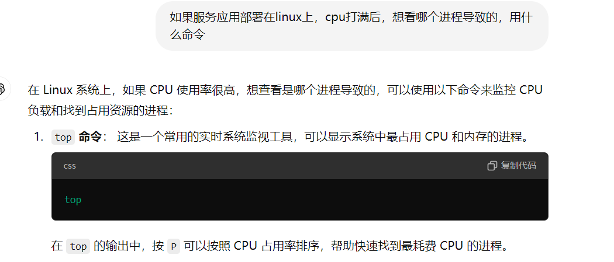

lsof：查看当前系统上所有打开的文件和与之关联的进程。每个进程在系统中都有文件描述符，用于指向打开的文件，这些文件可以是磁盘文件、网络套接字、管道等。

查找在端口80上监听的进程：

lsof -i 80

# 中断系统调用

# 虚拟地址空间

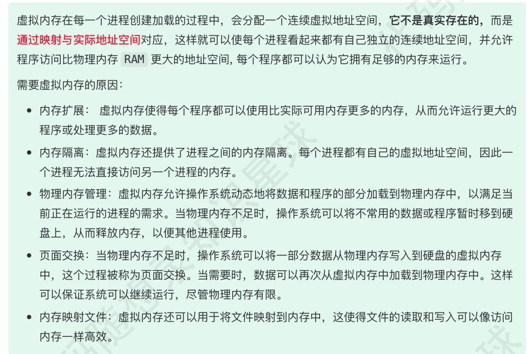

# 线程 进程 协成 守护进程

守护进程：操作系统启动的时候它就启动，操作系统关闭的时候它才关闭。后台运行的。**通常用于提供系统级别的服务**，比如：

- 网络服务（如 `sshd` 提供的 SSH 服务）。
- 打印服务（如 `cupsd`）。
- 定时任务服务（如 `cron`）。
- 系统日志服务（如 `syslogd`）。

`init` 是系统守护进程，它负责启动各运行层次特定的系统服务，所以很多进程的 PPID 是 `init`，并且这个 `init` 也负责收养孤儿进程。超级用户特权运行的。


进程是cpu分配资源的最小单位，线程是操作系统执行调度的最小单位。

一个进程可包含多个线程。

不管是时间效率，还是空间效率线程比进程都要高：

- 上下文切换快，共享虚拟空间
- 创建进程代价高，速度慢，需要复制虚拟地址空间，时间开销大。创建线程比创建进程快10倍甚至更多。

- ==进程之间信息难共享，必须采用进程通信的方式进行信息交换==。==线程共享虚拟地址空间，方便共享信息==，无需采用写时复制来复制内存，无需复制**页表**。线程可以更快速共享信息，只需将数据复制到共享变量中(全局或堆)。创建线程比创建进程快10倍甚至更多。


协程是一种用户态的轻量级线程。在一个用户线程上可以跑多个协程，这样就提高了单核的利用率。协程不像进程或者线程，可以让系统负责相关的调度工作，协程是处于一个线程中，系统是无感知的，所以需要在该线程中阻塞某个协程的话，就需要手工进行调度。

**协程是一种用户态的轻量级线程，协程的调度完全由用户控制。**
**一个线程可以拥有多个协程，协程不是被操作系统内核所管理，而完全是由程序所控制（也就是在用户态执行）。**
与其让操作系统调度，不如我自己来，这就是协程。协程拥有自己的寄存器上下文和栈。协程调度切换时，将寄存器上下文和栈保存到其他地方，在切回来的时候，恢复先前保存的寄存器上下文和栈，直接操作栈则基本没有内核切换的开销，可以不加锁的访问全局变量，所以上下文的切换非常快。
  **协程与线程主要区别是它将不再被内核调度，而是交给了程序自己而线程是将自己交给内核调度，所以也不难理解golang中调度器的存在。**


# 一致性哈希

分布式系统：数据切分到不同结点，访问数据，要找到对应节点

**普通的哈希：节点扩容，存在数据迁移量大的问题**

一致性哈希：将数据与结点都映射到首尾相连的环上，删除增加一个结点只影响后继结点。

虚拟节点：之前的会有节点分布不均匀的问题，请求可能会大量集中在一个结点。对一个真实结点做多个副本，将虚拟节点映射到环上。

# 锁 & CAS

[由浅入深C A S，小白也能与BAT面试官对线 (qq.com)](https://mp.weixin.qq.com/s?__biz=MzU0OTE4MzYzMw==&mid=2247509711&idx=3&sn=7515d76b142dcf6fbe36a68239e70e3e&chksm=fbb12f31ccc6a6279e2b5b70afce7023bc8e9d5c123ad063cb8e315101717e6fa34d33e597ef&scene=27)：

`C A S（compareAndSwap）`也叫比较交换，是一种**无锁原子算法**，映射到操作系统就是一条`cmpxchg`硬件汇编指令（**保证原子性**），其作用是让`C P U`**将内存值更新为新值**，但是有个条件，内存值必须与期望值相同，并且`C A S`操作无需用户态与内核态切换，直接在用户态对内存进行读写操作（**意味着不会阻塞/线程上下文切换**）。

[CAS（Compare and Swap）](https://blog.csdn.net/qq_57748030/article/details/134019693)：CAS操作一般包含3个参数，期望值、内存值、新值。**如果期望值与内存值相等，则用新值去更新这个内存值。如果不相等，则可以再次进行比较，一直到成功为止**。

aba：ABA问题指的是在CAS操作中，如果一个值从A变为B，然后再变回A，那么在此期间可能有其他线程进行了一些操作，导致CAS操作误认为该值没有被修改过，从而产生错误的结果。解决：加版本号

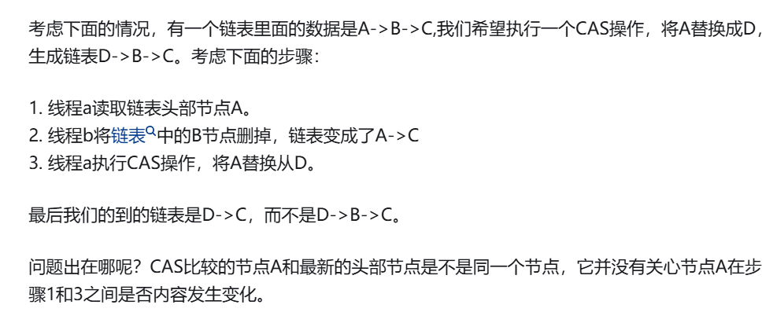

互斥锁、自旋锁、读写锁、乐观锁、悲观锁

## 互斥锁 & 自旋锁

最底层的两种就是会「互斥锁和自旋锁」，有很多高级的锁都是基于它们实现的

- 互斥锁

  加锁失败后，会**释放cpu**给其他线程，线程会**阻塞**。

  对于互斥锁加锁失败而阻塞的现象，**操作系统内核**实现。

  > 当加锁失败时，内核会将线程置为「睡眠」状态，等到锁被释放后，内核会在合适的时机唤醒线程，当这个线程成功获取到锁后，于是就可以继续执行。

   互斥锁加锁失败，通过**系统调用陷入内核态**，**内核帮助切换切换线程**，会有**两次**切换成本:

  > - 当线程加锁失败时，内核会把线程的状态从「运行」状态设置为「睡眠」状态，然后把 CPU 切换给其他线程运行；
  > - 接着，当锁被释放时，之前「睡眠」状态的线程会变为「就绪」状态，然后内核会在合适的时间，把 CPU 切换给该线程运行

- 自旋锁

  **自旋锁**加锁失败后，线程会**忙等待**，它会在循环中不断地检查锁的状态，而不是被挂起或阻塞。直到它拿到锁。

  **需要注意，在单核 CPU 上，需要抢占式的调度器（即通过时钟中断一个线程，运行其他线程）。否则，自旋锁在单 CPU 上无法使用，因为一个自旋的线程永远不会放弃 CPU。**

  如果被锁住的时间很短，没必要互斥锁，因为上下文切换（临界区代码执行短）。

# 上下文切换

**线程切换的原因**
线程切换是操作系统的一个重要功能，它发生的原因包括：

时间片耗尽：为了公平地分配 CPU 时间，操作系统将时间划分为小片段，每个线程在一个时间片内执行。当时间片耗尽时，操作系统需要切换到另一个线程。

阻塞操作：当线程执行阻塞操作（如等待 I/O 完成）时，操作系统将切换到另一个就绪状态的线程，以充分利用 CPU。

中断处理：当硬件中断发生（如键盘输入或定时器触发），操作系统需要暂停当前线程的执行以处理中断。


pcb: cpu中寄存器的值，进程被切换时，cpu状态信息会被保存在相应pcb中，进程重新执行时，可以从断点处继续。

pcb组织：通常是通过**链表**的方式进行组织，把具有**相同状态的进程链在一起，组成各种队列**


- cpu上下文切换

  常支持大于 CPU 数量的任务同时运行。实际上，这些任务并不是同时运行的，只是因为系统在很短的时间内，让各个任务分别在 CPU 运行，于是就造成同时运行的错觉。

  任务是交给 CPU 运行的，那么在每个任务运行前，CPU 需要知道任务从哪里加载，又从哪里开始运行。

  所以，操作系统需要事先帮 CPU 设置好 **CPU 寄存器和程序计数器**。

  程序计数器则是用来存储 CPU 正在执行的指令位置、或者即将执行的下一条指令位置。

  所以说，CPU 寄存器和程序计数是 CPU 在运行任何任务前，所必须依赖的环境，这些环境就叫做 **CPU 上下文**。

  CPU 上下文切换就是先把前一个任务的 **CPU 上下文（CPU 寄存器和程序计数器）**保存起来，然后加载新任务的上下文到这些寄存器和程序计数器，最后再跳转到程序计数器所指的新位置，运行新任务。

  **系统内核会存储保持下来的上下文信息**，当此任务再次被分配给 CPU 运行时，CPU 会重新加载这些上下文，这样就能保证任务原来的状态不受影响，让任务看起来还是连续运行。

  上面说到所谓的「任务」，主要包含进程、线程和中断。所以，可以根据任务的不同，把 CPU 上下文切换分成：**进程上下文切换、线程上下文切换和中断上下文切换**。

- 进程上下文切换

  ==进程是由内核管理和调度的，所以进程的切换只能发生在内核态==，系统调用

  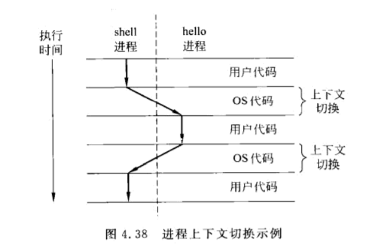

  **进程的上下文切换不仅包含了虚拟内存、栈、全局变量等用户空间的资源，还包括了内核堆栈、寄存器等内核空间的资源。**

  通常，会把交换的信息**保存在进程的 PCB**，当要运行另外一个进程的时候，我们需要从这个进程的 PCB 取出上下文，然后**恢复到 CPU** 中，这使得这个进程可以继续执行

- 线程上下文切换

  两个线程是属于同一个进程，**因为虚拟内存是共享的，所以在切换时，虚拟内存这些资源就保持不动，只需要切换线程的私有数据、寄存器等不共享的数据**

# 磁盘

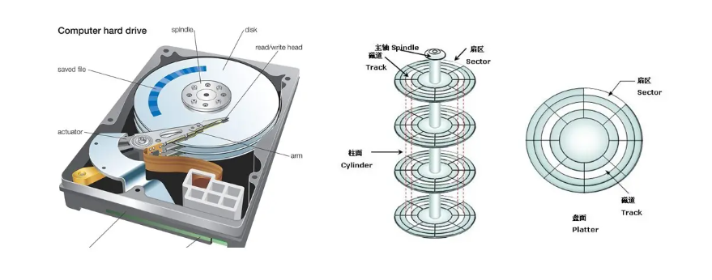

结构：

- **盘片**：磁盘由多个盘片组成。
- **盘面**：一个盘片有两个盘面。
- **磁道**：磁盘的盘面被划分成一个个磁道，一个同心圆环就是一个磁道。
- **扇区**：一个磁道又被划分成一个个扇区，每个扇区就是一个“磁盘块”。各个扇区存放的数据量相同。
- **柱面**：所有盘面中相对位置（或编号）相同的磁道组成一个柱面。磁道数与柱面数相等。
- **磁头和磁臂**：所有的磁头都是连在同一个磁臂上的，因此所有磁头只能“共进退”。“磁头”移动到想要读/写的扇区所在的磁道。磁盘会转起来，让目标扇区从磁头下面划过，才能完成对扇区的读/写操作。

**每个磁道分多个扇区，每个扇区是 `512` 字节**


磁盘读取响应时间：

- **寻道时间**：磁头从开始移动到数据所在的磁道需要的时间，寻道时间越短，I/O操作越快，目前磁盘的平均寻道时间一般在3-15ms，一般都在10ms左右。
- **旋转延迟**：盘片旋转将请求数据所在扇区移至读写磁头下方所需要的时间，旋转延迟取决于磁盘转速，普通硬盘一般是7200rpm，慢的5400rpm
- **数据传输时间**：完成传输请求的数据所需要的时间。
  个人理解寻道时间和旋转应该是并发进行的，比如寻找到了目标磁道，同时盘片旋转也旋转到了该磁道的扇区


==之前面试没有答出来的：==

**操作系统与磁盘打交道最小单位是磁盘块**，**多个物理上存在的扇区组成了系统中所谓的逻辑块**。
块的形成：由于扇区的数量比较小，数目多在寻址时比较困难，所以操作系统将相邻的扇区组合在一起形成块，在对块进行整体的读写操作。

总结

扇区： 硬盘的最小读写单元
块/簇： 是操作系统针对硬盘读写的最小单元
page： 是内存与操作系统之间操作的最小单元。

调度算法（具体看小林）：

- 先来先服务
- 最短寻道时间优先（饥饿）
- 扫描（中间比较占优势）
- 循环扫描（单个方向扫）

# 上下文切换场景

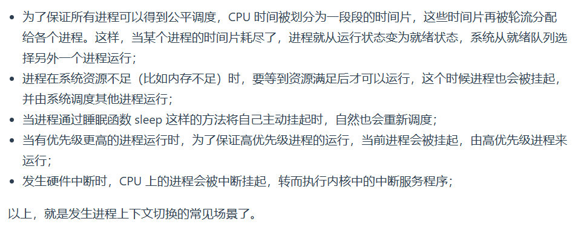

# 进程阻塞

1. **I/O 操作等待**

进程在执行输入/输出操作（如文件读取、网络通信等）时，通常会进入阻塞状态，直到操作完成。常见的 I/O 操作包括：

- 读取文件或写入文件
- 等待网络数据
- 等待用户输入

2. **系统资源不足**

进程在运行时可能会请求某些系统资源（如内存、文件句柄），如果资源不足，进程可能会被阻塞，直到所需资源可用。

3. **进程间通信（IPC）等待**

当进程通过某种通信机制（如管道、消息队列、信号量或共享内存）与其他进程通信时，可能会进入阻塞状态，直到收到所需的数据或信号。例如：

- 进程等待消息队列中的消息
- 进程等待信号量释放

4. **同步与锁**

进程或线程在并发环境中，为了避免数据竞争，可能会使用互斥锁、读写锁或信号量等同步机制。当一个进程请求已被其他进程占用的锁时，它会进入阻塞状态，直到锁被释放。

5. **等待事件或信号**

进程可能会通过操作系统机制等待某个事件或信号的发生，例如：

- 进程等待子进程的退出（使用 `wait()` 函数）
- 进程等待定时器超时
- 进程等待特定信号（如 `SIGTERM` 等）

6. **内存分页（Page Fault）**

当进程访问未加载到内存的虚拟内存页面时，会触发缺页中断，操作系统需要将页面从磁盘加载到内存。在这段时间内，进程会被阻塞，直到页面加载完毕。

7. **CPU 调度**

如果操作系统的调度器决定暂时不为进程分配 CPU 时间，进程可能会被阻塞等待 CPU 资源。

在这些情况下，阻塞的进程会被操作系统挂起，直到条件满足，然后恢复执行。


# 面试总被问，创建多少个线程合适

[面试总被问，创建多少个线程合适？真的越多越好吗_线程数量多少合适-CSDN博客](https://blog.csdn.net/pangzhaowen/article/details/106141365)

和cpu密集型、io密集型有关

多线程不一定就比单线程高效，比如大名鼎鼎的 Redis （后面会分析），因为它是基于内存操作，这种情况下，单线程可以很高效的利用CPU。而多线程的使用场景一般时存在相当比例的I/O或网络操作


多线程不一定就比单线程高效，比如大名鼎鼎的 Redis （后面会分析），因为它是基于内存操作，这种情况下，单线程可以很高效的利用CPU。而多线程的使用场景一般时存在相当比例的I/O或网络操作


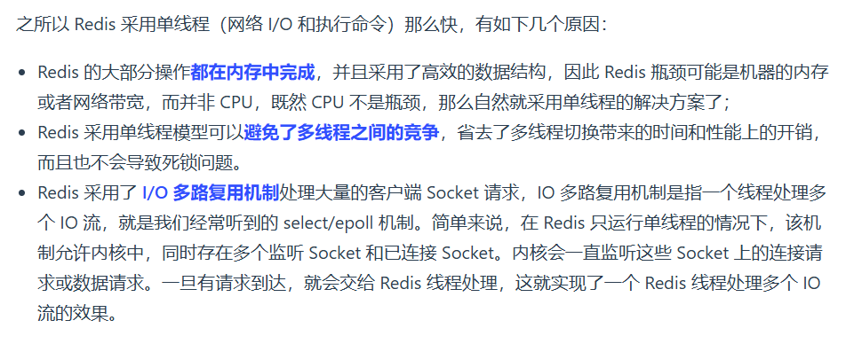

# zookeeper选举

[蚂蚁面试官：Zookeeper 的选举流程是怎样的？我当场懵逼了。。。-腾讯云开发者社区-腾讯云 (tencent.com)](https://cloud.tencent.com/developer/article/1890925)

# 网络通信（结合webserver代码）

[从 5 个方面掌握 reactor 网络模型_哔哩哔哩_bilibili](https://www.bilibili.com/video/BV1U8411B7PN/?vd_source=02fba9262f39b6a6053eea3dd75e9e3c) 讲的很好

## socket、字节序、端口复用

对网络中不同主机上的应用程序之间进行双向通信的端点抽象

socket->ip地址和端口。

linux中可以把socket看成一个文件


字节序：

- 网络字节序都是大端

- 主机字节序都可能

- 小端：低字节放低地址（视觉上反着）

- 判断：

  ```c++
  void check() {
      int i = 1;
      char* p = (char*)&i;
      
      if (*p == 1) 
          小端
      else
          大端
  }
  ```


端口复用：

在默认的情况下，如果一个网络应用程序的一个套接字绑定了一个端口( 8080)，这时候，别的套接字就无法使用这个端口( 8080 )。

==但是端口复用允许在一个应用程序可以把多个套接字绑在一个端口上而不出错。==

- 防止服务器重启时之前绑定的端口没有释放
- 也就是**第三次挥手的时候会有个等待释放时间（time_wait），这个时间段大概是1-4分钟（2MSL）**， 在这个时间内，**端口不会迅速的被释放**

==为什么一个端口可以建立多个连接？==

作为一个服务器监控一个端口，比如80端口，它为什么可以建立上百万个连接？首先要明白一点，当accept出来后的新socket，它所占用的本地端口依然是80端口，很多新手都以为是一个新的随机端口。由四元组就很容易分析到了，同一个(src_ip,src_port)，它所对应的(dst_ip,dst_port)可以无穷变化，这样就可以建立很多个客户端的请求了。

服务器作为服务方，通常会在本地固定监听一个端口，等待客户端的连接。因此服务器的本地 IP 和端口是固定的，于是对于服务端 TCP 连接的四元组只有对端 IP 和端口是会变化的，所以**最大 TCP 连接数 = 客户端 IP 数×客户端端口数**。

## 通信流程 基本版本

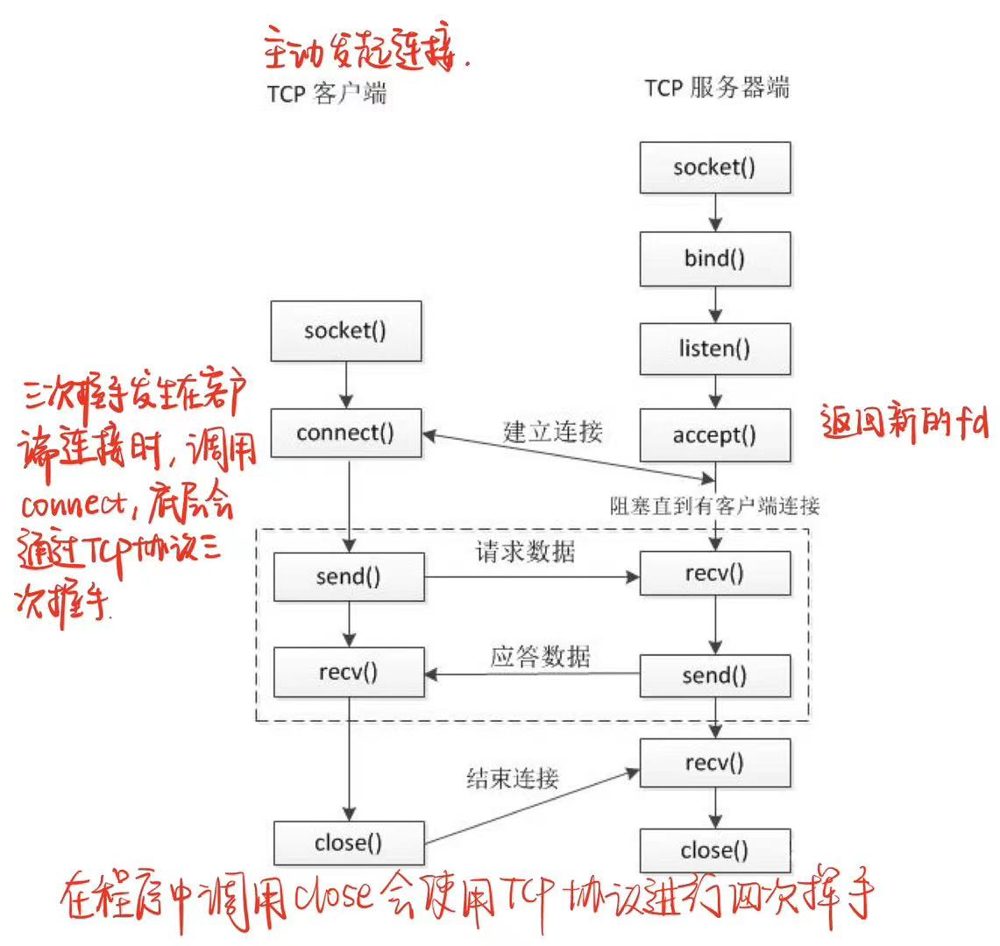

**服务器端（被动接受连接）：**

- 创建用于监听的套接字。将该监听文件fd与本地（服务器）ip、端口绑定。

  > 客户端连接时使用的就是这ip和端口

- 设置监听，监听的fd开始工作。
- 接受客户端连接 阻塞等待连接，会返回一个用于和客户端通信的socket
- 通信
- 通信结束，断开连接。

**客户端：**

- 创建用于通信的socket
- 连接服务器，指定需要连接的服务器的ip和端口
- 连接成功就通信
- 通信结束 断开连接

## 多进程 多线程

多进程：

- 父进程负责等待并接受客户端连接，子进程通信。服务器的主进程负责监听客户的连接，一旦与客户端连接完成，accept() 函数（在while循环中）就会返回一个「已连接 Socket」，这时就通过 `fork()` 函数创建一个子进程，实际上就把父进程所有相关的东西都**复制**一份
- 使用信号处理函数来回收子进程

多线程:

- 类似，不过线程轻量级
- 使用**线程池**的方式来避免线程的频繁创建和销毁

## 多路复用（还是会调用listen accept）

==多路复用负责事件就绪，事件读写是非阻塞IO（指的accept read write这些，视频中说的很清楚）==

==通过一次系统调用 允许单个进程同时监听多个文件描述符==

> 如果要让服务器服务多个客户端，那么最直接的方式就是为每一条连接创建线程。
>
> 其实创建进程也是可以的，原理是一样的，进程和线程的区别在于线程比较轻量级些，线程的创建和线程间切换的成本要小些，为了描述简述，后面都以线程为例。
>
> 处理完业务逻辑后，随着连接关闭后线程也同样要销毁了，但是这样不停地创建和销毁线程，不仅会带来性能开销，也会造成浪费资源，而且如果要连接几万条连接，创建几万个线程去应对也是不现实的。
>
> 要这么解决这个问题呢？我们可以使用「资源复用」的方式。
>
> 也就是不用再为每个连接创建线程，而是创建一个「线程池」，将连接分配给线程，然后一个线程可以处理多个连接的业务。
>
> 不过，这样又引来一个新的问题，线程怎样才能高效地处理多个连接的业务？
>
> 当一个连接对应一个线程时，线程一般采用「read -> 业务处理 -> send」的处理流程，如果当前连接没有数据可读，那么线程会阻塞在 `read` 操作上（ socket 默认情况是阻塞 I/O），不过这种阻塞方式并不影响其他线程。
>
> 但是引入了线程池，那么一个线程要处理多个连接的业务，线程在处理某个连接的 `read` 操作时，如果遇到没有数据可读，就会发生阻塞，那么线程就没办法继续处理其他连接的业务。
>
> 要解决这一个问题，最简单的方式就是将 socket 改成非阻塞，然后线程不断地轮询调用 `read` 操作来判断是否有数据，这种方式虽然该能够解决阻塞的问题，但是解决的方式比较粗暴，因为轮询是要消耗 CPU 的，而且随着一个 线程处理的连接越多，轮询的效率就会越低。
>
> ==上面的问题在于，线程并不知道当前连接是否有数据可读，从而需要每次通过 `read` 去试探。==
>
> 那有没有办法在只有当连接上有数据的时候，线程才去发起读请求呢？答案是有的，实现这一技术的就是 I/O 多路复用。
>
> I/O 多路复用技术会用一个系统调用函数来监听我们所有关心的连接，也就说可以在一个监控线程里面监控很多的连接。

- **select:**

将已连接的 Socket 都放到一个**文件描述符集合**，然后调用 select 函数将文件描述符集合**拷贝**到内核里，让内核来检查，内核通过**遍历**文件描述符集合的方式，当检查到有事件产生后，将此 Socket 标记为可读或可写， 接着再把整个文件描述符集合**拷贝**回用户态里，然后用户态还需要再通过**遍历**的方法找到可读或可写的 Socket，然后再对其处理。

所以，对于 select 这种方式，需要进行 **2 次「遍历」文件描述符集合**，一次是在内核态里，一个次是在用户态里 ，而且还会发生 **2 次「拷贝」文件描述符集合**，先从用户空间传入内核空间，由内核修改后，再传出到用户空间中。

select 使用固定长度的 BitsMap，表示文件描述符集合，而且所支持的**文件描述符的个数是有限制的**，在 Linux 系统中，由内核中的 FD_SETSIZE 限制， 默认最大值为 `1024`，只能监听 0~1023 的文件描述符。

- **poll**

poll 不再用 BitsMap 来存储所关注的文件描述符，取而代之用动态数组，以链表形式来组织，突破了 select 的文件描述符个数限制，当然还会受到系统文件描述符限制

- **epoll：**支持et lt
  
  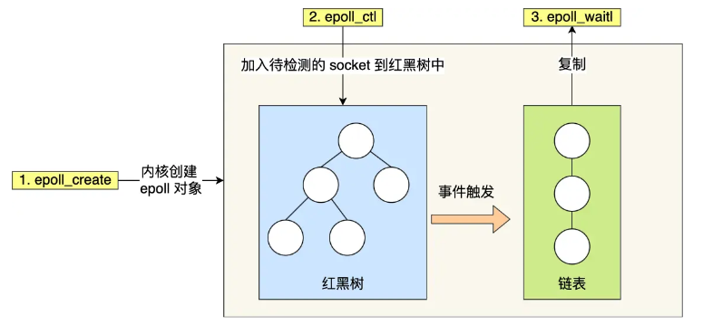
  
  - epoll_create直接**在内核区创建epoll实例**。维护一个**红黑树**（记录待检测的fd）和**链表**（就绪事件）。减少了拷贝数据到内核，返回的是改变了得fd。
  - 边缘触发模式时（edge-triggered，ET），当被监控的 Socket 描述符上有可读事件发生时，**服务器端只会从 epoll_wait 中苏醒一次**，即使进程没有调用 read 函数从内核读取数据，也依然只苏醒一次，因此我们程序要保证一次性将内核缓冲区的数据读取完。==会**循环**从文件描述符读写数据，非阻塞IO==
  - 使用水平触发模式时（level-triggered，LT），当被监控的 Socket 上有可读事件发生时，**服务器端不断地从 epoll_wait 中苏醒，直到内核缓冲区数据被 read 函数读完才结束**，目的是告诉我们有数据需要读取；
  - ==边缘触发的效率比水平触发的效率要高，因为边缘触发可以减少 epoll_wait 的系统调用次数，==
  
  
  
  ## api用法todo：
  
  - epoll_create：创建epoll对象
  
  - epoll_ctl(int epfd, int op, int fd, struct epoll_event *event)：**事件注册函数**
  
    epoll_ctl向 epoll对象中添加、修改或者删除感兴趣的事件，返回0表示成功，否则返回–1，此时需要根据errno错误码判断错误类型。
  
    EPOLL_CTL_ADD：注册新的fd到epfd中；
    EPOLL_CTL_MOD：修改已经注册的fd的监听事件；
    EPOLL_CTL_DEL：从epfd中删除一个fd；
  
    第四个参数event是指向epoll_event 类型结构体的指针,用来告诉内核需要监听的是什么事件的什么动作
  
  - 

```c++
int s = socket(AF_INET, SOCK_STREAM, 0);
bind(s, ...);
listen(s, ...)

int epfd = epoll_create(...);
epoll_ctl(epfd, ...); //将所有需要监听的socket添加到epfd中

while(1) {
    int n = epoll_wait(...);
    for(接收到数据的socket){
        //处理
    }
}
```

​	

## 同步异步/阻塞非阻塞（针对网络IO）

**什么是IO?**

针对内存来说。从内存中读output，将数据写入内存input。

Linux中进程无法直接操作IO设备，必须通过系统调用，请求内核完成操作。内核会为每个IO设备维护一个缓冲区。

eg：对于input，进程系统调用后，内核先看缓冲区中有无数据，有数据就将数据复制到内存；无数据等待设备发送数据过来后存入内存。所以IO一般慢。

**系统调用和异常?**

用户态可以通过系统调用切换到内核态，这是主动进入到内核态。此外在出现异常或者外围设备的中断也会进入到内核态，不过是被动响应的

**阻塞是什么？**

我们所说的 “阻塞”是指进程在**发起了一个系统调用**（System Call） 后， 由于该系统调用的操作不能立即完成，需要等待一段时间，于是内核将进程挂起为等待 （waiting）状态， 以确保它不会被调度执行， **不占用 CPU 资源**。


**5种io模型**

典型的一次IO 两个阶段

- 数据就绪（阻塞与非阻塞）

  > 用户线程等待内核将数据从网卡拷贝到内核空间(比如服务器那个socket缓冲区在内核)

- 数据读写（同步异步）

  > 将数据从内核空间拷贝到用户空间
  >
  > 无论 read 和 send 是阻塞 I/O，还是非阻塞 I/O 都是同步调用
  >
  > 如果应用程序在读取数据时需要自己复制数据从内核空间到用户空间，则是同步方式；而如果应用程序不需要自己复制数据，而是由**操作系统**来完成这一过程，则是异步方式。通常情况下，同步方式对性能要求较高，因为数据复制操作是由应用程序自行完成的，而异步方式可以减少应用程序的运算负担，提升程序的处理性能。
  >


1. ==同步阻塞==

   用户线程发起read阻塞，让出cpu。内核等待网卡数据到来，将数据从网卡拷贝到内核空间，接着从内核空间拷贝到用户空间，再把用户线程叫醒。

   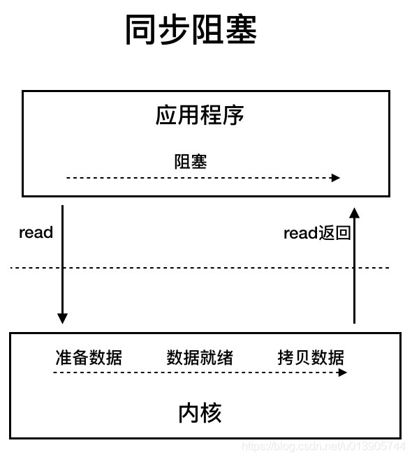

2. ==同步非阻塞==

用户线程不断发起read调用，**数据没有到达内核空间时返回失败**。

直到数据到达内核空间，这一次read调用后，在等待数据从内核空间拷贝到用户空间这段时间里，线程还是阻塞的，等数据到了用户空间再把线程叫醒。

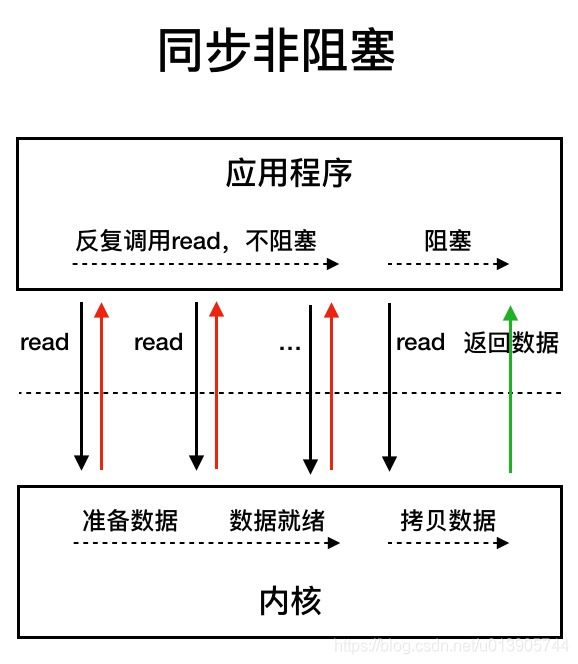

3. ==IO多路复用==

用户线程的读取分成了两步。

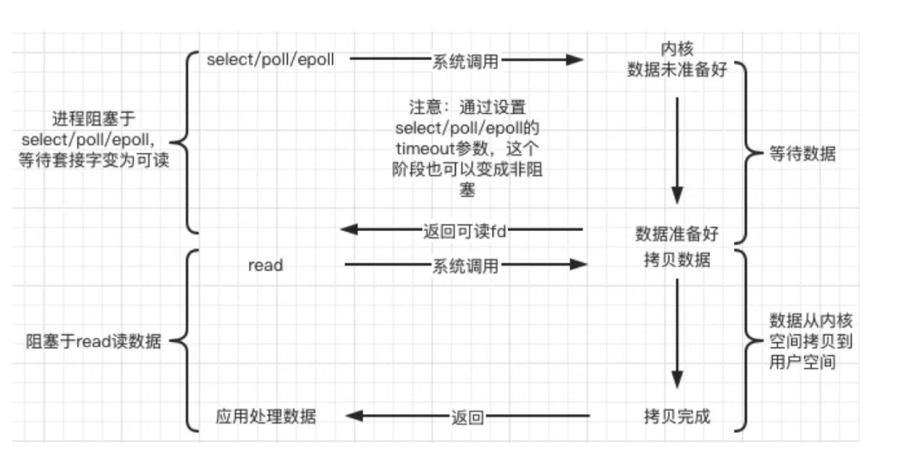

4. ==异步IO==

用户线程发起 read 调用的同时注册一个回调函数，read 立即返回，等内核将数据准备好后，再调用指定的回调函数完成处理。在这个过程中，用户线程一直没有阻塞。**直到数据准备就绪并且完成了从内核空间向用户空间拷贝的工作，这时用户进程会收到一个通知，告诉他read操作已完成**


同步：应用程序要直接参与 IO 读写，要主动拉取结束状态。

异步：所有的 IO 读写交给操作系统去处理，应用程序只需要等待通知。

（不知道回调的说法对不对）

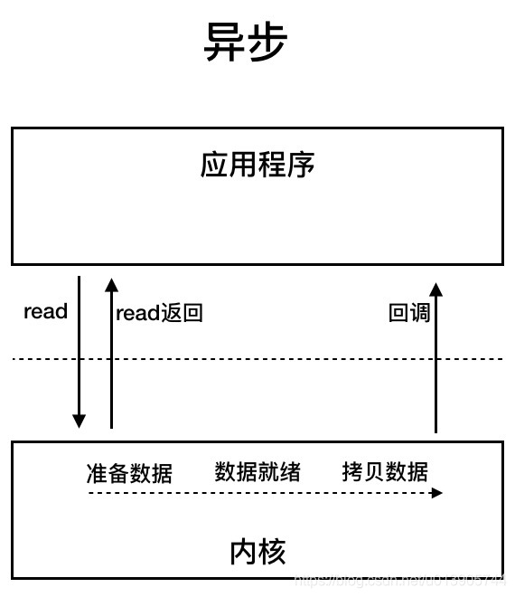

5. ==信号驱动==


## 两种高效事件处理模式Reactor Proator

同步IO通常用于实现reactor

异步IO通常用于实现proator

- **Reactor 是同步网络模式，感知的是就绪可读写事件**。在每次感知到有事件发生（比如可读就绪事件）后，就需要应用进程主动调用 read 方法来完成数据的读取，也就是要应用进程主动将 socket 接收缓存中的数据读到应用进程内存中，这个过程是同步的，读取完数据后应用进程才能处理数据。
- **Proactor 是异步网络模式， 感知的是已完成的读写事件**。在发起异步读写请求时，需要传入数据缓冲区的地址（用来存放结果数据）等信息，这样系统内核才可以自动帮我们把数据的读写工作完成，这里的读写工作全程由操作系统来做，并不需要像 Reactor 那样还需要应用进程主动发起 read/write 来读写数据，操作系统完成读写工作后，就会通知应用进程直接处理数据。

### reactor

==Reactor模型主要就是监听事件，分发事件和处理事件。其中Reactor角色会负责监听事件 和分发事件，Handler角色和Acceptor角色会负责处理事件==

两个核心组成：

- reactor：监听和分发事件

- handler：业务处理

剩下的 3 个方案都是比较经典的，且都有应用在实际的项目中：

- 单 Reactor 单进程 / 线程；
- 单 Reactor 多线程 / 进程；
- 多 Reactor 多进程 / 线程；


==单Reactor单线程模型==

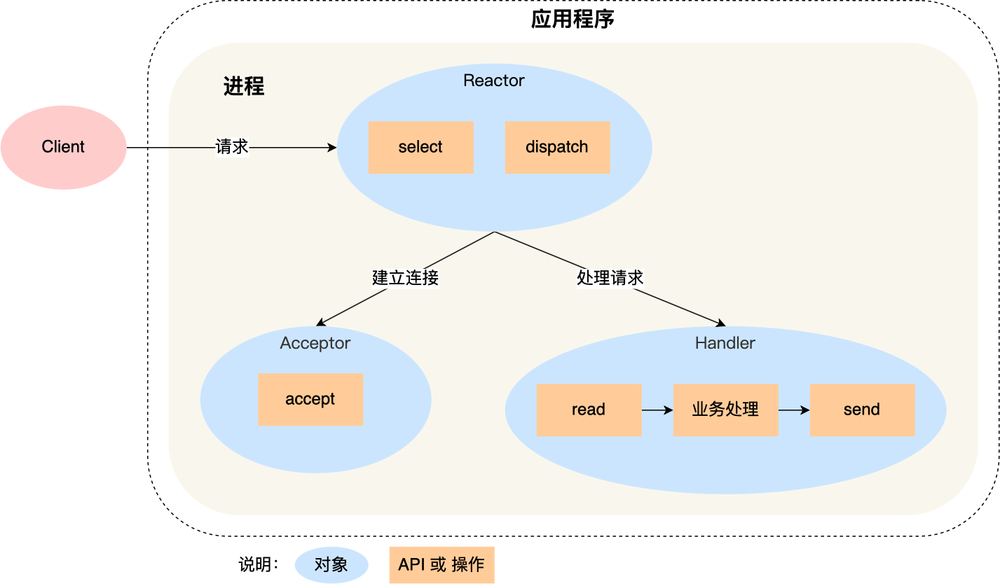

- Reactor 对象通过 select （IO 多路复用接口） 监听事件，收到事件后通过 dispatch 进行分发，**具体分发给 Acceptor 对象还是 Handler 对象，还要看收到的事件类型；**
- 如果是连接建立的事件（**监听文件描述符有事件发生**），则交由 Acceptor 对象进行处理，Acceptor 对象会通过 accept 方法 获取连接，并创建一个 Handler 对象来处理后续的响应事件；
- 如果不是连接建立事件， 则交由当前连接对应的 Handler 对象来进行响应；
- Handler 对象通过 read -> 业务处理 -> send 的流程来完成完整的业务流程。

都在一个线程中完成，业务处理耗时，响应延迟

==单 Reactor 多线程 / 多进程==

让业务处理不阻塞主线程，构建一个线程池

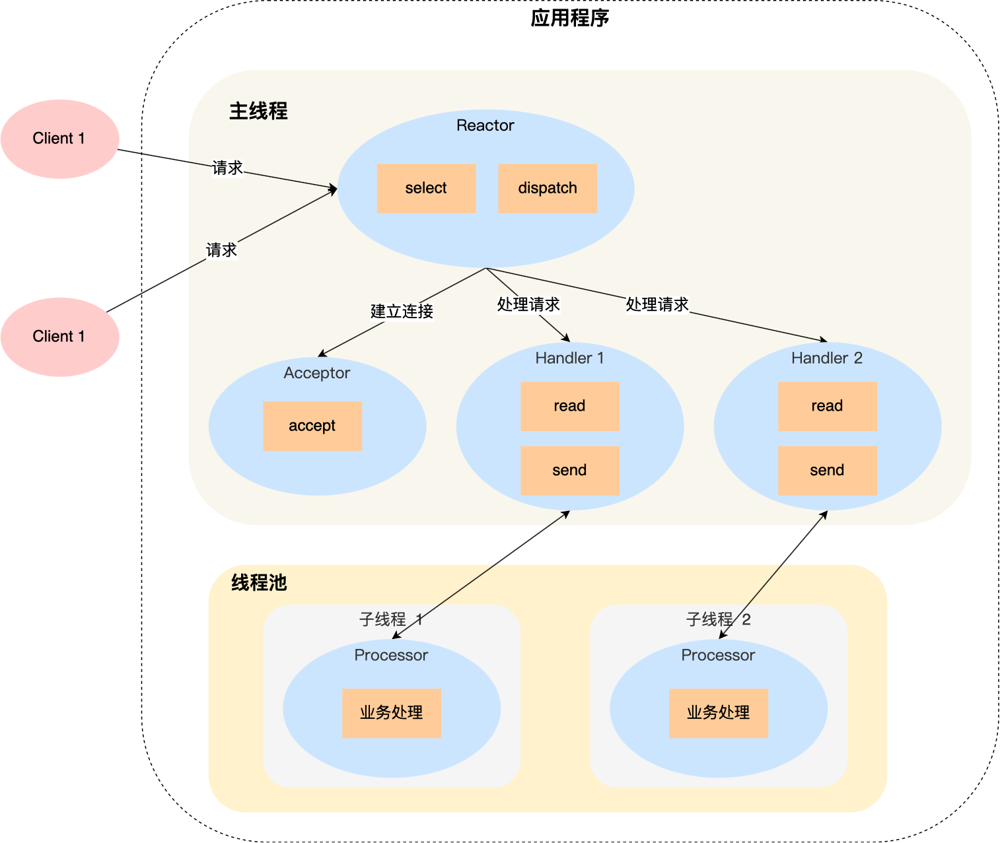

- Handler 对象不再负责业务处理，只负责数据的接收和发送，Handler 对象通过 read 读取到数据后，会将数据发给子线程里的 **Processor 对象**进行业务处理；
- 子线程里的 Processor 对象就进行业务处理，处理完后，将结果发给主线程中的 Handler 对象，接着由 Handler 通过 send 方法将响应结果发送给 client；

==主从reactor多线程模型==

单Reactor多线程模型虽然解决了只有一个线程的问题，但是可以发现，**仍旧是只有一个Reactor在同时监听ACCEPT事件和READ事件。**

那么现在思考一下，为什么一个Reactor同时监听ACCEPT事件和READ事件是不好的**。其实就是因为通常客户端连接的建立是不频繁的，但是连接建立后数据的收发是频繁的，所以如果能够将监听READ事件这个动作拆分出来，让多个子Reactor来监听READ事件，而原来的主Reactor只监听ACCEPT事件，那么整体的效率，会进一步提升，而这，就是主从Reactor多线程模型。**

主从**Reactor**模型中，有一个主**Reactor**，专门监听**ACCEPT**事件，然后有多个从**Reactor**，专门监听**READ**事件，示意图如下所示。

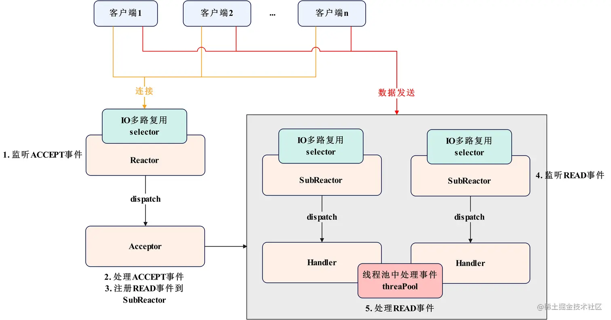


- 组成：**非阻塞 IO（IO 操作）**+ **IO 多路复⽤（IO 检测）**
- 特征：基于事件循环，以事件驱动或事件回调的方式来实现业务逻辑
- 表述：将连接的 IO 处理转化为事件处理

#### **面试：Reactor 为什么使用非阻塞 IO**

- 多线程环境：一个事件同时被多线程监听，当该事件就绪，只有一个线程获得控制权，其他线程阻塞，即**惊群效应**。例：accept 惊群。
- 边缘触发：在读事件触发时，read 要在一次事件循环中把读缓冲读空。若读缓冲已经读空，继续调用 read 会阻塞。
- select bug：有数据到达，select 检测 fd 可读，随后协议栈检验到该数据错误而丢弃，此时调用 read 无数据可读。若该 fd 设置没有设置成非阻塞，则 read 阻塞当前线程。man 2 select读事件会误报

### eventloop事件循环

- Event Loop：事件循环，负责监听各种IO事件，如可读、可写和错误事件等，一旦有事件发生，它就会调用相应的回调函数处理事件。

```c++
/ 一次事件循环
 void eventloop_once(reactor_t * r, int timeout) {
     int n = epoll_wait(r->epfd, r->fire, MAX_EVENT_NUM, timeout);
     for (int i = 0; i < n; ++i) {
         struct epoll_event *e = &r->fire[i];  // 获取事件
         int mask = e->events;                 // 获取事件类型
         
         // 用 io 函数捕获具体的错误信息
         if (e->events & EPOLLERR) mask |= EPOLLIN | EPOLLOUT;
         // 用 io 函数捕获断开的具体信息
         if (e->events & EPOLLHUP) mask |= EPOLLIN | EPOLLOUT;
         
         event_t *et = (event_t*) e->data.ptr; // 获取事件关联的用户数据
         // 处理读事件
         if (mask & EPOLLIN) {
             if (et->read_fn) {
                 et->read_fn(et->fd, EPOLLIN, et);   // 执行读回调
             }          
         }
         // 处理写事件
         if (mask & EPOLLOUT) {
             if (et->write_fn) {
                 et->write_fn(et->fd, EPOLLOUT, et); // 执行写回调
             }     
             else {
                 uint8_t *buf = buffer_write_atmost(&et->out);
                 event_buffer_write(et, buf, buffer_len(&et->out));
             }
         }
     }
 }
 ​
 // 停止事件循环
 void stop_eventloop(reactor_t * r) {
     r->stop = 1;
 }
 ​
 // 事件循环
 void eventloop(reactor_t * r) {
     while (!r->stop) {
         // int timeout = find_nearest_expire_timer();
         eventloop_once(r, /*timeout*/ -1);
         // expire_timer();
     }
 }
```


### proactor：todo


# dma零拷贝

## dma是什么

没有dma的时候read()：

- cpu向磁盘控制器发起io请求
- 磁盘：数据放入磁盘控制器缓冲区，发起io中断
- cpu：收到中断，停下手头工作，磁盘控制器缓冲区->pagecache，pagecache->用户缓冲区 （这里pagecache就是内核缓冲区）

使用dma时read()：

- 用户调用read，向操作系统发起io请求，进程进入阻塞状态
- 操作系统收到请求，io请求发送给dma，cpu执行其他任务
- dma将请求发给磁盘
- 磁盘：数据放入磁盘控制器缓冲区，向dma发起io中断
- dma：收到中断，**磁盘控制器缓冲区->内核缓冲区，发送中断给cpu**
- cpu：内核缓冲区->用户缓冲区


**传统文件传输：磁盘上文件读取，通过网络协议发给客户**

一般两次系统调用

```
read
write
```

**4次用户态和内核态的上下文切换，4次数据拷贝：**

- 磁盘数据->内核缓冲区 dma
- 内核缓冲区->用户缓冲区，cpu
- 用户缓冲区->socket缓冲区，cpu
- socket缓冲区->网卡缓冲区，dma


提升性能：用户态与内核态的上下文切换，内存拷贝的次数减少

实现零拷贝的方式：

- mmap + write：4次上下文切换，3次拷贝
- sendfile：2次上下文切换，3次拷贝

**sendfile还不是真正的零拷贝技术，如果网卡支持SG-dma，****两次拷贝**：

- dma：磁盘数据->内核缓冲区
- 内核缓冲区->网卡缓冲区


**零拷贝：没有在内存层面拷贝数据，全程没有通过cpu搬运，所有数据通过dma传输。只需要2次上下文切换和数据拷贝。**


## pagecache与大文件传输

pagecache：缓存最近访问数据，预读功能

**大文件传输**，pagecache 没什么作用，dma多做了拷贝


没有dma调用read方法，会阻塞， **异步io + 直接io（没有pagecache）**：

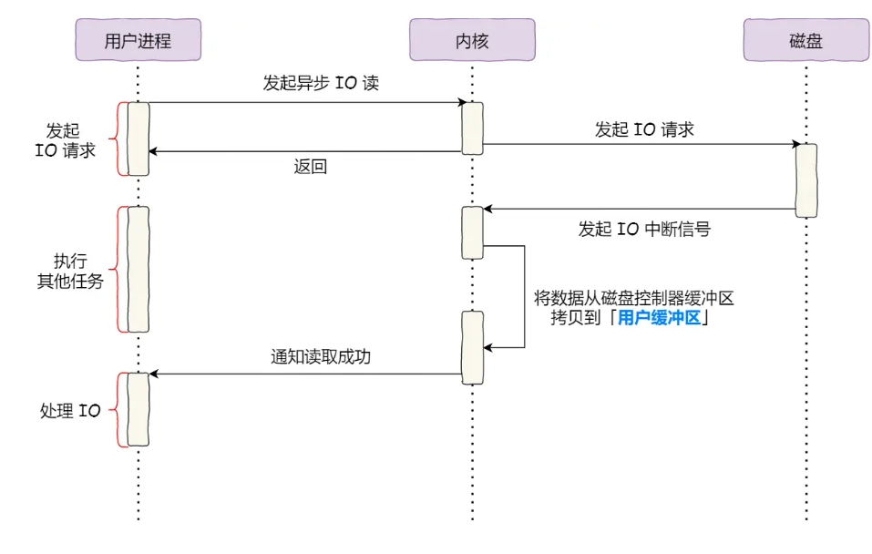


## 应用访问一块磁盘上的数据需要哪些步骤？页表（Page Table）的变化

优先在pagecache中找，有就返回；否则在磁盘中读取，并缓存在pagcache中。

### 

在这个过程中，页表的作用是将虚拟地址转换为物理地址，并对内存管理进行支持。以下是页表相关的变化：

1. **虚拟地址到物理地址的映射**：
   - 应用程序使用的是虚拟地址空间，内核负责通过页表将虚拟地址映射到实际的物理内存地址。
   - 如果应用程序请求的数据已经在页缓存中，系统会通过页表将该数据所在的物理内存位置映射到应用程序的虚拟地址空间中。
2. **缺页中断**：
   - 当应用程序访问的数据不在页缓存或者内存中时，系统会发生缺页中断（Page Fault）。
   - 内核会加载相应的磁盘数据到内存，并更新页表，建立虚拟地址与新加载的物理内存之间的映射。
3. **页表更新**：
   - 在磁盘数据被加载到内存后，操作系统会更新页表，为该虚拟内存区域指派新的物理页帧（Page Frame）。此时，页表发生了变化，新数据所在的物理内存页帧被映射到对应的虚拟地址。
   - 如果数据已经在页缓存中，页表不会发生新的映射变化，应用程序直接通过现有的映射访问数据。