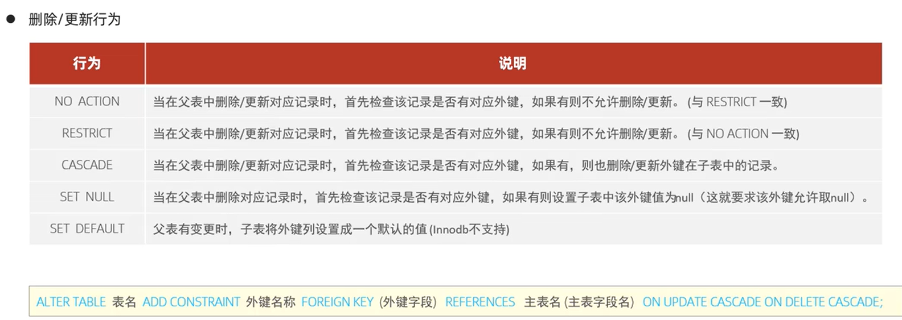
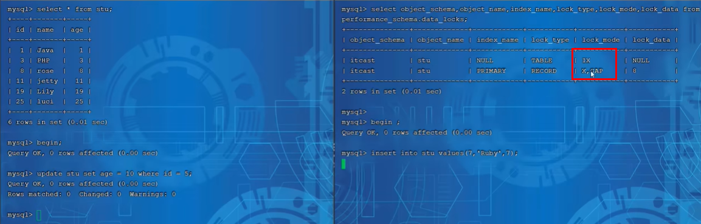

# 基础

## 1. MYSQL概述

数据库软件DMBS（数据库管理系统）。数据库是通过DBMS操作和管理的容器。

你使用的DMBS，它替你访问数据库。

MYSQL是DBMS。DBMS分为共享文件系统的、基于客户机-服务器的。MYSQL属于后者。

MYSQL关系型数据库（RDBMS）:建立在关系模型基础上，有多张相互连接的二维表组成的数据库


## 2. SQL

不区分大小小，关键词建议大写

### 

### 2.1 DDL 

#### DDL 数据库操作

查询

```sql
--查询所有数据库
show databases；
--查询当前数据库
select database();
```

创建

```sql
create database [if not exists] 数据库名 [default charset 字符集] [collate 排序规则]
```

删除

```sql
drop database [if exists] 数据库名
```

使用

```sql
use 数据库名
```

#### DDL 表操作 查询&创建

查询

```sql
--查询当前数据库所有表
show tables；
--查询表结构
desc 表名；
--查询指定表的建表语句
show create table 表名；
```

创建：**最后一行没有逗号**

```sql
create table 表名(
    字段1 字段1类型 [comment 字段1注释]，
    字段2 字段2类型 [comment 字段2注释]，
    ..
    字段3 字段3类型 [comment 字段3注释]
)[comment 表注释]；
```

#### DDL 表操作 数据类型


char(10) 无论字符串多长 都占10字节

varchar(10) 字符串多长就占几字节,性能差一些

usrname varchar(10)

gender char(1)


#### DDL 表操作 修改删除

修改字段

```sql
--添加字段
alter table 表名 add 字段名 类型(长度) [comment 注释]；
--修改数据类型
alter table 表名 modify 字段名 类型(长度)；
--修改字段名 数据类型
alter table 表名 change 旧名 新字段名 类型(长度) [comment 注释]；
```

删除字段

```sql
alter table 表名 drop 字段名;
```

修改表名

```sql
alter table 表名 rename to 新表名;
```

删除表

```
drop table [if exists] 表名;
```

删除指定表，并重新创建该表

```sql
truncate table 表名;
```

### 2.2 DML 对数据库中表的记录增删改操作

添加insert into

```sql
--给指定字段添加
insert into 表名(字段1，字段2...) values(值1，值2，..);
--给所有字段添加
insert into 表名 values(值1，值2);
--批量添加数据
insert into 表名(字段1，字段2...) values(值1，值2，..),(值1，值2，..)...;
insert into 表名 values(值1，值2),(值1，值2)..;
```

更新update

```sql
update 表名 set 字段1=值1，字段2=值2 .. [where 条件];
```

删除delete

```sql
delete from 表名 [where 条件];
```

### 2.3 DQL 查询select

#### DQL 基础查询


```sql
--查询多个字段
select 字段1，字段2 from 表名;
select * from 表名;

--设置别名,as可以省略
select 字段1 [as 别名1] from 表名;

--去除重复记录
select distinct 字段列表 from 表名;
```


#### DQL 条件查询

```sql
select 字段列表 from 表名 where 条件;
```


```sql
 select * from emp where age in(18, 20, 40);
 select * from emp where name like '__';--两个下划线 名字两个字
 select * from emp where idcard like '%X';--身份证号最后一位X
```


#### DQL 聚合函数

将一列数据作为一个整体，聚合计算

```sql
select 聚合函数(字段列表) from 表名;
```


**所有null值不参与聚合函数计算**

```sql
select count(*) from emp;--统计员工数量 字段也可以
select avg(age) from emp;--平均年龄
select max(age) from emp;
select min(age) from emp;
select sum(age) from emp where workaddress = "山西";
```


#### DQL 分组查询 group by

```sql
select 字段列表 from 表名 [where 条件] group by 分组字段名 [having 分组后过滤条件]
```


==where、having区别：==

- where在分组之前过滤，不满足where条件不参加分组；having是分组之后对结果过滤。
- where不能对聚合函数判断，having可以

==执行顺序：where > 聚合函数 > having==

==分组之后，查询的字段一般为聚合函数和分组字段，其他字段没有意义==


```sql
-- 根据性别分组，统计男 女的数量
select gender, count(*) from emp group by gender;
-- 根据性别分组 统计男和女的平均年龄
select gender, avg(age) from emp group by gender;
-- 查询年龄小于45的员工，并根据工作地址分组，获取员工数量大于等于3的工作地址
select workaddress, count(*) from emp where age < 45 group by workaddress having count(*) >= 3;
```


#### DQL 排序查询 order by

```sql
select 字段列表 from 表名 order by 字段1 排序1, 字段2 排序2...
```

asc: 升序 默认

desc：降序

如果多字段，当第一个字段值相同，根据第二个字段排序


#### DQL 分页查询 


```sql
-- 查询第一页员工数据 每页展示10条记录
select * from emp limit 0, 10; -- 或者limit 10
-- 查询第二页员工数据 每页展示10
select * from emp limit (2-1)*10, 10;
```


#### 练习


```sql
select * from emp where age in(20, 21, 22, 23);
select * from emp where sex = "男" and name like "___" and (age between 20 and 40);
select gender, count(*) from emp where age < 60 group by sex;
select name, sex from emp where age <= 35 order by age asc, date desc;
select * from emp where sex = "男" and age <= 40 and age >= 20 order by age asc, date asc limit 5;
```


#### DQL执行顺序


### 2.4 DCL 

Data Control language，管理数据库用户、控制数据库访问权限

#### 用户管理

查询用户

```sql
use mysql
select * from user;
```

创建用户

```sql
create user '用户名'@'主机名' identified by '密码';
```

修改用户密码

```sql
alter user '用户名'@'主机名' identified with mysql_native_password by '新密码';
```

删除用户

```
drop user '用户名'@'主机名';
```


#### 权限控制

创建用户初始没有访问权限

查询权限

```sql
show grants for '用户名'@'主机名'
```

授予权限

```sql
grant 权限列表 on 数据库名.表名 to '用户名'@'主机名';
```

撤销权限

```sql
revoke 权限列表 on 数据库名.表名 from '用户名'@'主机名';
```


```sql
show grants for 'heima'@'%';
grant all on test.* to 'heima'@'%';
revoke all on test.* from 'heima'@'%';
```


## 3. 函数


### 3.1 字符串数


```sql
select concat("hi", "mysql");
select lower("Hi");
select upper("Hi");
select lpad("01", 5, "-");
select trim(" hello mysql  ");
```

```sql
-- 业务需求变更，企业员工工号统一5位数，不足5位数在前面补0
update emp set workno = lpad(workno, 5, 0);
```

### 3.2 数值函数


```sql
-- 生成六位数的随机验证码
select round(rand()*1000000, 0); --有问题 如果rand=0.011111
select lpad(round(rand()*1000000, 0),6,'0');
```

### 3.3 日期函数


### 3.4 流程函数


```sql
--查询emp表的员工姓名和工作地址（上海北京->一线 其他->二线）
select name, 
	(case workaddress when "上海" then "一线" when "北京" then "一线" else "二线" end) as "工作地址"
from emp;

--统计成绩 >=85 优秀  >=60及格 否则不及格
select name,
	case when score>= .....
from student;
```

## 4. 约束

### 4.1 概述

一个字段可以添加多个约束


```sql
create table user(
    id int primary key auto_increment comment "主键",
    name varchar(10) not null unique comment "姓名",
    age int check (age > 0 and age <= 120) comment "年龄",
    statuse char(1) default '1' comment "状态",
    gender char(1) comment "性别"
)comment "用户表;
```

### 4.2 外键

外键：子表中中的某个字段(是父表的主键)


```sql
create table emp(
    ...
    [constraint name_dept_id] foreign key (dept_id) references dept(id)
);

alter table add constraint name_dept_id foreign key (dept_id) references dept(id);

alter table 表名 drop foreign key 外键名称;
```

### 4.3 外键删除更新行为



## 5.多表查询


**笛卡尔积：**将一个表的每条记录与另一个表的每条记录进行组合。**在多表查询时，需要消除无效的笛卡尔积**


emp表：


### 5.1 多表关系

一对多（员工 部门）、多对多（学生 课程）、一对一（用于单表拆分）

- 一对多

  

- 多对多

  

- 一对一

  

### 5.2 内连接

**查询两张表交集部分**.避免产生笛卡尔积。

```sql
--隐式内连接
select 字段列表 from 表1,表2 where ...
--显示
select 字段列表 from 表1 [inner] join 表2 on ...
```

```sql
--查询每个员工名字 和 关联部门名称
select emp.name, dept.name from emp dept where emp.dept_id = dept.id;
-- 可以给表起别名
select e.name, d.name from emp e dept d where e.dept_id = d.id;
```

### 5.3 左外连接（多）

**查询表1（左表）的所有数据，包含表1表2交集部分的数据**

```sql
select 字段 from 表1 left [outer] join 表2 on 条件
```

假设我们有两张表：products 和 orders ，分别存储了产品信息和订单信息。我们需要查询所有产品及其关联的订单信息。==如果某个产品（左表）没有任何关联的订单信息，则其订单编号为 NULL。==

```sql
select products.name, orders.id 
from products 
left join orders
on orders.id = products.id;
```

### 5.4 右外连接

**相当于查询表2(右表)的所有数据， 包含表1和表2交集部分的数据**

```sql
select 字段 from 表1 right [outer] join 表2 on 条件；
```

假设我们有两张表：employees 和 departments，分别存储了员工信息和部门信息。我们查询所有部门及其关联的员工信息：==某个部门（右表）没有任何关联的员工信息，则其员工姓名为 NULL。==

```sql
select departments.name, employees.name
from employees
right join departments
on employees.depart_id = departments.id;
```

### 5.5 自连接

可以是内连接、外连接

指在同一张表中进行连接查询的操作，可以**看成两个**表，需要起**别名**

```sql
select 字段 from 表1 别名1 join 表2 别名2 on 条件
```

看成两个表：


```sql
--查询员工、所属领导名字
select a.name, b.name
from emp a
join emp b
on a.managerid = b.id;
-- 查询员工、所属领导名字,如果没有领导也需要查询出来
select a.name, b.name
from emp a
left join emp b
on a.managerid = b.id;
```

### 5.6 子查询

细节看视频


## 6. 事务

事务是在 MySQL 引擎层实现的，我们常见的 InnoDB 引擎是支持事务的

==**事务**是一组操作的集合，要么同时成功，要么同时失败==

事务操作：

mysql默认是事务自动提交，就是执行一条语句就会提交。

```sql
-- 开启事务
start transaction 或者 begin;-- 手动控制事务
-- 提交
commit;
--回滚
rollback;
```


==事务四大特性（ACID）:==

**原子性**：事务是不可分割的最小操作单元，要么全部成功，要么全部失败

**隔离性**：数据库允许多个并发事务同时对其数据进行读写和修改的能力，隔离性可以防止多个事务并发执行时由于交叉执行而导致数据的不一致，因为多个事务同时使用相同的数据时，不会相互干扰，每个事务都有一个完整的数据空间，对其他并发事务是隔离的。

**持久性**：事务一旦被提交，它对数据库中数据的改变就是永久性的

**一致性**：事务完成时，所有数据保持一致状态


==InnoDB 引擎通过什么技术来保证事务的这四个特性的呢？==

- 持久性是通过 redo log （重做日志）来保证的；

- 原子性是通过 undo log（回滚日志） 来保证的；

- 隔离性是通过 **MVCC（多版本并发控制） 或锁机制**来保证的；

- 一致性则是通过持久性+原子性+隔离性来保证；

  

==并发事务的问题：==

- 脏读：一个事务读到了另一个未提交事务修改过的数据
- 不可重复度：在事务a内多次读取同一个数据，先后两次读的数据不一样（事务b修改了然后提交）
- 幻读：在事务a内查询**某个符合查询条件的记录数量**，如果初夏前后两次查询到的记录数量不一样

严重程度：脏读>不可重复读>幻读


幻读和不可重复读区别：[技术分享 | 隔离级别：正确理解幻读 - 知乎 (zhihu.com)](https://zhuanlan.zhihu.com/p/401773322)


==事务隔离级别：==

**前面我们提到，当多个事务并发执行时可能会遇到「脏读、不可重复读、幻读」的现象，这些现象会对事务的一致性产生不同程序的影响。SQL 标准提出了四种隔离级别来规避这些现象，隔离级别越高，性能效率就越低，这四个隔离级别如下**（==背==）：

- **读未提交（read uncommitted）**，指一个事务还没提交时，它做的变更就能被其他事务看到；
- **读提交（read committed）**，指一个事务提交之后，它做的变更才能被其他事务看到；
- **可重复读（repeatable read）**，指一个事务执行过程中看到的数据，一直跟这个事务启动时看到的数据是一致的，**MySQL InnoDB 引擎的默认隔离级别**；
- **串行化（serializable ）**；会对记录加上读写锁，在多个事务对这条记录进行读写操作时，如果发生了读写冲突的时候，后访问的事务必须等前一个事务执行完成，才能继续执行；


RU: 1读数据，2修改但是没提交，1再读，不一样了

RC：只有事务2提交了以后，1读数据会变化，但是前后读的不一样，不可重复读

RR：事务2提交了，1前后读的都是一样的，当1提交后就不一样了。幻读：1读id=3的数据不存在，2插入一条数据并提交，1读依然不存在但是无法插入这条数据(主键相同)


==这四种隔离级别具体是如何实现的呢？==

- 对于「读未提交」隔离级别的事务来说，因为可以读到未提交事务修改的数据，所以直接读取最新的数据就好了；
- 对于「读提交」和「可重复读」隔离级别的事务来说，它们是通过 **Read View 来实现的，它们的区别在于创建 Read View 的时机不同，大家可以把 Read View 理解成一个数据快照，就像相机拍照那样，定格某一时刻的风景。「读提交」隔离级别是在「每个语句执行前」都会重新生成一个 Read View，而「可重复读」隔离级别是「启动事务时」生成一个 Read View，然后整个事务期间都在用这个 Read View**。

- 对于「串行化」隔离级别的事务来说，通过加读写锁的方式来避免并行访问；


**MySQL InnoDB 引擎的默认隔离级别虽然是「可重复读」，但是它很大程度上避免幻读现象（并不是完全解决了，详见这篇[文章 (opens new window)](https://xiaolincoding.com/mysql/transaction/phantom.html)）**，解决的方案有两种：（==链接中提到发生幻读的场景，怎么避免==）

- 针对**快照读**（普通 select 语句），是**通过 MVCC 方式解决了幻读**，因为可重复读隔离级别下，事务执行过程中看到的数据，一直跟这个事务启动时看到的数据是一致的，即使中途有其他事务插入了一条数据，是查询不出来这条数据的，所以就很好了避免幻读问题。
- 针对**当前读**（select ... for update 等语句），是**通过 next-key lock（记录锁+间隙锁）方式解决了幻读**，因为当执行 select ... for update 语句的时候，会加上 next-key lock，如果有其他事务在 next-key lock 锁范围内插入了一条记录，那么这个插入语句就会被阻塞，无法成功插入，所以就很好了避免幻读问题。

在**可重复读隔离级别**中，**普通的 select 语句**就是基于 MVCC 实现的快照读，也就是不会加锁的。而 **select .. for update 语句**就不是快照读了，而是当前读了，也就是每次读都是拿到最新版本的数据，但是它会对读到的记录加上 next-key lock 锁。

MySQL 里**除了普通查询是快照读**，其他都是**当前读**，比如 **update、insert、delete**，这些语句执行前都会查询最新版本的数据，然后再做进一步的操作。


==MVCC：undolog+readview==[事务隔离级别是怎么实现的？ | 小林coding (xiaolincoding.com)](https://xiaolincoding.com/mysql/transaction/mvcc.html#read-view-在-mvcc-里如何工作的)

**一个事务去访问记录的时候，除了自己的更新记录总是可见之外**，还有这几种情况：。。。。

两个重点：

- readview四个字段作用

  

- 聚族索引记录中两个和事务有关的隐藏字段。undo log 版本链。

  - trx_id，当一个事务对某条聚簇索引记录进行改动时，就会把该事务的事务 id 记录在 trx_id 隐藏列
  - roll_pointer，然后**这个隐藏列是个指针，指向每一个旧版本记录**

  

  

==可重复读怎么工作：==

**事务启动时生成readview，然后整个事务期间使用该readview。**

当不同的事务对数据操作时，会通过指针维护旧版本的记录

读取的事务遍历这个版本链，找到一个可见的版本

==读提交怎么工作：==

**每次读取数据时，都会生成一个新的 Read View**。


## 7. 存储引擎（==todo==）

连接层：接受客户端的连接，完成连接处理、认证授权（校验用户名密码），检测是否超过最大连接数等

服务层：大部分核心功能

引擎层：msql提供了很多存储引擎选择，不满足需求还可以扩展，可插拔式存储引擎。InnoDB是mysql5.5之后默认存储引擎


### 7.1 介绍

存储引擎是存储数据、**建立索引**、更新\查询等技术实现的方式。**存储引擎是基于表的。**


建表时候默认innodb：


### 7.2 特点

innodb：

- ==支持事务==
- ==行级锁==
- ==外键==

文件：xxx.ibd，xxx是表名，innodb的每张表都有这样的表空间文件，存储表结构、数据、索引


页16k 是磁盘操作的最小单位

### 7.3 存储引擎对比

innodb：mysql默认，支持事务、行锁、主键。由于支持行锁，适合高并发读写

MyISAM:

- 是早期mysql默认：不支持事务，支持表锁不支持行锁，访问速度快。`InnoDB是聚集索引`，使用B+Tree作为索引结构，数据文件是和（主键）索引绑在一起的；`MyISAM是非聚集索引`，它也是使用B+Tree作为索引结构，但是索引和数据文件是分离的，索引保存的是数据文件的指针

Memory：

- **表数据存在内存**中，由于收到硬件断点问题的影响，只能作为临时表或缓存。**服务器重启或者崩溃数据会丢失时**
- 内存存放、支持hash索引（索引）

大部分都是innodb，MyISAM->mongodb取代 memory->redis取代

## 8. 索引

### 8.1概述


### 8.2 结构

常见：B+树、hash索引（不支持范围查询）


二叉树：

- 大数据量层级过深


B树（多路平衡查找树）（看视频动画）：

最大度数为5的btree，每个结点最多存4个key，5个指针

插入的过程：中间向上裂变


B+树：

所有数据出现在叶子结点，叶子结点形成**双向链表**


B+树范围查询：


hash索引：不支持范围查询

### 8.3 思考题

**MySQL 的数据是持久化的，意味着数据（索引+记录）是保存到磁盘上的，因为这样即使设备断电了，数据也不会丢失。**

磁盘是一个慢的离谱的存储设备

磁盘读写的最小单位是**扇区**，扇区的大小只有 `512B` 大小，操作系统一次会读写多个扇区，所以**操作系统的最小读写单位是块（Block）。Linux 中的块大小为 `4KB`**，也就是一次磁盘 I/O 操作会直接读写 8 个扇区。

由于数据库的索引是保存到磁盘上的，因此当我们通过索引查找某行数据的时候，**就需要先从磁盘读取索引到内存，再通过索引从磁盘中找到某行数据，然后读入到内存**，也就是说查询过程中会发生多次磁盘 I/O，而磁盘 I/O 次数越多，所消耗的时间也就越大。

所以，我们希望索引的数据结构能在尽可能少的磁盘的 I/O 操作中完成查询工作，因为磁盘 I/O 操作越少，所消耗的时间也就越小。

另外，MySQL 是支持范围查找的，所以索引的数据结构不仅要能高效地查询某一个记录，而且也要能高效地执行范围查找。

所以，要设计一个适合 MySQL 索引的数据结构，至少满足以下要求：

- 能在尽可能少的磁盘的 I/O 操作中完成查询工作；
- 要能高效地查询某一个记录，也要能高效地执行范围查找；


**为什么选择b+树**：

- 相比二叉树层级更少，效率高

- B+ 树的非叶子节点不存放实际的记录数据，仅存放索引，因此数据量相同的情况下，相比存储即存索引又存记录的 B 树，B+树的非叶子节点可以存放更多的索引，因此 B+ 树可以比 B 树更「矮胖」，查询底层节点的磁盘 I/O次数会更少

- b树叶子结点和非叶子结点都存了数据，页大小固定，一页能存的键值、指针减少，树的高度增加。

- 所有索引都会在叶子节点出现，叶子节点之间构成一个有序链表（利于**范围查找**）

- hash只支持等值匹配，不支持范围查询


- B+树是多叉平衡搜索树，扇出高，只需要3层左右就能存放2kw左右的数据，同样情况下跳表则需要24层左右，假设层高对应磁盘IO，那么B+树的读性能会比跳表要好，因此mysql选了B+树做索引。

- redis的读写全在内存里进行操作，不涉及磁盘IO，同时跳表实现简单，相比B+树、AVL树、少了旋转树结构的开销，因此redis使用跳表来实现ZSET，而不是树结构。

- 存储引擎RocksDB内部使用了跳表，对比使用B+树的innodb，虽然写性能更好，但读性能属实差了些。在读多写少的场景下，B+树依旧YYDS
  

### 8.4 索引分类

看小林code


聚集索引选取规则：

- 如果有主键，主键索引就是聚集索引
- 不存在主键，使用第一个唯一索引作为聚集索引
- 没有主键或合适的唯一索引，自动生成一个rowid作为隐藏的聚集索引


select * from user where name ="Arm"会发生==回表查询==


### 8.5 语法：创建查看删除

```sql
---创建索引
create [unique|fulltext] index index_name on table_name(index_col_name,...);
---查看索引
show index from table_name;
---删除索引
drop index index_name on table_name;
```


练习：


```sql
create index idx_user_name on tb_user(name);
create unique index idx_user_phone on tb_user(phone);
create index idx_user_pro_age_sta on tb_user(profession, age, status);--联合索引
```


### 8.6 SQL性能分析 explain

[MySQL性能调优 | 小林coding (xiaolincoding.com)](https://xiaolincoding.com/interview/mysql.html#性能调优)


type：找到所需数据时使用的扫描方式

key：实际用到的索引


### 8.7 使用规则

#### 验证索引使用效率


#### 最左前缀法则 范围查询

使用==联合索引==时，按照最左优先的方式进行索引匹配。

创建(a,b,c)联合索引，可以匹配联合索引(因为有查询优化器 顺序不重要)：

- where a=1
- where a=1 and b=2 and c=3
- where a=1 and b=2

部分索引失效

- where a = 1 and c=3

索引失效：

- where b=2；
- where c=3；
- where b=2 and c=3；


联合索引中出现范围查询(> <)，**范围查询右侧的索引列失效**

```sql
select * from t where a = 1 and b > 2 and c=3; --失效
select * from t where a = 1 and b >= 2 and c=3;--不失效
```

#### ==索引失效==

- **索引列使用函数或表达式计算**

  索引保存的是索引字段的原始值，而不是经过函数计算后的值

- **索引隐士类型转换，如：字符串类型不加引号**

  会发生隐式类型转换，字符串转为数字，相当于对索引使用了函数

- **头部模糊匹配**

- **or连接**，两边都要索引才不失效（因为没有索引的要全表扫描，既然本来就要全表扫描，索引页没有意义）
- **联合索引没有遵循最左匹配原则**

- **数据分布影响**：mysql评估使用索引比全表慢，不使用索引。

#### SQL提示


#### 覆盖索引 回表查询

覆盖索引：覆盖索引是指一个索引包含了查询所需的所有列,而无需访问表的实际数据页

**覆盖索引不用回表查询了**

覆盖索引：查询使用了索引，并且需要返回的列，在该索引中能全部找到


根据（username，password）建立联合索引


#### 前缀索引 索引选择性

字段类型字符串且很长，索引很大，查询浪费大量磁盘IO。

**只对字符串的一部分前缀建立索引**

```sql
create index idx_xxx on table_name(column(5))
```

根据**索引的选择性（不重复的索引值和数据表的记录总数比值）**，越高查询效率越高

```sql
select count(distinct email)/count(*) from tb_user;
select count(distinct subset(email,1,5))/count(*) from tb_user;
```

#### 一般对什么数据创建索引，在什么情况下不适合使用索引


#### 索引设计原则

### 8.8 索引优化

前缀索引优化：

某个字段中字符串的前几个字符建立索引，为了减小索引字段大小


覆盖索引优化：

避免回表，减少大量io操作


主键索引自增：

自增就都是追加操作，否则出现也分裂，造成大量内存碎片，导致索引结构不紧凑，从而影响查询效率。

主键长度最好不要太大。


防止索引失效


#### 插入数据

批量插入（如果是大批量，insert性能低，使用load指令）

手动事务提交

主键顺序插入：innodb中表数据根据住主键顺序组织存放， 如果乱序插入会发生页分裂


#### 主键优化

主键顺序插入：innodb中表数据根据住主键顺序组织存放， 如果乱序插入会发生页分裂

尽量降低主键长度

不要使用自然主键如身份证号作为主键，没有顺序


#### order by

using filesort：通过索引或者全表扫描读取满足条件的数据行，然后在排序缓冲区sort buffer中排序，不是通过索引直接返回排序结果的叫filesort

using index：通过索引扫描顺序直接返回有序结果，不需要额外排序


#### group by


#### limit

没看懂


#### count

- count(主键)

  每一行的主键id取出来，返回服务层，直接进行累加(主键不为null)

- count(字段)

  每一行字段值取出来，返回服务层

  有not null约束，直接累加

  没有not null约束，判断是否为null再累加

- count(1)

  不取值，服务层对返回的每行放一个“1”，累加

- count(*)

  不取值，直接累加

效率：count(字段)<count(主键)<count(1)≈count(*)


#### update

==innodb的行锁是针对索引加的锁，且索引不能失效，否则行锁会升级成表锁==

更新的条件要是索引（where后面的条件的字段），才会加行锁，否则表锁，并发性降低。因为where后面字段不加索引会全表扫描，相当于每行都加了索引，锁住了整个表。

## 锁（小林coding更清楚）

### 死锁

在操作系统里，两个或多个并发线程在执行过程中，因争夺资源而造成的一种互相等待的现象，且无外力干预的情况下，这些线程都无法进一步执行下去。

**死锁产生的4个条件**：互斥、占有并等待、不可抢占、循环等待（[解释的很清楚](https://zhuanlan.zhihu.com/p/686722188)）


破坏任何一个条件都可以解除死锁

设置事务等待时间（数据库）

死锁检测

保持上锁的顺序一致


### 概述

**按锁功能分：**
**共享锁Shared Locks（S锁，也叫读锁）：** 为了方便理解，下文我们全部使用**读锁**来称呼加了读锁的记录，允许其他事务再加读锁
加锁方式：select…lock in share mode
**排他锁Exclusive Locks（X锁，也叫写锁）：**为了方便理解，下文我们全部使用**写锁**来称呼
加了写锁的记录，不允许其他事务再加读锁或者写锁加锁方式：select…for update


分类：

- 全局锁：锁住数据库中所有表
- 表级锁：锁住整张表
- 行级锁：锁住对应行数据

### 全局锁-一致性数据备份

对数据库实例加锁，整个实例处于已读状态，后续DML、DDL、已经更新操作的事务提交预计被阻塞

使用场景：**全库逻辑备份**。

备份：将数据库中数据备份成sql文件到磁盘


备份方式一：


备份方式二：不加全局锁，通过快照读

```
mysqldump --single-transaction -uroot -p123456 itcast->itcast.sql
```

### 表级锁

**分类：**

- **表锁**
- **元数据锁（meta data lock,MDL)**
- **意向锁**


#### 表锁：

- 表共享读锁（read lock）
- 表独占写锁（write lock）

```sql
--加锁
lock tables 表名... read/write;
--释放锁
unlock tables/客户端断开连接;
```


**读锁不会阻塞其他客户端的读，会阻塞写。**

**写锁阻塞其他客户端的读和写。**


#### 元数据锁（有点没懂）

元数据锁不需要显式指定，在访问一个表的时候会被自动加上，锁的作用是保证读写的正确性。
可以想象一下：如果一个查询正在遍历一个表中的数据，而执行期间另一个线程对这个表结构做变更， 删了一列，那么查询线程拿到的结果跟表结构对不上，肯定是不行的。
因此，**在 MySQL 5.5 版本中引入了元数据锁**，当对一个表做增删改查操作的时候，**加 元数据 读锁**；当要对表做结构变更操作的时候，**加 元数据 写锁**。
**读锁是共享的，是互相不阻塞的**：因此你可以有多个线程同时对一张表加读锁，保证数据在读取的 过程中不会被其他线程修改。
**写锁则是排他的：**也就是说一个写锁会阻塞其他的写锁和读锁，用来保证变更表结构操作的安全
性。因此，如果有两个线程要同时给一个表加字段，其中一个要等另一个执行完才能开始执行


#### 意向锁：意向锁之间不互斥

对id=3记录更新，因为是主键，update情况下加行锁

另一个线程想加表锁，会和行锁冲突（判断加了行锁的方式：遍历，性能低）

**意向锁作用**：避免在DML执行时，假的行锁与表锁冲突，在innodb中引入了意向锁，使得表锁不用检查每行数据是否加锁，使用意向锁减少表锁的检查


select后加lock in share mode：加上行锁的共享锁，表加上意向共享锁

线程2：表加读锁可以，表加写锁阻塞


update行级排他锁+意向排他锁

线程2：表加行锁读锁失败


### 行级锁

innodb引擎特有

行锁通过**对索引上的索引项**加锁实现，不是对记录加锁，分类：

- 行锁（record lock）：锁定单个行记录的锁，防止其他事务对此进行update和delete，在RC RR隔离级别支持
- 间隙锁（gap lock）：锁定索引记录间隙（不含该记录），确保索引记录间隙不变，防止其他事务在间隙insert，产生幻读。RR隔离级别支持
- 临键锁（next-key lock）：行锁间隙锁组合。RR支持

#### 行锁


innodb中的行锁是针对于索引加的锁，不通过索引条件检索数据，**会升级为表锁**

#### 间隙锁/临键锁


update stu set age=10 where id =5;

id=5并不存在，id是唯一索引进行了等值查询，优化为间隙锁，锁住id（3,8）的部分



## innodb引擎

### 逻辑存储结构


### 内存结构

mysql5.5开始，默认使用innodb，擅长事务处理，有崩溃恢复的特性。

以下为innodb架构图，**左侧为内存结构，右侧磁盘**


- **buffer pool**：缓冲池可以缓存磁盘上经常操作的真实数据，在执行增删改查时，先操作缓冲池数据，若没有数据从磁盘上加载并缓存，然后以一定频率刷新到磁盘，从而减少磁盘IO，加快处理速度。
  - 缓冲池以page页为单位，底层采用链表管理page，page分类：
    - free page：空闲page，没有被使用
    - clean page：被使用page，没有被修改过
    - dirty page：脏页，被使用，数据被修改，与磁盘中不一致

- **change buffer**：存储SQL变更操作，比如Insert/Update/Delete等DML语句；每个变更操作都有对应数据页，且该数据页未加载到缓存中；变更操作对应的数据页加载到缓存中后，innodb会把变更操作merge到数据页上。

  针对**非唯一二级索引**，二级索引通常是不是唯一的，并且以相对随机的顺序插入，如果每次都进行磁盘IO显然会影响数据库的性能，**因此InnoDB不会立即执行数据页不在缓存中的二级索引的变更操作**，**先将变更操作缓存起来，在某个时刻再将某一个数据页上面的所有变更操作合并到该数据页上，通过变更操作缓存(ChangeBuffer)可合并同一个数据页上的大量随机访问I/O。**

- **自适应哈希索引**：优化buffer pool数据查询，innodb会监控对表上各索引页的查询，如果观察到hash可以提升速度，则建立hash索引。**系统根据情况自动完成**

- **log buffer**：日志缓冲区，保存要写入磁盘中的log日志数据（redo log, undo log），默认大小16mb，log buffer中的日志会定期刷新到磁盘中。增加日志缓冲区大小可以节省磁盘IO

  参数：innodb_log_buffer_size缓冲区大小

  ​			innodb_flush_log_at_ax_commit日志刷新到磁盘时机

### 磁盘结构（没看懂）

### 后台线程

作用：**innodb缓冲池中的数据在合适的时机刷新到磁盘中**


### 日志

- **undo log（回滚日志）**：是 Innodb 存储引擎层生成的日志，实现了事务中的**原子性**，主要**用于事务回滚和 MVCC**。
- **redo log（重做日志）**：是 Innodb 存储引擎层生成的日志，实现了事务中的**持久性**，主要**用于掉电等故障恢复**；
- **binlog （归档日志）**：是 Server 层生成的日志，主要**用于数据备份和主从复制**；


#### undolog回滚日志

逻辑日志

- ==作用一：回滚，保证原子性==

我们在执行执行一条“增删改”语句的时候，虽然没有输入 begin 开启事务和 commit 提交事务，但是 MySQL 会**隐式开启事务**来执行“增删改”语句的，执行完就自动提交事务的。一个事务在执行过程中，在还没有提交事务之前，如果 MySQL 发生了崩溃，要怎么回滚到事务之前的数据呢？

当事务执行错误，或者需要回滚时，那么就根据undo log中记录的信息将原表恢复到原来的状态

- ==作用二：通过 ReadView + undo log 实现 MVCC（多版本并发控制）==

MVCC 是通过 ReadView + undo log 实现的。undo log 为每条记录保存多份历史数据，MySQL 在执行快照读（普通 select 语句）的时候，会根据事务的 Read View 里的信息，顺着 undo log 的版本链找到满足其可见性的记录。

> 很多人疑问 undo log 是如何刷盘（持久化到磁盘）的？
>
> undo log 和数据页的刷盘策略是一样的，都需要通过 redo log 保证持久化。
>
> buffer pool 中有 undo 页，对 undo 页的修改也都会记录到 redo log。redo log 会每秒刷盘，提交事务时也会刷盘，数据页和 undo 页都是靠这个机制保证持久化的。


#### redolog重做日志——持久性

**物理日志**: 记录了某个数据页做了什么修改，比如**对 XXX 表空间中的 YYY 数据页 ZZZ 偏移量的地方做了AAA 更新**，每当执行一个事务就会产生这样的一条或者多条物理日志。

但是如果我们只在内存的 Buffer Pool 中修改了页面，假设在事务提交后突然发生了某个故障，导致内存中的数据都失效了，那么这个已经提交了的事务对数据库中所做的更改也就跟着丢失了，这是我们所不能忍受的。

那么如何保证这个 持久性 呢？一个很简单的做法就是在事务提交完成之前把该事务所修改的所有页面都刷新到磁盘，但是这个简单粗暴的做法有些问题：

为什么不直接事务提交时将bufferpool中数据页刷新到磁盘？**刷新一个完整的数据页页比较浪费**。一个事务中的记录一般是随机操作数据页，涉及大量随机磁盘IO，性能低。redolog文件刷新，**是日志文件，是追加**的，**顺序IO 高于 随机磁盘IO**。**write-ahead logging（WAL先行日志**机制）


redolog重做过程：


1. 将原始数据读入内存，修改数据的内存副本。
2. 生成redo log并写入重做日志缓冲区，redo log中存储的是修改后的新值。
3. 事务提交前，将重做日志缓冲区中的内容刷新到重做日志文件。
4. 当系统崩溃时，虽然脏页数据没有持久化，但是 redo log 已经持久化，接着 MySQL 重启后，可以根据 redo log 的内容，将所有数据恢复到最新的状态。


redologbuffer中redolog还在内存中，什么时候刷盘：

- MySQL 正常关闭时；
- 当 redo log buffer 中记录的写入量大于 redo log buffer 内存空间的一半时，会触发落盘；
- InnoDB 的后台线程每隔 1 秒，将 redo log buffer 持久化到磁盘。
- 每次事务提交时都将缓存在 redo log buffer 里的 redo log 直接持久化到磁盘（这个策略可由 innodb_flush_log_at_trx_commit 参数控制，下面会说）。


#### binlog二进制日志 与 主从复制

是**server层**实现的日志，所有存储引擎可以用。前面介绍的 undo log 和 redo log 这两个日志都是 Innodb 存储引擎生成的。==作用：归档，灾难时的数据恢复、mysql的主从复制==


redo log 和 binlog 有什么区别？

- binlog 是 MySQL 的 Server 层实现的日志，所有存储引擎都可以使用；redo log 是 Innodb 存储引擎实现的日志；

- 用途不同：

  - binlog 用于备份恢复、主从复制、归档、时间点恢复；
  - redo log 用于掉电等故障恢复。

  > 如果不小心整个数据库的数据被删除了，能使用 redo log 文件恢复数据吗？

  不可以使用 redo log 文件恢复，只能使用 binlog 文件恢复。

  因为 redo log 文件是循环写，是会边写边擦除日志的，只记录未被刷入磁盘的数据的物理日志，已经刷入磁盘的数据都会从 redo log 文件里擦除。

  binlog 文件保存的是全量的日志，也就是保存了所有数据变更的情况，理论上只要记录在 binlog 上的数据，都可以恢复，所以如果不小心整个数据库的数据被删除了，得用 binlog 文件恢复数据

- 写入方式：

  - binlog 是追加写，写满一个文件，就创建一个新的文件继续写，不会覆盖以前的日志，保存的是全量的日志。（binlog.0001 binglog.0002 ...）
  - redo log 是循环写，日志空间大小是固定，全部写满就从头开始，保存未被刷入磁盘的脏页日志。

- 日志格式：

  - binlog 有 3 种格式类型，分别是 STATEMENT（默认格式）、ROW、 MIXED，区别如下：
    - STATEMENT：每一条修改数据的 SQL 都会被记录到 binlog 中（相当于记录了逻辑操作，所以针对这种格式， binlog 可以称为逻辑日志），主从复制中 slave 端再根据 SQL 语句重现。但 STATEMENT 有动态函数的问题，比如你用了 uuid 或者 now 这些函数，你在主库上执行的结果并不是你在从库执行的结果，这种随时在变的函数会导致复制的数据不一致；
    - ROW：记录行数据最终被修改成什么样了（这种格式的日志，就不能称为逻辑日志了），不会出现 STATEMENT 下动态函数的问题。但 ROW 的缺点是每行数据的变化结果都会被记录，比如执行**批量 update 语句**，更新多少行数据就会产生多少条记录，使 binlog 文件过大，而在 STATEMENT 格式下只会记录一个 update 语句而已；
    - MIXED：包含了 STATEMENT 和 ROW 模式，它会根据不同的情况自动使用 ROW 模式和 STATEMENT 模式；
  - redo log 是物理日志，记录的是在某个数据页做了什么修改，比如对 XXX 表空间中的 YYY 数据页 ZZZ 偏移量的地方做了AAA 更新；

binlog分为三种格式：**statement、row、mixed**

**statement ：记录写操作的SQL，语句轻量、传输快，使用该格式可能会导致数据不一致**（因为从机与主机所处的环境不同，比如从机时间与主机不同时，使用now()函数）

**row ： 记录数据的修改，数据量大、传输慢，误操作时可以恢复数据（反向操作），主从同步时数据一致**

**mixed ：结合statement、row的优点，自动混合选择格式**

大多数情况下都是选择格式为row，因为数据一致并且可以恢复数据


主从复制：

将主数据库的DDL（定义数据库对象 库 表 字段） DML（对数据库表中记录增删改）操作，通过**二进制日志binlog传到从库服务器**中，在**从库上对这些日志重新执行（重做）**。使得从库主库数据保持**同步**。比较 **seconds_behind_master** 是否为0，为0说明没延迟

mysql支持一台主库（master）同时想多台从库（slave）复制，从库也可以作为其他服务器的主库，实现链状复制

==优点：==

1. 主库出现问题，快读切换到从库提供服务
2. 实现读写分离，降低主库访问的压力。主库写，从库读。
3. 可以在从库中数据备份，避免备份期间影响主库服务。数据备份要加**全局锁**。

原理：


- master主库在事务提交时，将数据变更记录在binlog中

- master创建dump线程，推送binglog到slave。从库的io线程读取主库binlog的日志，写入relay log中继日志。

- sql线程读取relay log，回放 binlog 更新存储引擎中的数据，实现主从一致性。

  

主从不一致原因：

数据库较大更新并发操作可能会主从同步延时，从库中单线程回放sql日志的，希望重放 sql 日志的顺序跟主库事务提交的顺序保持一致

怎么办：强制查主库、延时读从库、使用缓存、半同步（默认异步）

**半同步复制**（Semisynchronous replication），介于异步复制和全同步复制之间，主库在执行完客户端提交的事务后不是立刻返回给客户端，而是等待至少一个从库接收到并写到relay log中才返回给客户端。相对于异步复制，半同步复制牺牲了一定的性能，提高了数据的安全性。


#### 慢查询日志与排查方式

慢查询日志记录了所有执行时间超过参数long_query_time设置值并且扫描记录数不小于min_examined_row_limit的所有sql语句的日志，默认不开启。long_query_time默认10s。


如果执行sql响应比较慢，有如下几个原因：

- 没有索引或索引失效

  > 打开MySQL的慢查询日志，收集一段时间的慢查询日志内容，然后找出耗时最长的SQL语句，对这些SQL语句进行分析。执行计划explain去查看SQL是否有命中索引。

- 单表数据量过多

  > 即使SQL语句走了索引，表现性能也不会特别好。这个时候我们需要考虑对表进行切分。表切分规则一般分为两种，一种是水平切分，一种是垂直切分(分表)。也可以分库。

- 网络原因或机器负载过高

  > 读写分离。主库处理写数据，从库读。

- 热点数据导致单点负载不均衡

  > 这种情况下，除了对数据库本身的调整以外，还可以增加缓存。将查询比较频繁的热点数据预存到缓存当中，比如Redis、MongoDB、ES等，以此来缓解数据的压力，从而提高数据库的响应速度。


面试官：
那这个SQL语句执行很慢, 如何分析呢？

候选人：
如果一条sql执行很慢的话，我们通常会使用mysql自动的**执行计划explain**来去查看这条sql的执行情况，比如在这里面可以通过**key和key_len**检查是否命中了索引，如果本身已经添加了索引，也可以判断索引是否有失效的情况，第二个，可以通过**type字段查看sql是否有进一步的优化空间**，是否存在全索引扫描或全盘扫描，第三个可以通过**extra**建议来判断，是否出现了回表的情况，如果出现了，可以尝试添加索引或修改返回字段来修复


## 分库分表（todo）

## 数据库连接池

==频繁访问数据库的场景，减少数据库连接的开销。创建和管理数据库连接的技术，缓存数据库连接对象，连接允许被重用。==

**工作原理：**

- 初始化：连接池在应用启动时预先创建一定数量的数据库连接，并将连接保存在池中。
- 获取连接：应用程序需要进行数据库操作时，会从池中请求一个连接。如果池中有空闲的连接，返回一个现有的数据库连接。
- 使用连接：应用程序使用获取的连接执行数据库操作
- 释放连接：操作完成后，应用程序将连接返回连接池

**参数：**

- 初始化连接数：表示启动的时候初始多少个连接保存到连接池里面。
- 最大连接数：表示同时最多能支持多少连接，如果连接数不够，后续要获取连接的线程会阻塞。
- 最大空闲连接数：表示没有请求的时候，连接池中要保留的最大空闲连接。
- 最小空闲连接：当连接数小于这个值的时候，连接池需要再创建连接来补充到这个值。然后，就是在使用连接的时候的关键参数：
- 连接超时时间：如果一定时间内无法获取到连接，抛出异常
- 空闲连接存活时间：超过时间的空闲连接会被关闭，释放资源。

## mysql执行流程

[MySQL四十五讲（基础篇）知识汇总（全）_mysql45讲-CSDN博客](https://blog.csdn.net/qq_54729417/article/details/124718731)

+ 小林

## 非关系型数据库、关系型数据库

数据模型：

关系型数据库使用表格的结构，其中数据按照行和列的方式组织，并且使用预定义的模式（schema）来定义数据结构。数据之间的关系通过主键和外键建立。
非关系型数据库采用不同的数据模型，例如键值对（key-value）、文档型（document-oriented）、列族（column-family）或图形（graph）等。这种灵活性允许存储和检索非结构化和半结构化数据。

- 数据的一致性和事务支持：

关系型数据库强调数据的一致性和完整性，遵循ACID（原子性、一致性、隔离性和持久性）特性。支持事务的原子操作，要么全部执行成功，要么全部回滚。
非关系型数据库通常更加关注可扩展性和性能，并放宽了一致性要求。一些NoSQL数据库提供柔性事务（flexible transactions）或最终一致性（eventual consistency）来保持数据的一致性。

- 扩展性：

关系型数据库通常采用垂直扩展（vertical scaling），即通过增加硬件资源（如CPU、内存）来提高数据库性能。这种扩展方式存在一定的物理限制。
非关系型数据库一般采用水平扩展（horizontal scaling），即通过增加服务器节点来分布数据和负载，从而提高性能和容量。这种扩展方式更加适合大规模的数据处理。
- 灵活性和半结构化数据的处理：

关系型数据库需要预定义模式（schema），并要求数据符合该模式。如果数据结构发生变化，可能需要对数据库模式进行修改。
非关系型数据库对数据结构没有严格的限制，可以容纳不同结构的数据。这种灵活性使得处理半结构化数据更为便捷。
- 查询语言：

关系型数据库通常使用结构化查询语言（SQL）进行查询和操作数据，SQL提供了强大的查询能力和丰富的操作函数。
非关系型数据库的查询语言因数据库类型而异。一些NoSQL数据库使用类似SQL的查询语法，而其他数据库可能使用自定义的查询语言或API。

## select* select全部字段区别

查询分析器的解析成本会增加，效率则会稍慢于后者

## 百万级数据分页查询

1. 可以扯到自己实习的内容上

深分页为什么慢：

- offset越大，扫描了很多行数，然后丢弃
- 深分页场景使用二级索引时会涉及回表，开销大。如果偏移量太大，回表的数据量也会很大，可能索引失效。

解决：

- 子查询
- inner join延迟关联
- 覆盖索引
- 范围查询

深分页本质问题：偏移量越大，扫描行越多，然后还要抛弃，效率低

[mysql 深分页 mysql深分页原理_epeppanda的技术博客_51CTO博客](https://blog.51cto.com/u_12831/9233580)

statement limit delete

[24 | MySQL是怎么保证主备一致的？ - 代码堆里的看客 - 博客园 (cnblogs.com)](https://www.cnblogs.com/gaosf/p/11149717.html)


## mysql一行数据怎么存储的

存储行为由存储引擎决定，每创建一个数据库database，都会创建一个目录，**表结构、表数据**文件会存放在这里面。**表数据存在tablename.ibd，也称为独占表空间文件**


表空间文件：段、区、页、row

行格式：compact是一种紧凑的行格式，dynamic是mysql5.7默认的，和compact差不多


==mysql的null怎么存放：==

- compact行格式中null值列表，null值不会存在“记录的真实数据”中。
- 当所有字段都是not null，没有null值列表
- 如果存在允许null的列，一个列对应一个bit。null值列表用整数个字节的位表示，不足补0.

## 索引下推

减少二级索引在查询时的回表操作，将sevrer层负责的部分事交给存储引擎处理

当存在索引列作为判断条件时，将一部分判断条件传给存储引擎。回表是存储引擎进行回表


会涉及索引下推：reward包含在联合索引中，所以在存储引擎中会对联合索引中的reward进行一个判断

```
select * from t_user were age > 20 and reward = 100000;
```

## lru


## ON DUPLICATE KEY UPDATE


## mysql单表存放的记录上限多大

一般推荐2000w

对于非聚簇索引，非叶子存索引，叶子存行数据，所以三层的情况下存的数量也不同。

一般b+树三层差不多，减少磁盘io。

mysql为了提高性能，会将表索引装载到内存，在innodb buffer size足够时，其能完全加载进内存，查询没有问题。 但是单表到达一个量级时，内存无法存储索引，会产生磁盘io，性能下降。

## 联合索引

什么时候失效、什么时候不失效

https://xiaolincoding.com/mysql/index/index_interview.html#%E6%8C%89%E5%AD%97%E6%AE%B5%E4%B8%AA%E6%95%B0%E5%88%86%E7%B1%BB

## MySQL CPU飙高 如何排查？

- **查看系统日志和MySQL日志：**

检查系统日志（如 /var/log/messages 或 syslog），寻找在CPU飙升时间段前后是否有相关的警告或错误信息。
分析MySQL错误日志（通常位于MySQL的数据目录下，如 /var/lib/mysql/host.err），看是否有异常信息记录。

- **使用性能监控工具：**

如果之前已经配置了性能监视工具（如Prometheus + Grafana、Percona Monitoring and Management (PMM)、MySQL Performance Schema或者InnoDB Monitor），可以直接查看这些工具提供的图表，定位到指定时间段的CPU使用率、QPS（Query Per Second）、TPS（Transaction Per Second）、慢查询等指标。

- **分析慢查询日志：**

检查MySQL的慢查询日志，看是否有执行时间长的SQL语句在那个时间段频繁执行。可以通过设置 long_query_time 参数来定义哪些查询会被记录。
使用pt-query-digest分析：

- **利用top或htop命令：**

使用top或更友好的htop命令实时查看CPU使用情况，如果问题仍然存在，可以迅速看到哪个进程占用了大量CPU。
原文链接：https://blog.csdn.net/a772304419/article/details/139143672

## 数据库三大范式

1nf：数据库每一列都是不可分割的原子项

2nf：每一列都完全依赖于表的主键。避免出现部分依赖。

3nf：消除传递依赖，确保非主键列之间没有依赖关系。

## using filesort

[Mysql - Using filesort - 李若盛开 - 博客园 (cnblogs.com)](https://www.cnblogs.com/beatle-go/p/17910118.html)