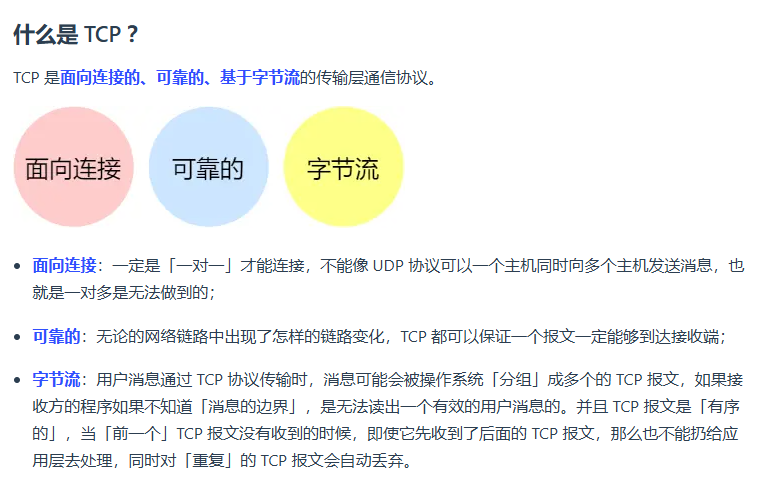

todo：mac arp http

# 和路由器 交换机 ip mac有关 整个流程

[讲的很清楚](https://www.zhihu.com/question/21546408/answer/2303205686)

应用层发送数据，使用系统调用，写入内核缓冲区，TCP层根据端口进行报文封装，IP层根据源IP和目标IP封装数据包，mac地址。。。

网卡发送数据帧，

当然如果目标IP在不同的网段，网卡会发送给网关，一般是路由器，路由器收到数据包后根据目标IP查询路由表，修改源MAC地址和目标MAC地址（每次经过[路由器](https://so.csdn.net/so/search?q=路由器&spm=1001.2101.3001.7020)，源MAC地址为本路由器接口MAC地址，目的MAC地址为该目的IP地址下一条对应IP地址的MAC地址），直到发送到目标网段，到达目标网段后可能会发送给交换机，交换机维护了目标MAC地址和端口的映射关系，转发给正确的主机，

主机接受到后网卡会检测目标MAC地址是否正确，IP层会检测目标IP地址是否正确，TCP层根据端口号发送给监听该端口的内核缓冲区，当应用程序调用系统调用时从该内核缓冲区拷贝数据并返回

# 网络模型

7层osi网络模型：理论上的参考模型

5层TCP/IP网络模型：符合实际的模型

为什么TCP/IP网络模型：

同一设备上的进程通信，多种方式

不同设备上进程通信，需要**网络通信**，设备多样，要兼容多种设备-》通用的网络协议

**应用层**

- 电脑手机使用的应用软件在应用层实现。**应用层工作在操作系统的用户态**，**传输层及以下内核态。**
- 专注于为用户提供功能，不关心数据如何传输
- **HTTP**(web浏览器与web服务器传输信息)、**FTP**(文件传输协议)、**DNS**(域名转换成IP地址)、**SMTP**(邮件传输协议)...

**传输层**

- 主机到主机的通信（端到端的通信）

- **TCP UDP**
- 应用层的数据可能很大，传输层的数据包超过**MSS（TCP最大报文段长度）**，数据包会分块，**再加上TCP头部**（即使中途有一个分块丢失或损坏了，只需要重新发送这一个分块，而不用重新发送整个数据包）
- 传输层的报文携带**端口号**。一般服务器端口号固定（http80 https443），客户端随机分配

**网络层**

- 寻址路由

- **ip协议**，**网络层负责将数据从一个设备传输到另一个设备，在各种各样的路径和节点进行选择**
- IP报文（加上了IP头部）不能超过**MTU（以太网中1500字节**），会再分片
- 报文携带**IP地址**

**网络接口层（数据链路层+物理层）**

- 加上**MAC头部**，封装成**数据帧**发送到网络上
- 网络接口层主要为网络层提供「链路级别」传输的服务，负责在以太网、WiFi 这样的底层网络上发送原始数据包，工作在网卡这个层次，使用 MAC 地址来标识网络上的设备。
- 以太网就是一种在**「局域网」内**，把附近的设备连接起来，使它们之间可以进行通讯的**技术**。

# 有了ip地址为什么还要有Mac地址 + ARP协议

作者：你好啊世界
链接：https://www.zhihu.com/question/21546408/answer/149670503
来源：知乎
著作权归作者所有。商业转载请联系作者获得授权，非商业转载请注明出处。

当年设计 IP 地址的目的是什么呢？**当年设计出 IP 地址这个东西，就是因为随着网络中的设备逐渐增多**，人们发现路由（也就是寻找数据包从发送方到接收方的路径）变得越来越困难了。于是人们想了一个办法，就是把**网络划分成很多个子网**。这样，在路由的时候，路由器可以把其他子网看成一个整体来进行计算。对于目的地在其他子网的数据包，**路由器只需要让数据包到达那个子网即可，而剩下的工作就由子网内部解决了**。虽然这种方法只能让寻找到的路径接近最优而不保证最优，不过它大大减少了路由器的计算量，利大于弊，所以被采用了。

那么为什么我们需要 IP 地址呢？因为如果我们只用 MAC 地址的话，我们会发现**路由器需要记住每个 MAC 地址所在的子网是哪一个**（不然每一次收到数据包的时候路由器都要重新满世界地去找这个 MAC 地址的位置）。而世界上有2482^{48}2^{48}个 MAC 地址，这就意味着即使我们给每个 MAC 地址只留 1 字节的储存空间，每个路由器也需要 256 TB 的内存！这显然是不可能实现的。**ip地址有拓扑结构**

这就是我们需要 IP 地址的原因了。和 MAC 不同的是，IP 地址是和地域相关的。对于位于同一个子网上的设备，我们给他们分配的 IP 地址前缀都是一样的。这个前缀就像[邮政编码](https://www.zhihu.com/search?q=邮政编码&search_source=Entity&hybrid_search_source=Entity&hybrid_search_extra={"sourceType"%3A"answer"%2C"sourceId"%3A"149670503"})一样。这样，路由器过 IP 地址的前缀就能知道这个设备在哪个子网上了。现在，路由器只需要记住每个子网的位置即可，大大减少了路由器所需要的内存。

**既然 IP 地址不能去掉，那么能不能去掉 MAC 地址呢？**也不能。因为 IP 地址是要设备上线以后，才能根据他进入了哪个子网来分配的，在设备还没有 IP 地址的时候（或者分配 IP 地址的过程中），我们还需要用 MAC 地址来区分不同的设备。

总之，MAC 地址就像自己的 ID 号，而 IP 地址就像带着邮政编码的住址，各有各的用途。所以我们需要两个地址，缺一不可。

有了IP地址还要使用MAC地址的原因包括：**两者的作用和使用场景不同、IP地址和MAC地址可以提高通信效率和安全性等。**具体内容如下：

- 两者的作用和使用场景不同。IP地址主要用于网络层，实现跨网络的通信和路由，它是一个动态分配且具有结构化特性的地址。MAC地址则用于数据链路层，用于标识网卡的物理地址，实现**局域网内部**的寻址和数据传输，它通常是固定且扁平化的地址。
- 提高通信效率和安全性。在局域网内，设备通过MAC地址直接通信，这比通过IP地址通信更高效，MAC地址作为物理地址,可以在链路层被直接寻址和转发,实现更快速的帧交换。如果只使用IP地址,所有的路由都需要在网络层进行,效率会降低。MAC地址的唯一性也有助于防止地址欺骗和网络管理。
- 即使在动态网络环境下,主机IP地址变化频繁,MAC地址可以继续用于标识和寻址该主机,保证网络的连通性。

此外，当一个IP地址被多个主机共享使用时（如通过NAT技术），MAC地址可以唯一确定主机的物理信息，保证网络的连通性。

MAC 头部是以太网使用的头部，它包含了接收方和发送方的 MAC 地址等信息。

在 MAC 包头里需要**发送方 MAC 地址**和**接收方目标 MAC 地址**，用于**两点之间的传输**。

如何获取对方的 MAC 地址呢？ARP 协议会在以太网中以**广播**的形式。

好像每次都要广播获取，这不是很麻烦吗？在后续操作系统会把本次查询结果放到一块叫做 **ARP 缓存**的内存空间留着以后用

也就是说，在发包时：

- 先查询 ARP 缓存，如果其中已经保存了对方的 MAC 地址，就不需要发送 ARP 查询，直接使用 ARP 缓存中的地址。
- 而当 ARP 缓存中不存在对方 MAC 地址时，则发送 ARP 广播查询。

# 从输⼊ URL 到⻚⾯展示到底发⽣了什么？

1. 查看**浏览器缓存**，如果存在返回
2. 解析url产生http请求
3. **dns域名解析**：查询服务器域名对应的IP地址。dns解析时按照浏览器缓存->本地hosts文件->本地dns服务器的流程
4. http基于tcp协议传输，三次握手建立连接
5. ip、mac
6. 服务器接受请求，根据请求**生成响应数据**。
7. **浏览器解析响应信息**。若响应头状态码为 301、302 ，会重定向到新地址；若响应数据类型是字节流类型，⼀般会将请求提交给下载管理器；若是HTML类型，会进⼊下⼀部渲染流程。
8. http断开请求（现在一般是长连接），tcp四次挥手结束

# DNS解析过程

浏览器缓存->本地hosts文件->本地dns服务器的流程-。。。

# dns负载均衡

请求的资源都在同一台服务器- >崩掉

原理：dns服务器中为同一个主机名配置多个ip地址。应答dns查询：dns服务器对每个查询以dns文件中主机记录的ip地址顺序返回不同结果。将client访问引导到不同机器上。

负载均衡相关算法：

- 轮询
- 基于地理位置
- 加权轮询，为不同服务器分配不同权重
- 最少连接

# 端口相关

0. 有一个ip的服务端监听了一个端口，tcp最大连接数是多少

   > 理论上：客户端ip*客户端端口数量
   >
   > 但是不可能达到这个上限，受以下因素影响：
   >
   > - 文件描述符限制：每个tcp连接都是一个文件，文件描述符满了，会发生too many open files
   > - 内存限制：每个tcp连接都要占用一定内存，操作系统内存有限

1. 客户端使用端口64992与服务端建立了tcp连接，还可以继续使用该端口建立连接吗

   >可以。TCP 连接是由四元组（源IP地址，源端口，目的IP地址，目的端口）。不同服务器就行了。

2. 多个客户端可以bind同一个端口吗

   > bind一般用于服务端，但是也可以用于客户端。
   >
   > 客户端在调用**connect**时，由**内核随机选取一个端口作为连接端口**
   >
   > 如果要自己指定连接的端口，用bind，那么和服务端情况一样了，
   >
   > 一般建议connect，疑问客户端的端口没什么意义
   >
   > 多个客户端绑定的ip和端口一样，会报错address already in use

3. 客户端timewait过多，会导致端口资源耗尽无法建立新连接吗？

   > 建立连接的是同一个服务器（目标ip port相同）：客户端端口资源会耗尽
   >
   > **不是同一个服务器：端口可以复用**

4. 如何解决客户端timewait过多

   > 建立连接的是同一个服务器（目标ip port相同）：客户端端口资源会耗尽.
   >
   > 打开**`net.ipv4.tcp_tw_reuse`** 这个内核参数。（**该参数是客户端调用connect时候起作用**）
   >
   > 因为开启了这个内核参数后，客户端调用 connect 函数时，如果选择到的端口，已经被相同四元组的连接占用的时候，**就会判断该连接是否处于 TIME_WAIT 状态，如果该连接处于 TIME_WAIT 状态并且 TIME_WAIT 状态持续的时间超过了 1 秒，那么就会重用这个连接**，然后就可以正常使用该端口了。

5. TCP 和 UDP 可以同时绑定相同的端口吗？

   > TCP 和 UDP 传输协议，在内核中是由两个完全**独立的软件模块实现**的。
   >
   > 当主机收到数据包后，可以在 **IP 包头的「协议号」字段知道该数据包是 TCP/UDP**，所以可以根据这个信息确定**送给哪个模块（TCP/UDP）处理**，**送给 TCP/UDP 模块的报文根据「端口号」确定送给哪个应用程序处理**。

6. 多个 TCP 服务进程可以同时绑定同一个端口吗？

   > 如果两个 TCP 服务进程同时绑定的 IP 地址和端口都相同，那么执行 bind() 时候就会出错，错误是“Address already in use”。
   >
   > 如果两个 TCP 服务进程绑定的端口都相同，而 IP 地址不同，那么执行 bind() 不会出错。

7. 重启tcp服务进程，为什么会“Address already in use”

   >服务器重启，服务器是主动断开方，会出现timewait状态，ip+port在timewiat的时候还是有效的，所以执行bind会返回Address already in use
   >
   >怎么解决：设置端口复用（socket设置SO_REUSEADDR），如果当前启动进程绑定的ip+port和timewiat状态占用的ip+port冲突，可以绑定成功

# TCP三次握手过程与四次挥手

## 三次握手过程

**第一次握手：**客户端发送syn包(seq=x)到服务器，并进入SYN_SEND状态，等待服务器确认;

**第二次握手：**服务器收到syn包，必须确认客户的SYN(ack=x+1)，同时自己也发送一个SYN包(seq=y)，即SYN+ACK包，此时服务器进入SYN_RECV状态;

**第三次握手：**客户端收到服务器的SYN+ACK包，向服务器发送确认包ACK(ack=y+1)，此包发送完毕，客户端和服务器进入ESTABLISHED状态，完成三次握手。

## 为什么是三次，不是两次

- 防止【历史连接】初始化连接

  > 通俗的话来讲：网络拥堵的情况下，**一个旧的syn报文比新的syn报文**早到达（两个syn报文，可能服务器宕机），服务端回syn+ack报文给客户端，客户端收到后发现和期待的确认序号不一样，就会回rst报文终止连接。
  >
  > 如果两次握手的话，就会建立无效的历史连接，又可能服务器白白发送了数据，浪费资源。 看的小林coding

- 客户端、服务器发送初始序列号都应该得到对方的回应

  > 当服务端发送「初始序列号」给客户端的时候，依然也要得到客户端的应答回应，这样一来一回，才能确保双方的初始序列号能被可靠的同步。

## 三次握手过程中可以携带数据吗？

其实第三次握手的时候，是可以携带数据的。但是，第一次、第二次握手不可以携带数据。

为什么这样呢?大家可以想一个问题，假如第一次握手可以携带数据的话，如果有人要**恶意攻击服务器**，那他每次都在第一次握手中的 SYN 报文中放入大量的数据，这时攻击者根本就不关心服务器的接收、发送能力是否正常，只是疯狂重复发 SYN 报文，这会让服务器花费很多时间、内存空间来接收这些报文。

也就是说，第一次握手不可以放数据，其中一个简单的原因就是会让服务器更加容易受到攻击了。而对于第三次的话，**此时客户端已经处于 ESTABLISHED 状态**。对于客户端来说，他已经建立起连接了，并且也已经知道服务器的接收、发送能力是正常的了，所以可以携带数据了。

## 为什么建立tcp连接，初始化的序列号不一样？

- 如果每次建立连接，客户端和服务端的初始序列号都一样，很容易出现历史报文被下一个相同的四元组的连接接收的问题。很容易使历史报文正好在服务端的接收窗口中，造成数据混乱。
- 安全性，黑客伪造相同序列号的tcp报文被对方接受

## 握手丢失发生什么

1. 第一次握手丢失：**只会客户端重传**

   > 客户端一直收不到服务端的syn-ack报文，触发超时重传，**重传的syn报文序列号一样**。tcp_syn_retries限制最大重传次数，达到了后再等一段时间，还没收到客户端断开连接。

2. 第二次丢失：**客户端和服务端都会重传**

   > - 客户端收不到syn+ack，以为是自己的syn丢失，触发超时重传，重传次数由tcp_syn_retries决定。
   > - 服务端收不到第三次握手，服务端也会重传syn+ack，重传次数由tcp_synack_retries决定。

3. 第三次丢失：服务端重传

   > ack报文丢失，但是ack报文是不会重传的。
   >
   > 服务端重传syn+ack

## syn攻击&半连接全连接队列

1. syn攻击

   > 伪造不同ip的syn报文
   >
   > 客户端发送的syn+ack得不到ack应答
   >
   > 半连接队列会满（满了后收到的syn报文丢弃）

2. 半连接队列、全连接队列

   >半（syn队列）：服务端收到syn，创建一个半连接对象，放入半连接队列
   >
   >全（accept队列）：服务端收到ack，从半连接队列取出一个半连接对象，创建一个新的连接对象放入全连接队列。
   >
   >应用通过调用accept()，从全连接队列中取出连接对象

3. 怎么避免syn攻击

   >增大半连接队列
   >
   >开启net.ipv4.tcp_syncookies:半连接队列满了以后，不丢弃，算一个cookie放在第二次握手的序列号
   >
   >减少syn+ack重传次数，更快速断开连接

## 四次挥手过程

**双方都可以主动断开连接**，主动关闭连接的才有time_wait, 假设客户端先主动断开.

客户端发送fin表示不能能发送数据，但是能传输数据。

## timewait相关

1. timewait作用

- 防止历史连接中的数据，被后面相同四元组的连接错误的接收

  > 序列号和初始化序列号并不是无限递增的，会发生回绕为初始值的情况，这意味着无法根据序列号来判断新老数据。
  >
  > 

- 确保被动断开端收到ack

2. timewait危害

   

2. timewait过多怎么办

   - 打开 net.ipv4.tcp_tw_reuse :客户端调用 connect 函数时，如果选择到的端口，已经被相同四元组的连接占用的时候，**就会判断该连接是否处于 TIME_WAIT 状态，如果该连接处于 TIME_WAIT 状态并且 TIME_WAIT 状态持续的时间超过了 1 秒，那么就会重用这个连接**

   - **net.ipv4.tcp_tw_recycle**

     > 字面意思，销毁掉 TIME_WAIT。 当开启了这个配置后，内核会快速的回收处于TIME_WAIT状态的socket连接。多快？不再是2MSL，而是一个RTO（retransmission timeout，数据包重传的timeout时间）的时间，这个时间根据RTT动态计算出来，但是远小于2MSL。

   - net.ipv4.tcp_max_tw_buckets:这个值默认为 18000，**当系统中处于 TIME_WAIT 的连接一旦超过这个值时，系统就会将后面的 TIME_WAIT 连接状态重置**

   - 设置socket选项，设置close关闭连接的行为，发送一个`RST`标志给对端，该 TCP 连接将跳过四次挥手，也就跳过了`TIME_WAIT`状态，直接关闭

3. timewait过多的可能原因：

    高并发且持续的短连接、没有长连接、长连接超时、长连接请求数量到上限

4. closewait：TIME_WAIT并不可怕（not really，后面讲），CLOSE_WAIT才可怕，因为CLOSE_WAIT很多，可能是你的**应用程序写的有问题没有执行close方法**；**服务器业务处理占用时间较长**；有一些socket没有注册到epoll，肯定无法检测事件，无法调用close(fd)

   ## closewaittodo

## MSL的含义以及为什么要等待2MSL

MSL：**报文最大生存时间**，任何报文在网络中存在的最长时间，超过会被丢弃。linux默认值30s

2MSL：客户端给服务端发送的ACK = 1丢失，**服务端等待 1MSL没收到**，**然后重新发送消息需要1MSL**。客户端只需等待2MSL，如果没有再次收到服务端的消息，就说明服务端已经接收到自己确认消息

## 为什么四次挥手

TCP全双工。任何一⽅都可以在数据传送结束后发出连接释放的通知，

待对⽅确认后进⼊半关闭状态。 当另⼀⽅也没有数据再发送的时候，则发出连接释放通知，对⽅确认。

## 可以三次挥手吗

被动关闭方在tcp挥手过程，**没有数据要发送**，并且使用**tcp延迟确认机制**，2、3次挥手会合并

服务端收到客户端的fin，内核会马上回一个ack。fin报文的发送控制权在服务端应用程序

**close vs shutdown**

## 挥手丢失

1. 第一次丢失：客户端重传

   > 一直收不到ack，触发超时重传，直到达到指定次数

2. 第二次丢失：客户端重传

3. 第三次丢失：服务端重传。**客户端如果通过close关闭连接**，处于finwait2状态时长有限制，规定时间内没有收到第三次，连接断开

4. 第四次丢失：服务端重传。**客户端处于timewait**，开启时长2msl定时器，等待完断开连接。

## get post区别

- GET：**从服务器获取指定资源**，而POST：**根据报文body，对指定的资源做出处理**。

- **根据HTTP规范，GET用于信息获取，而且应该是安全的和幂等的。**

  　　(1).所谓安全的意味着该操作用于获取信息而非修改信息。换句话说**，GET 请求一般不应产生副作用。就是说，它仅仅是获取资源信息，就像数据库查询一样，不会修改，增加数据，不会影响资源的状态**。

    　　* 注意：这里安全的含义仅仅是指是非修改信息。

    　　(2).幂等的意味着对同一URL的多个请求应该返回同样的结果。

  实际应用中，以上2条规定并没有这么严格。引用别人文章的例子：比如，新闻站点的头版不断更新。虽然第二次请求会返回不同的一批新闻，该操作仍 然被认为是安全的和幂等的，因为它总是返回当前的新闻。从根本上说，如果目标是当用户打开一个链接时，他可以确信从自身的角度来看没有改变资源即可。

- **根据HTTP规范，POST表示可能修改变服务器上的资源的请求**。继续引用上面的例子：还是新闻以网站为例，读者对新闻发表自己的评论应该通过POST实现，因为在评论提交后站点的资源已经不同了，或者说资源被修改了。

- GET 请求的参数位置一般是写在 URL 中，URL 规定只能支持 ASCII，所以 GET 请求的参数只允许 ASCII 字符 ，而且浏览器会对 URL 的长度有限制。**POST 的语义是根据请求负荷（报文body）对指定的资源做出处理**，具体的处理方式视资源类型而不同。POST 请求携带数据的位置一般是写在报文 body 中，body 中的数据可以是任意格式的数据。

- 

# TCP 连接 断电和进程崩溃

- 进程崩溃：内核维护tcp连接，内核回收tcp资源，内核发送fin断开连接。

- 断电：

**假设客户端宕机的话。**

有数据传输：服务端多次发送数据（重传），到达一定次数，断开连接

无数据传输：keep alive机制

**如果客户端宕机后又重启：**

回rst

# TCP如何保证可靠传输

1. **校验和**。TCP在发送数据前会计算校验和，接收方在收到数据后也会重新计算校验和。如果校验和不一致，接收方会认为数据传输过程中出现了错误。检验数据在传输过程中是否有错误

   > 循环冗余校验码（CRC）
   >
   > 

2. **序列号与确认号**。保证有序性。

3. **一些重传机制**。数据在传输过程丢失。

4. **滑动窗口机制**：通过滑动窗口实现流量控制与拥塞控制。

# TCP重传机制

数据包丢失

- 超时重传

  > 发送数据时设置一个定时器，超过时间后没有收到ack确认应答报文，重传。
  >
  > 重发数据再次超时：**TCP超时时间加倍**
  >
  > 缺点：等待时间较长
  >
  > RTT：数据发送时刻到收到确认的差值：
  >
  > 

- 快速重传

  > 收到相同的三个ACK报文，会重传丢失的报文
  >
  > 缺点：重传一个还是重传所有
  >
  > 

- SACK 选择性确认（在快速重传基础上）

  > TCP头部的选项字段加入一个**SACK**的东西，将已收到的数据的信息发**送给发送方**，发送方知道哪些数据收到了。这样只用重传丢失的数据。
  >
  > 发送方收到了三次相同的ACK确认报文，触发重传。
  >
  > 
  >
  > 

- DSAK （SACK基础上）

  告知发送方有哪些数据包自己重复接收

# TCP滑动窗口

其实有点没懂

**改善吞吐量**，允许发送方在接受任何应答前继续发送数据。

滑动窗口的大小意味着接收方还有多大的缓冲区可以用于接收数据。

窗口的实现实际上是操作系统开辟的一个缓存空间，发送方主机在等到确认应答返回之前，必须在缓冲区中保留已发送的数据。如果按期收到确认应答，此时数据就可以从缓存区清除。

接收方通过在TCP段报头中的窗口字段中指示大小来传达其接收窗口。当发送方收到它时，这个窗口大小就成为可用窗口。

因为滑动窗口并不是一成不变的。比如，当接收方的应用进程读取数据的速度非常快的话，这样的话接收窗口可以很快的就空缺出来。那么新的接收窗口大小，是通过 TCP 报文中的 Windows 字段来告诉发送方。那么这个传输过程是存在时延的，所以接收窗口和发送窗口是约等于的关系。

**累计确认/累计应答**

# TCP流量控制

TCP提供一种机制让**发送方**根据**接收方的实际接受能力控制发送数据**

看小林coding的例子

操作系统缓冲区与滑动窗口的关系:前面的流量控制例子，我们假定了发送窗口和接收窗口是不变的，但是实际上，发送窗口和接收窗口中所存放的字节数，都是放在操作系统内存缓冲区中的，而操作系统的缓冲区，会**被操作系统调整**。

# TCP拥塞控制

**拥塞窗口单位：cwnd以字节为单位，但是慢启动以报文段大小为单位进行增加**

流量控制：避免发送方数据填满接收方的缓存，并不知道网络中发生了什么

拥塞控制：避免发送方的数据填满整个网络

> **在网络出现拥堵时，如果继续发送大量数据包，可能会导致数据包时延、丢失等，这时 TCP 就会重传数据，但是一重传就会导致网络的负担更重，于是会导致更大的延迟以及更多的丢包，这个情况就会进入恶性循环被不断地放大....**
>
> 所以，TCP 不能忽略网络上发生的事，它被设计成一个无私的协议，当网络发送拥塞时，TCP 会自我牺牲，降低发送的数据量。

为了在「发送方」调节所要发送数据的量，定义了一个叫做「**拥塞窗口**」的概念。

**拥塞窗口 cwnd**是发送方维护的一个的状态变量，它会根据**网络的拥塞程度动态变化的**。

我们在前面提到过发送窗口 `swnd` 和接收窗口 `rwnd` 是约等于的关系，那么由于加入了拥塞窗口的概念后，此时**发送窗口的值是swnd = min(cwnd, rwnd)**，也就是拥塞窗口和接收窗口中的最小值。

==总结==

==拥塞控制算法==

- 慢启动

  > 发送方每收到一个ACK，拥塞窗口大小cwnd加一
  >
  > 发包的个数**指数性增长**
  >
  > 
  >
  > 有一个叫**慢启动门限** `ssthresh` （slow start threshold）状态变量。
  >
  > - 当 `cwnd` < `ssthresh` 时，使用慢启动算法。
  > - 当 `cwnd` >= `ssthresh` 时，就会使用「拥塞避免算法」

- 拥塞避免

  > **每当收到一个 ACK 时，cwnd 增加 1/cwnd**
  >
  > **线性增长**
  >
  > 就这么一直增长着后，网络就会慢慢进入了拥塞的状况了，于是就会出现丢包现象，这时就需要对丢失的数据包进行重传。
  >
  > 当触发了重传机制，也就进入了「拥塞发生算法」。

- 拥塞发生

  网络出现拥塞，也就是会发生数据包重传

  **不同的重传算法的拥塞发生算法不同**

  

  - 超时重传的拥塞发生算法

    > - `ssthresh` 设为 `cwnd/2`，
    > - `cwnd` 重置为 `1` （是恢复为 cwnd 初始化值，我这里假定 cwnd 初始化值 1）
    > - 慢启动...
    >
    > 

  - 快速重传的拥塞发生算法

    > 还有更好的方式，前面我们讲过「快速重传算法」。当接收方发现丢了一个中间包的时候，发送三次前一个包的 ACK，于是发送端就会快速地重传，不必等待超时再重传。
    >
    > TCP 认为这种情况不严重，因为大部分没丢，只丢了一小部分，则 `ssthresh` 和 `cwnd` 变化如下：
    >
    > - `cwnd = cwnd/2` ，也就是设置为原来的一半;
    > - `ssthresh = cwnd`;
    > - 进入**快速恢复算法**

- ==快速恢复==

  将`慢开始门限ssthresh`和`拥塞窗口cwnd`重新设置为当前拥塞窗口的一半，然后执行拥塞避免算法

# TCP面向字节流 UDP面向报文的协议

因为操作系统对 TCP 和 UDP 协议的**发送方的机制不同**

## **为什么 UDP 是面向报文的协议？**

> 操作系统不会对消息进行拆分, 每个UDP报文就是一个用户消息的边界，读一个 UDP 报文就能读取到完整的用户消息。
>
> 收到了**两个 UDP 报文**，操作系统是怎么**区分**开的？
>
> 

## **为什么 TCP 是面向字节流的协议？**

> 消息可能会被操作系统分组成多个的 TCP 报文, **TCP 所传输的数据是没有边界的**。于是就有了粘包、拆包问题的出现。**粘包、拆包**问题只发生在TCP协议中。
>
> **粘包：多个消息的某个部分内容被分到同一个 TCP 报文时**
>
> 

## 解决TCP粘包

三种分包方式：

- **固定长度的消息**

  > 灵活性不高，实际上很少用

- **特殊字符作为边界**

  > 两个用户消息之间插入一个特殊的字符串，这样接收方在接收数据时，读到了这个特殊字符，就把认为已经读完一个完整的消息。
  >
  > **HTTP 通过设置回车符、换行符作为 HTTP 报文协议的边界。**

- **数据包再加上一个首部，表示数据包的长度**

# HTTP、TCP的keepalive

完全两个东西

**HTTP 的 Keep-Alive 也叫 HTTP 长连接**，该功能是由「**应用程序**」实现的，可以使得用同一个 TCP 连接来发送和接收多个 HTTP 请求/应答，减少了 HTTP 短连接带来的多次 TCP 连接建立和释放的开销。

**HTTP的长连接短连接适用场景**，

短：通常**浏览器访问服务器**的时候就是短连接。

对于服务端来说，长连接会耗费服务端的资源，而且用户用浏览器访问服务端相对而言不是很频繁的。如果有几十万，上百万的连接，服务端的压力会非常大，甚至会崩溃。所以对于**并发量大，请求频率低**的，建议使用短连接。

长：适用于客户端和服务端通信频繁的场景，**数据库的连接用长连接**

**TCP 的 Keepalive 也叫 TCP 保活机制**，该功能是由「**内核**」实现的，当客户端和服务端长达一定时间没有进行数据交互时，内核为了**确保该连接是否还有效**，就会发送探测报文，来检测对方是否还在线，然后来决定是否要关闭该连接

# 如何基于UDP可靠传输

# TCP UDP区别与应用场景

区别：

1. TCP**面向连接**，UDP不面向连接，即可传输数据
2. TCP**可靠的**，无差错、不丢失、不重复、按序到达。UDP是不可靠的。
3. 首部开销，TCP没有[选项]20字节，会有一定的开销**（序列号用来解决乱序，确认号解决丢包）**，UDP是8字节
4. TCP**面向字节流**，UDP面向报文。
5. TCP只能一对一进行通信,UDP支持一对一、一对多、多对一*、*多对多通信

场景：

由于 TCP 是面向连接，能保证数据的**可靠性**交付，因此经常用于：

- `FTP` 文件传输；
- HTTP / HTTPS；

由于 UDP 面向无连接，**实时性高**的场景，它可以随时发送数据，再加上 UDP 本身的处理既简单又高效，因此经常用于：

- 包总量较少的通信，如 `DNS` 、`SNMP` 等；
- 视频、音频等多媒体通信；
- 广播通信；

DNS为什么UDP?

- DNS查询通常是小型请求.DNS查询通常需要低延迟来提供快速的域名解析服务

# UDP实现可靠传输

UDP 也可以实现可靠传输，把 TCP 的特性在**应用层上**实现就可以

# HTTP

## HTTP报文格式

- 请求行

请求行有三个字段：方法、URL、HTTP版本

（1）方法：可以取不同的值，包括GET、POST、HEAD、PUT和DELETE等。绝大部分HTTP请求报文使用GET方法。

（2）URL：请求对象的标识。示例中请求对象标识就是：/dir1/dir2/hello.html

（3）HTTP版本：略。示例中HTTP版本为1.1。

- 请求头

首部行由多组键值对（首部字段名：首部字段值）组成。下面分析示例：

1. host：指定服务器域名
2. content length：服务器返回数据时，body的长度。**http协议通过设置回车符、换行符作为http header的边界；content length作为body的边界，都是为了解决粘包的问题**
3. connection：客户端要求服务器使用http长连接机制，以便其他请求复用
4. content-type：服务器回应时告诉客户端数据是什么格式
5. accept：客户端请求的时候表示自己可以接受什么格式
6. content encoding：数据的压缩方法，服务器返回的数据使用了什么压缩格式
7. accept encoding：客户端请求时，说明自己可以接受哪些压缩方法

- 请求体

使用GET方法时，实体体为空；

而使用POST方法时才使用实体体，举例说明：

当用户提交表单时，HTTP使用POST方法，则实体体内包含的就是用户在表单的输入值。

## 状态码

常见：

200 OK 处理成功！

- 「**301 Moved Permanently**」表示**永久重定向**，说明请求的资源已经不存在了，需改用新的 URL 再次访问。
- 「**302 Found**」表示**临时重定向**，说明请求的资源还在，但暂时需要用另一个 URL 来访问。

301 和 302 都会在响应头里使用字段 `Location`，指明后续要跳转的 URL，浏览器会自动重定向新的 URL。

- 「**304 Not Modified**」不具有跳转的含义，表示资源未修改，重定向已存在的缓冲文件，也称缓存重定向，也就是告诉客户端可以**继续使用缓存资源**，用于缓存控制。、
- **400 Bad Request**」表示客户端请求的**报文有错误**，但只是个笼统的错误。
- 「**403 Forbidden**」表示**服务器禁止访问资源**，并不是客户端的请求出错。
- 「**404 Not Found**」表示请求的资源在**服务器上不存在或未找到**，所以无法提供给客户端。

`5xx` 类状态码表示客户端请求报文正确，但是**服务器处理时内部发生了错误**，属于服务器端的错误码。

- 「**500 Internal Server Error**」与 400 类型，是个笼统通用的错误码，服务器发生了什么错误，我们并不知道。
- 「**501 Not Implemented**」表示客户端请求的功能还不支持，类似“即将开业，敬请期待”的意思。
- 「**502 Bad Gateway**」通常是服务器作为网关或代理时返回的错误码，表示服务器自身工作正常，访问后端服务器发生了错误。
- 「**503 Service Unavailable**」表示服务器当前很忙，暂时无法响应客户端，类似“网络服务正忙，请稍后重试”的意思。

404 Not Found 你最不希望看到的，即找不到页面。如你在 google 上找到一个页面，点击这个链接返回 404，表示这个页面已经被网站删除了。
500 Internal Server Error 看到这个错误，你就应该查查服务端的日志了，肯定抛出了一堆异常。

## 缓存技术

避免发送 重复性HTTP 请求的方法就是通过**缓存技术**

两种实现方式：**强制缓存与协商缓存**

**强制缓存**：浏览器判断缓存没有过期，则直接使用浏览器的本地缓存。

**`强制缓存的工作原理是通过HTTP响应头中的特定字段来控制的。这些字段通常包括`Expires`和`Cache-Control`，它们指示了资源的缓存有效时间。当浏览器在有效时间内再次请求同一资源时，它会直接从本地缓存中获取该资源，而不会向服务器发送请求`**。

**协商缓存:** 服务端通过一些状态码告知客户端是否可以使用缓存的方式

当客户端首次请求一个资源时，服务器可以在响应中包含缓存相关的头信息，例如ETag和Last-Modified字段。客户端会将这些头信息存储在本地，下次请求同样的资源时会将这些头信息发送给服务器，以便服务器判断资源是否发生变化。
当客户端发送一个带有缓存头信息的请求时，服务器会进行判断：

- 如果资源没有发生变化，服务器会返回状态码**304**，并在响应头中省略响应体。客户端会使用本地缓存的数据。
- 如果资源发生了变化，服务器会返回状态码**200**，并在响应头中返回新的资源内容。客户端会使用新的数据，并更新本地缓存。

## HTTP特性

http1.1优点：简单、灵活易于扩展、应用广泛跨平台

http1.1缺点：无状态(cookie解决)，明文传输

http1.1性能：

- 长连接
- pipeline：第一个请求发送后不必等回来，就可以发第二个请求。服务器：接受请求的顺序 发送响应。（默认不开启）

## HTTP123

http常见版本HTTP/1.1，HTTP/2.0，HTTP/3.0    1和2用的tcp，3用的udp

HTTP1.1相比http1.0：

- **长连接**，不用每发起一个请求就建立一次TCP连接，减小开销

- 支持管道（pipeline）传输，只要第一个请求发出去了，不必等其回来，就可以发第二个请求出去，可以**减少整体的响应时间。**（默认不开启）。

  > pipeline只是解决了请求的队头阻塞，还有响应的队头阻塞。服务器按照接受请求的顺序发送响应

HTTP2: 基于https，安全性有保障

- **头部压缩：**减小传输的数据量。头部是带了大量信息的。

- **二进制格式：**

  HTTP/2 不再像 HTTP/1.1 里的纯文本形式的报文，而是全面采用了**二进制格式**，极大提高了 HTTP 传输效率。头信息和数据体都是二进制，并且统称为帧（frame）：**头信息帧（Headers Frame）和数据帧（Data Frame）**。

- **服务器推送：**

  HTTP/2 还在一定程度上改善了传统的「请求 - 应答」工作模式，服务端不再是被动地响应，可以**主动**向客户端发送消息

- **多路复用：** **多个stream复用在一个tcp连接上**

  http1.1存在队头阻塞的问题，http2多个请求和响应同时在一个连接上传输。

  

HTTP3:

http2的问题：队头阻塞+tcp如果丢包阻塞，tcp保证收到的数据完整连续，内核才会将缓冲区的数据返回给http应用

- **基于 UDP 的 QUIC（应用层实现） 协议 可以实现类似 TCP 的可靠性传输。**

  主要为了更彻底解决队头阻塞：

  - HTTP/1.1 中的管道（ pipeline）虽然解决了请求的队头阻塞，但是**没有解决响应的队头阻塞**，因为服务端需要按顺序响应收到的请求，如果服务端处理某个请求消耗的时间比较长，那么只能等响应完这个请求后， 才能处理下一个请求，这属于 HTTP 层队头阻塞。
  - HTTP/2 虽然通过多个请求复用一个 TCP 连接解决了 HTTP 的队头阻塞 ，但是**一旦发生丢包，就会阻塞住所有的 HTTP 请求**，这属于 TCP 层队头阻塞。

- 更快的连接建立

- **切换网络时的连接保持：**

  基于 TCP 传输协议的 HTTP 协议，由于是通过四元组（源 IP、源端口、目的 IP、目的端口）确定一条 TCP 连接。

  **当移动设备的网络从 4G 切换到 WIFI 时，意味着 IP 地址变化了，那么就必须要断开连接，然后重新建立连接**。而建立连接的过程包含 TCP 三次握手和 TLS 四次握手的时延，以及 TCP 慢启动的减速过程，给用户的感觉就是网络突然卡顿了一下，因此**连接的迁移成本是很高的**。

  QUIC通过**连接id标记通信的两个端点**，client server选择一组id标记自己，即使网络变化，只要仍然保佑上下文信息（id、tls秘钥等），可以复用原连接

## HTTP与HTTPS

==区别：==

- HTTP 是超文本传输协议，信息是明文传输，存在安全风险的问题。HTTPS 则解决 HTTP 不安全的缺陷，在 TCP 和 HTTP 网络层之间加入了 SSL/TLS 安全协议，使得报文能够加密传输。
- HTTP 连接建立相对简单， TCP 三次握手之后便可进行 HTTP 的报文传输。而 HTTPS 在 TCP 三次握手之后，还需进行 SSL/TLS 的握手过程，才可进入加密报文传输。
- 两者的默认端口不一样，HTTP 默认端口号是 80，HTTPS 默认端口号是 443。
- HTTPS 协议需要向 CA（证书权威机构）申请数字证书，来保证服务器的身份是可信的

==为什么 HTTP 协议不安全呢？主要表现在以下三个方面：==

- **容易被窃听**：HTTP 传输的数据是明文。黑客很容易通过嗅探技术截获报文，由于数据没有加密，内容可以被黑客所理解。

  举个例子：如果用户输入密码取款，那么黑客窃听了此密码后，就可以为所欲为了！

- **容易被篡改**：黑客可以在截获 HTTP 报文后，对报文进行修改，然后再发送到目的地。

  举个例子：如果用户想要转账给家人，而黑客将收款人修改成了自己，将会造成用户出现损失！

- **容易被伪造身份**：黑客可以伪造 HTTP 报文，假装自己是用户真正想要访问的网站，然后与用户进行通信。

  举个例子：如果用户想要访问淘宝网站进行购物，而黑客冒充自己是淘宝网站，用户就可能在此假淘宝网站上买东西，造成损失！

  

[很清楚](https://blog.csdn.net/qq_45901741/article/details/119223513)

[20 张图带你全面了解 HTTPS 协议，再也不怕面试问到了！ - 哔哩哔哩 (bilibili.com)](https://www.bilibili.com/read/cv22919248/)

==HTTPS 是如何解决以上安全性问题的呢？主要方法如下所示：==

- **数据加密**（解决窃听）：混合加密。非对称加密算法传输会话密钥，用对称加密算法传输实际数据。

  > 1. 服务器发送公钥给客户端，客户端收到公钥后会生成一把秘钥（用于对称加密）。
  > 2. 客户端用服务器公钥对会话秘钥加密。
  > 3. 客户端将加密的会话秘钥发给服务器，服务器私钥解密。
  >
  > ==问题：公钥也会被窃取，所以需要CA颁发的证书保证公钥是不是服务器的，完整性摘要保证没有篡改==

- **完整性摘要**（解决篡改）：HTTPS 通过摘要算法得到报文的一个摘要，如果黑客篡改了报文内容，那么重新生成的摘要将发生变化，接收方校验后就知道数据不再完整，被篡改了！

- **数字证书**（身份伪造）：HTTPS 通过数字证书来验证通信实体的身份，而黑客因为没有相应的证书，一旦冒充其他网站将会被识破！ 

1. 服务器向CA申请**数字证书**：服务器把公钥注册到ca，CA有私钥公钥。CA对明文数据（服务器信息、公钥等）hash，hash的值用私钥加密得到数字签名。**明文和数字签名构成数字证书**。数字证书发给客户端。
2. 客户端拿到证书，得到明文和数字签名。用CA的公钥对数字签名解密，明文用哈希算法得到一个值，这两个值比较是否相等。

## HTTPS四次握手 todo

## HTTPS一定安全吗&中间人服务器

客户端向服务端发起https请求，被 **假基站** 转发到了 **中间人服务器**，**客户端和中间人服务器完成tls握手，中间人再与服务器完成真正tls握手。中间人可以看到https请求 与 响应 的数据**。中间人与客户端在tls握手过程中，**实际发送了自己伪造的证书**，**可以被客户端识别出非法**，如果client点击了继续浏览网页，https通信能被中间人监听。

电脑中毒，被恶意导入了中间人根证书，验证的时候，操作系统信任了中间人根证书，等同中间人证书合法，这时浏览器不会弹出风险提示

**https协议本身是没有漏洞的，及时成功进行中间人攻击，本质利用了客户端漏洞（客户端继续访问 或 恶意导入伪造的根证书）。**

> 抓包工具能截取https数据原因

原理和中间人一致。客户端安装相应的根证书，客户端会将其视为受信任的ca。相当于抓包工具给自己创建了ca，客户端会认为证书是有效的。

>避免中间人抓取数据？

https双向认证，服务端也要验证客户端身份。

## 有http为什么还要rpc？

> tcp有什么问题

tcp基于字节流，没有边界。为了区分消息边界，可以把每条发送的数据进行包装，加入消息头，里面写清楚一个完整的包长度是多少。 消息头还可以放其他各种东西，比如是否被压缩、消息体格式，只要上下游约定好就行，这就是所谓**协议**。

于是基于tcp，衍生了很多协议，比如http、rpc。**http、rpc等是定义了不同消息格式的应用层协议（rpc说成一种调用方式更合适）。**

> http和rpc区别

- 服务发现：找到服务器对应ip、端口

  http: dns解析，端口80、

  rpc：专门的中间服务保存服务名、ip信息（etcd、consul甚至redis）

- 连接池

  rpc协议一般会建立连接池，请求量大的时候，建立多条连接在池中。有利于性能提升。

  但是不少编程语言的网络库都会给http加连接池，比如go

- 传输内容

  tcp传输的消息本质都是header+body。

  **body是真正传输的内容，要转换成二进制**，字符串数字都很容易变成二进制。**结构体呢？json、protobuf**。

  将结构体转换为二进制数组的过程叫**序列化**，反过来是**反序列化**

  

  对于主流的http1.1：设计初是做网页文本展示，传输内容以字符串为主。**body用的json序列化结构体数据**

  rpc：定制化程度更高，**体积更小的protobuf**或者其他序列化协议保存结构体数组，也不需要http考虑各种浏览器行为，比如302重定向等，==**性能也会更好**，**也是公司内部微服务中抛弃http采用rpc的最主要原因。**==
  
  http/2.0可能性能比rpc更好，但是这几年才出来，也不可能取代rpc
  
  

# sql注入攻击

[SQL 注入攻击介绍_sql注入攻击-CSDN博客](https://blog.csdn.net/weixin_43004044/article/details/129476793)

[[MySQL\]——SQL预编译、动态sql_预制sql-CSDN博客](https://blog.csdn.net/Panci_/article/details/134131428)

预编译SQL编译后将参数整体视为一个字符串，当语句开始执行时，才进行替换

# web安全攻击

**sql注入**

**中间人攻击**

**DDOS攻击（分布式拒绝服务）**：利用攻击软件通过大量的机器同时对服务进行攻击，规模大，危害大。

目前有两种主流的DDOS攻击：**SYN Flood攻击**和**TCP全连接攻击**。

- SYN Flood攻击：利用[tcp协议](https://zhida.zhihu.com/search?content_id=242728493&content_type=Article&match_order=1&q=tcp协议&zhida_source=entity)的缺陷，发送大量伪造的tcp连接请求，导致被攻击方资源耗尽。出现的原因是：在TCP三次握手过程中，假设用户发送了SYN报文后掉线，那么服务器在发出SYN+ACK是无法收到客户端的ACK报文，这时，服务端是会一直不断的重试并等待一段时间后丢弃这个未完成的连接的，如果有大量的伪造的攻击报文，发送到了服务端，服务端将为了维护一个非常大的[半连接队列](https://zhida.zhihu.com/search?content_id=242728493&content_type=Article&match_order=1&q=半连接队列&zhida_source=entity)而消耗过多的CPU时间和内存，这就会导致服务器失去响应。
- TCP全连接攻击：这种攻击是为了绕过防火墙设计的，它能够绕过防火墙，导致服务器有大量的TCP连接，最终导致服务器拒绝服务。

**XSS攻击（[跨站脚本攻击](https://zhida.zhihu.com/search?content_id=242728493&content_type=Article&match_order=1&q=跨站脚本攻击&zhida_source=entity)）**，它是指恶意攻击者在web网页中插入恶意html代码,当用户浏览网页时,嵌入其中的html代码会执行,从而达到恶意攻击的目的。